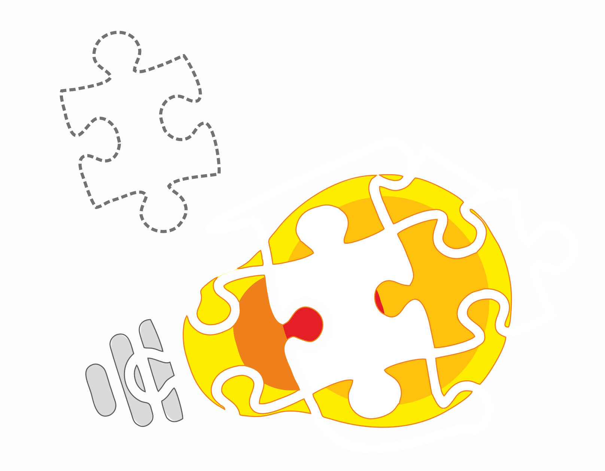
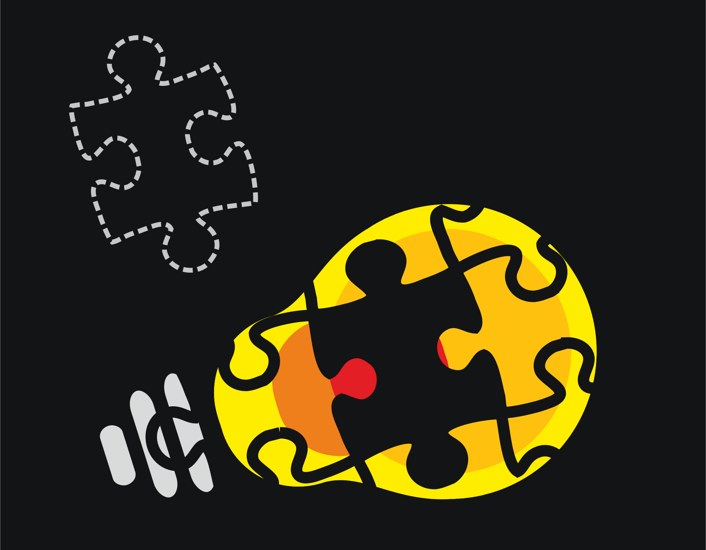

:orphan:

Page not found
==============

.. raw:: html

     
    

        
<strong>404: Puzzle piece not found.</strong>

        
Did you look under the sofa cushions?

    

     
     

Since version 1.0.0, the documentation structure has changed to improve content organization and to provide a better browsing experience.
Navigate using the left sidebar or type in the search box to find what you are looking for.
