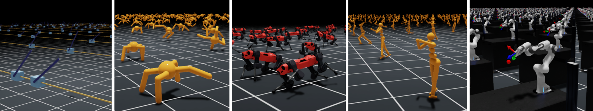

Isaac Lab environments
======================

.. raw:: html

      

Environments
------------

The repository https://github.com/isaac-sim/IsaacLab provides the example reinforcement learning environments for Isaac Lab (Orbit and Omniverse Isaac Gym unification).

These environments can be easily loaded and configured by calling a single function provided with this library. This function also makes it possible to configure the environment from the command line arguments (see Isaac Lab's `Training with an RL Agent <https://isaac-sim.github.io/IsaacLab/source/tutorials/03_envs/run_rl_training.html>`_) or from its parameters (:literal:`task_name`, :literal:`num_envs`, :literal:`headless`, and :literal:`cli_args`).

.. note::

    The command line arguments has priority over the function parameters.

.. note::

    Isaac Lab environments implement a functionality to get their configuration from the command line. Setting the :literal:`headless` option from the trainer configuration will not work. In this case, it is necessary to set the load function's :literal:`headless` argument to True or to invoke the scripts as follows: :literal:`isaaclab -p script.py --headless`.

.. raw:: html

     

Usage
^^^^^

.. tabs::

    .. tab:: Function parameters

        .. tabs::

            .. group-tab:: |_4| |pytorch| |_4|

                .. literalinclude:: ../../snippets/loaders.py
                    :language: python
                    :emphasize-lines: 2, 5
                    :start-after: [start-isaaclab-envs-parameters-torch]
                    :end-before: [end-isaaclab-envs-parameters-torch]

            .. group-tab:: |_4| |jax| |_4|

                .. literalinclude:: ../../snippets/loaders.py
                    :language: python
                    :emphasize-lines: 2, 5
                    :start-after: [start-isaaclab-envs-parameters-jax]
                    :end-before: [end-isaaclab-envs-parameters-jax]

    .. tab:: Command line arguments (priority)

        .. tabs::

            .. group-tab:: |_4| |pytorch| |_4|

                .. literalinclude:: ../../snippets/loaders.py
                    :language: python
                    :emphasize-lines: 2, 5
                    :start-after: [start-isaaclab-envs-cli-torch]
                    :end-before: [end-isaaclab-envs-cli-torch]

            .. group-tab:: |_4| |jax| |_4|

                .. literalinclude:: ../../snippets/loaders.py
                    :language: python
                    :emphasize-lines: 2, 5
                    :start-after: [start-isaaclab-envs-cli-jax]
                    :end-before: [end-isaaclab-envs-cli-jax]

        Run the main script passing the configuration as command line arguments. For example:

        .. code-block::

            isaaclab -p main.py --task Isaac-Cartpole-v0

.. raw:: html

     

API
^^^

.. autofunction:: skrl.envs.loaders.torch.load_isaaclab_env
