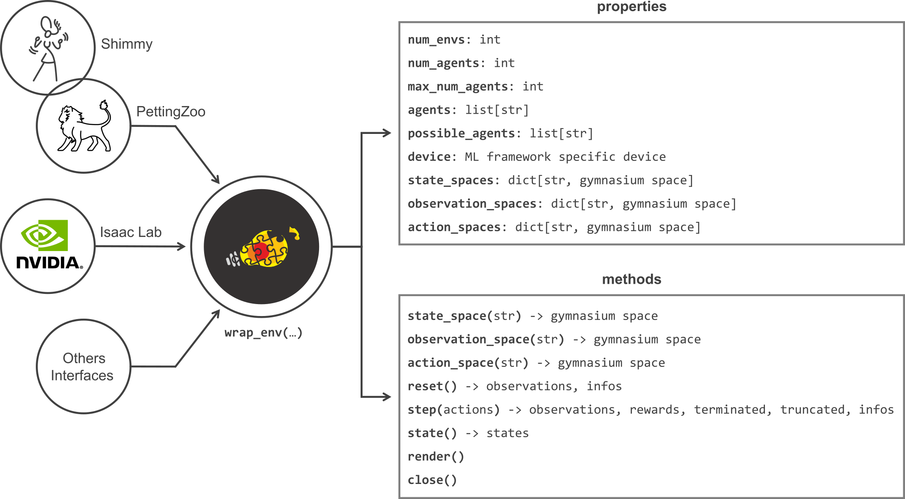
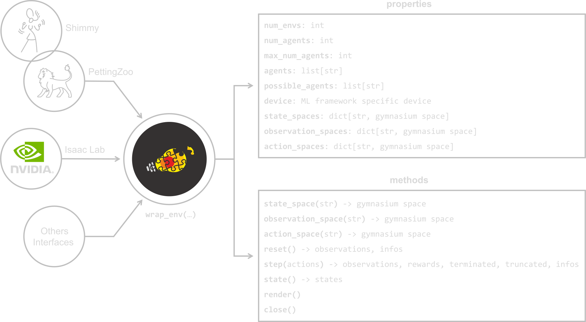

:tocdepth: 3

Wrapping (multi-agents)
=======================

.. raw:: html

     

This library works with a common API to interact with the following RL multi-agent environments:

* Farama `PettingZoo <https://pettingzoo.farama.org>`_ (parallel API) and `Shimmy <https://shimmy.farama.org/>`_
* NVIDIA `Isaac Lab <https://isaac-sim.github.io/IsaacLab/index.html>`_
* `Bi-DexHands <https://github.com/PKU-MARL/DexterousHands>`_

To operate with them and to support interoperability between these non-compatible interfaces, a **wrapping mechanism is provided** as shown in the diagram below

.. raw:: html

     

.. raw:: html

     

Usage
-----

.. tabs::

    .. tab:: Isaac Lab

        .. tabs::

            .. group-tab:: |_4| |pytorch| |_4|

                .. literalinclude:: ../../snippets/wrapping.py
                    :language: python
                    :start-after: [pytorch-start-isaaclab-multi-agent]
                    :end-before: [pytorch-end-isaaclab-multi-agent]

            .. group-tab:: |_4| |jax| |_4|

                .. literalinclude:: ../../snippets/wrapping.py
                    :language: python
                    :start-after: [jax-start-isaaclab-multi-agent]
                    :end-before: [jax-end-isaaclab-multi-agent]

    .. tab:: PettingZoo

        .. tabs::

            .. group-tab:: |_4| |pytorch| |_4|

                .. literalinclude:: ../../snippets/wrapping.py
                    :language: python
                    :start-after: [start-pettingzoo-torch]
                    :end-before: [end-pettingzoo-torch]

            .. group-tab:: |_4| |jax| |_4|

                .. literalinclude:: ../../snippets/wrapping.py
                    :language: python
                    :start-after: [start-pettingzoo-jax]
                    :end-before: [end-pettingzoo-jax]

    .. tab:: Shimmy

        .. tabs::

            .. group-tab:: |_4| |pytorch| |_4|

                .. literalinclude:: ../../snippets/wrapping.py
                    :language: python
                    :start-after: [pytorch-start-shimmy-multi-agent]
                    :end-before: [pytorch-end-shimmy-multi-agent]

            .. group-tab:: |_4| |jax| |_4|

                .. literalinclude:: ../../snippets/wrapping.py
                    :language: python
                    :start-after: [jax-start-shimmy-multi-agent]
                    :end-before: [jax-end-shimmy-multi-agent]

    .. tab:: Bi-DexHands

        .. tabs::

            .. group-tab:: |_4| |pytorch| |_4|

                .. literalinclude:: ../../snippets/wrapping.py
                    :language: python
                    :start-after: [start-bidexhands-torch]
                    :end-before: [end-bidexhands-torch]

            .. group-tab:: |_4| |jax| |_4|

                .. literalinclude:: ../../snippets/wrapping.py
                    :language: python
                    :start-after: [start-bidexhands-jax]
                    :end-before: [end-bidexhands-jax]

.. raw:: html

     

API (PyTorch)
-------------

.. autofunction:: skrl.envs.wrappers.torch.wrap_env

.. raw:: html

     

API (JAX)
---------

.. autofunction:: skrl.envs.wrappers.jax.wrap_env

.. raw:: html

     

Internal API (PyTorch)
----------------------

.. autoclass:: skrl.envs.wrappers.torch.MultiAgentEnvWrapper
    :undoc-members:
    :show-inheritance:
    :members:

.. autoclass:: skrl.envs.wrappers.torch.IsaacLabMultiAgentWrapper
    :undoc-members:
    :show-inheritance:
    :members:

.. autoclass:: skrl.envs.wrappers.torch.PettingZooWrapper
    :undoc-members:
    :show-inheritance:
    :members:

.. autoclass:: skrl.envs.wrappers.torch.BiDexHandsWrapper
    :undoc-members:
    :show-inheritance:
    :members:

.. raw:: html

     

Internal API (JAX)
------------------

.. autoclass:: skrl.envs.wrappers.jax.MultiAgentEnvWrapper
    :undoc-members:
    :show-inheritance:
    :members:

.. autoclass:: skrl.envs.wrappers.jax.IsaacLabMultiAgentWrapper
    :undoc-members:
    :show-inheritance:
    :members:

.. autoclass:: skrl.envs.wrappers.jax.PettingZooWrapper
    :undoc-members:
    :show-inheritance:
    :members:

.. autoclass:: skrl.envs.wrappers.jax.BiDexHandsWrapper
    :undoc-members:
    :show-inheritance:
    :members:
