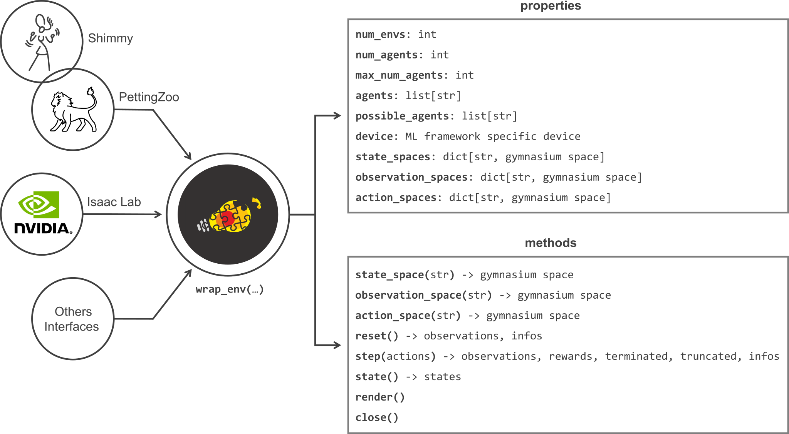
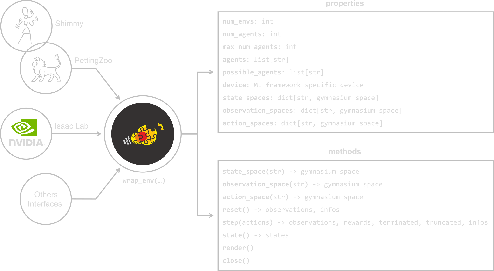

:tocdepth: 4

Wrapping (multi-agents)
=======================

.. raw:: html

     

This library works with a common API to interact with the following RL multi-agent environments:

* Farama `PettingZoo <https://pettingzoo.farama.org>`_ (parallel API) and `Shimmy <https://shimmy.farama.org/>`_
* NVIDIA `Isaac Lab <https://isaac-sim.github.io/IsaacLab/index.html>`_

To operate with them, out-of-the-box, and to support interoperability between these non-compatible interfaces,
a **wrapping mechanism is provided** as shown in the following image.

.. raw:: html

     

.. raw:: html

     

Usage
-----

The following snippets show how to wrap multi-agent environments from the different supported libraries:

|

.. tabs::

    .. tab:: Isaac Lab

        .. tabs::

            .. group-tab:: |_4| |pytorch| |_4|

                .. literalinclude:: ../../snippets/wrapping.py
                    :language: python
                    :start-after: [pytorch-start-isaaclab-multi-agent]
                    :end-before: [pytorch-end-isaaclab-multi-agent]

            .. group-tab:: |_4| |jax| |_4|

                .. literalinclude:: ../../snippets/wrapping.py
                    :language: python
                    :start-after: [jax-start-isaaclab-multi-agent]
                    :end-before: [jax-end-isaaclab-multi-agent]

    .. tab:: PettingZoo

        .. tabs::

            .. group-tab:: |_4| |pytorch| |_4|

                .. literalinclude:: ../../snippets/wrapping.py
                    :language: python
                    :start-after: [start-pettingzoo-torch]
                    :end-before: [end-pettingzoo-torch]

            .. group-tab:: |_4| |jax| |_4|

                .. literalinclude:: ../../snippets/wrapping.py
                    :language: python
                    :start-after: [start-pettingzoo-jax]
                    :end-before: [end-pettingzoo-jax]

    .. tab:: Shimmy

        .. tabs::

            .. group-tab:: |_4| |pytorch| |_4|

                .. literalinclude:: ../../snippets/wrapping.py
                    :language: python
                    :start-after: [pytorch-start-shimmy-multi-agent]
                    :end-before: [pytorch-end-shimmy-multi-agent]

            .. group-tab:: |_4| |jax| |_4|

                .. literalinclude:: ../../snippets/wrapping.py
                    :language: python
                    :start-after: [jax-start-shimmy-multi-agent]
                    :end-before: [jax-end-shimmy-multi-agent]

|

API
---

|

PyTorch
^^^^^^^

.. autofunction:: skrl.envs.wrappers.torch.wrap_env

|

JAX
^^^

.. autofunction:: skrl.envs.wrappers.jax.wrap_env

|

Internal API
------------

|

PyTorch
^^^^^^^

.. automodule:: skrl.envs.wrappers.torch
.. autosummary::
    :nosignatures:

    MultiAgentEnvWrapper
    ~isaaclab_envs.IsaacLabMultiAgentWrapper
    ~pettingzoo_envs.PettingZooWrapper

.. autoclass:: skrl.envs.wrappers.torch.MultiAgentEnvWrapper
    :undoc-members:
    :show-inheritance:
    :inherited-members:
    :members:

.. autoclass:: skrl.envs.wrappers.torch.isaaclab_envs.IsaacLabMultiAgentWrapper
    :undoc-members:
    :show-inheritance:
    :inherited-members:
    :members:

.. autoclass:: skrl.envs.wrappers.torch.pettingzoo_envs.PettingZooWrapper
    :undoc-members:
    :show-inheritance:
    :inherited-members:
    :members:

|

JAX
^^^

.. automodule:: skrl.envs.wrappers.jax
.. autosummary::
    :nosignatures:

    MultiAgentEnvWrapper
    ~isaaclab_envs.IsaacLabMultiAgentWrapper
    ~pettingzoo_envs.PettingZooWrapper

.. autoclass:: skrl.envs.wrappers.jax.MultiAgentEnvWrapper
    :undoc-members:
    :show-inheritance:
    :inherited-members:
    :members:

.. autoclass:: skrl.envs.wrappers.jax.isaaclab_envs.IsaacLabMultiAgentWrapper
    :undoc-members:
    :show-inheritance:
    :inherited-members:
    :members:

.. autoclass:: skrl.envs.wrappers.jax.pettingzoo_envs.PettingZooWrapper
    :undoc-members:
    :show-inheritance:
    :inherited-members:
    :members:
