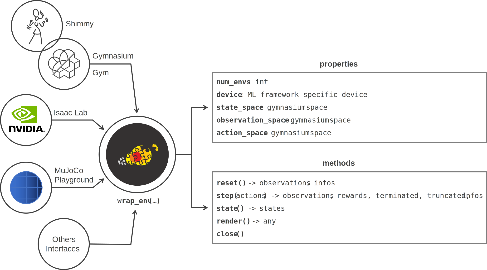
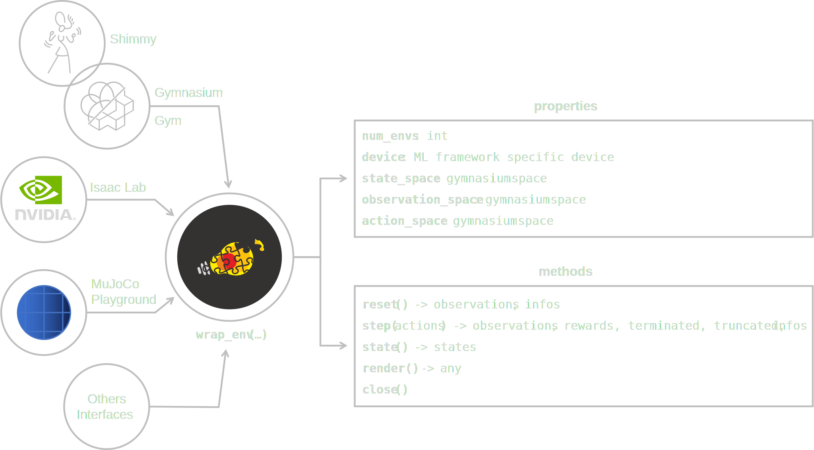

:tocdepth: 3

Wrapping (single-agent)
=======================

.. raw:: html

     

This library works with a common API to interact with the following RL environments:

* OpenAI `Gym <https://www.gymlibrary.dev>`_
* Farama `Gymnasium <https://gymnasium.farama.org/>`_ and `Shimmy <https://shimmy.farama.org/>`_
* NVIDIA `Isaac Lab <https://isaac-sim.github.io/IsaacLab/index.html>`_
* `ManiSkill <https://maniskill.readthedocs.io/en/latest/index.html>`_
* `MuJoCo Playground <https://playground.mujoco.org>`_

To operate with them and to support interoperability between these non-compatible interfaces, a **wrapping mechanism is provided** as shown in the diagram below

.. raw:: html

     

.. raw:: html

     

Usage
-----

.. tabs::

    .. tab:: Gymnasium / Gym

        .. tabs::

            .. tab:: Gymnasium

                .. tabs::

                    .. group-tab:: Single environment

                        .. tabs::

                            .. group-tab:: |_4| |pytorch| |_4|

                                .. literalinclude:: ../../snippets/wrapping.py
                                    :language: python
                                    :start-after: [pytorch-start-gymnasium]
                                    :end-before: [pytorch-end-gymnasium]

                            .. group-tab:: |_4| |jax| |_4|

                                .. literalinclude:: ../../snippets/wrapping.py
                                    :language: python
                                    :start-after: [jax-start-gymnasium]
                                    :end-before: [jax-end-gymnasium]

                            .. group-tab:: |_4| |warp| |_4|

                                .. literalinclude:: ../../snippets/wrapping.py
                                    :language: python
                                    :start-after: [warp-start-gymnasium]
                                    :end-before: [warp-end-gymnasium]

                    .. group-tab:: Vectorized environment

                        Visit the Gymnasium documentation (`Vector <https://gymnasium.farama.org/api/vector>`__) for more information about the creation and usage of vectorized environments

                        .. tabs::

                            .. group-tab:: |_4| |pytorch| |_4|

                                .. literalinclude:: ../../snippets/wrapping.py
                                    :language: python
                                    :start-after: [pytorch-start-gymnasium-vectorized]
                                    :end-before: [pytorch-end-gymnasium-vectorized]

                            .. group-tab:: |_4| |jax| |_4|

                                .. literalinclude:: ../../snippets/wrapping.py
                                    :language: python
                                    :start-after: [jax-start-gymnasium-vectorized]
                                    :end-before: [jax-end-gymnasium-vectorized]

                            .. group-tab:: |_4| |warp| |_4|

                                .. literalinclude:: ../../snippets/wrapping.py
                                    :language: python
                                    :start-after: [warp-start-gymnasium-vectorized]
                                    :end-before: [warp-end-gymnasium-vectorized]

            .. tab:: Gym

                .. tabs::

                    .. group-tab:: Single environment

                        .. tabs::

                            .. group-tab:: |_4| |pytorch| |_4|

                                .. literalinclude:: ../../snippets/wrapping.py
                                    :language: python
                                    :start-after: [pytorch-start-gym]
                                    :end-before: [pytorch-end-gym]

                            .. group-tab:: |_4| |jax| |_4|

                                .. literalinclude:: ../../snippets/wrapping.py
                                    :language: python
                                    :start-after: [jax-start-gym]
                                    :end-before: [jax-end-gym]

                    .. group-tab:: Vectorized environment

                        Visit the Gym documentation (`Vector <https://www.gymlibrary.dev/api/vector>`__) for more information about the creation and usage of vectorized environments

                        .. tabs::

                            .. group-tab:: |_4| |pytorch| |_4|

                                .. literalinclude:: ../../snippets/wrapping.py
                                    :language: python
                                    :start-after: [pytorch-start-gym-vectorized]
                                    :end-before: [pytorch-end-gym-vectorized]

                            .. group-tab:: |_4| |jax| |_4|

                                .. literalinclude:: ../../snippets/wrapping.py
                                    :language: python
                                    :start-after: [jax-start-gym-vectorized]
                                    :end-before: [jax-end-gym-vectorized]

    .. tab:: Isaac Lab

        .. tabs::

            .. group-tab:: |_4| |pytorch| |_4|

                .. literalinclude:: ../../snippets/wrapping.py
                    :language: python
                    :start-after: [pytorch-start-isaaclab]
                    :end-before: [pytorch-end-isaaclab]

            .. group-tab:: |_4| |jax| |_4|

                .. literalinclude:: ../../snippets/wrapping.py
                    :language: python
                    :start-after: [jax-start-isaaclab]
                    :end-before: [jax-end-isaaclab]

            .. group-tab:: |_4| |warp| |_4|

                .. literalinclude:: ../../snippets/wrapping.py
                    :language: python
                    :start-after: [warp-start-isaaclab]
                    :end-before: [warp-end-isaaclab]

    .. tab:: ManiSkill

        .. tabs::

            .. group-tab:: |_4| |pytorch| |_4|

                .. literalinclude:: ../../snippets/wrapping.py
                    :language: python
                    :start-after: [pytorch-start-mani-skill]
                    :end-before: [pytorch-end-mani-skill]

            .. group-tab:: |_4| |jax| |_4|

                .. literalinclude:: ../../snippets/wrapping.py
                    :language: python
                    :start-after: [jax-start-mani-skill]
                    :end-before: [jax-end-mani-skill]

            .. group-tab:: |_4| |warp| |_4|

                .. literalinclude:: ../../snippets/wrapping.py
                    :language: python
                    :start-after: [warp-start-mani-skill]
                    :end-before: [warp-end-mani-skill]

    .. tab:: Playground

        .. tabs::

            .. group-tab:: |_4| |pytorch| |_4|

                .. literalinclude:: ../../snippets/wrapping.py
                    :language: python
                    :start-after: [pytorch-start-playground]
                    :end-before: [pytorch-end-playground]

            .. group-tab:: |_4| |jax| |_4|

                .. literalinclude:: ../../snippets/wrapping.py
                    :language: python
                    :start-after: [jax-start-playground]
                    :end-before: [jax-end-playground]

            .. group-tab:: |_4| |warp| |_4|

                .. literalinclude:: ../../snippets/wrapping.py
                    :language: python
                    :start-after: [warp-start-playground]
                    :end-before: [warp-end-playground]

    .. tab:: Shimmy

        .. tabs::

            .. group-tab:: |_4| |pytorch| |_4|

                .. literalinclude:: ../../snippets/wrapping.py
                    :language: python
                    :start-after: [pytorch-start-shimmy]
                    :end-before: [pytorch-end-shimmy]

            .. group-tab:: |_4| |jax| |_4|

                .. literalinclude:: ../../snippets/wrapping.py
                    :language: python
                    :start-after: [jax-start-shimmy]
                    :end-before: [jax-end-shimmy]

            .. group-tab:: |_4| |warp| |_4|

                .. literalinclude:: ../../snippets/wrapping.py
                    :language: python
                    :start-after: [warp-start-shimmy]
                    :end-before: [warp-end-shimmy]

.. raw:: html

     

API (PyTorch)
-------------

.. autofunction:: skrl.envs.wrappers.torch.wrap_env

.. raw:: html

     

API (JAX)
---------

.. autofunction:: skrl.envs.wrappers.jax.wrap_env

.. raw:: html

     

API (Warp)
----------

.. autofunction:: skrl.envs.wrappers.warp.wrap_env

.. raw:: html

     

Internal API (PyTorch)
----------------------

.. autoclass:: skrl.envs.wrappers.torch.Wrapper
    :undoc-members:
    :show-inheritance:
    :members:

.. autoclass:: skrl.envs.wrappers.torch.gym_envs.GymWrapper
    :undoc-members:
    :show-inheritance:
    :members:

.. autoclass:: skrl.envs.wrappers.torch.gymnasium_envs.GymnasiumWrapper
    :undoc-members:
    :show-inheritance:
    :members:

.. autoclass:: skrl.envs.wrappers.torch.isaaclab_envs.IsaacLabWrapper
    :undoc-members:
    :show-inheritance:
    :members:

.. autoclass:: skrl.envs.wrappers.torch.mani_skill_envs.ManiSkillWrapper
    :undoc-members:
    :show-inheritance:
    :members:

.. autoclass:: skrl.envs.wrappers.torch.playground_envs.PlaygroundWrapper
    :undoc-members:
    :show-inheritance:
    :members:

.. raw:: html

     

Internal API (JAX)
------------------

.. autoclass:: skrl.envs.wrappers.jax.Wrapper
    :undoc-members:
    :show-inheritance:
    :members:

.. autoclass:: skrl.envs.wrappers.jax.gym_envs.GymWrapper
    :undoc-members:
    :show-inheritance:
    :members:

.. autoclass:: skrl.envs.wrappers.jax.gymnasium_envs.GymnasiumWrapper
    :undoc-members:
    :show-inheritance:
    :members:

.. autoclass:: skrl.envs.wrappers.jax.isaaclab_envs.IsaacLabWrapper
    :undoc-members:
    :show-inheritance:
    :members:

.. autoclass:: skrl.envs.wrappers.jax.mani_skill_envs.ManiSkillWrapper
    :undoc-members:
    :show-inheritance:
    :members:

.. autoclass:: skrl.envs.wrappers.jax.playground_envs.PlaygroundWrapper
    :undoc-members:
    :show-inheritance:
    :members:

.. raw:: html

     

Internal API (Warp)
-------------------

.. autoclass:: skrl.envs.wrappers.warp.Wrapper
    :undoc-members:
    :show-inheritance:
    :members:

.. autoclass:: skrl.envs.wrappers.warp.gymnasium_envs.GymnasiumWrapper
    :undoc-members:
    :show-inheritance:
    :members:

.. autoclass:: skrl.envs.wrappers.warp.isaaclab_envs.IsaacLabWrapper
    :undoc-members:
    :show-inheritance:
    :members:

.. autoclass:: skrl.envs.wrappers.warp.mani_skill_envs.ManiSkillWrapper
    :undoc-members:
    :show-inheritance:
    :members:

.. autoclass:: skrl.envs.wrappers.warp.playground_envs.PlaygroundWrapper
    :undoc-members:
    :show-inheritance:
    :members:
