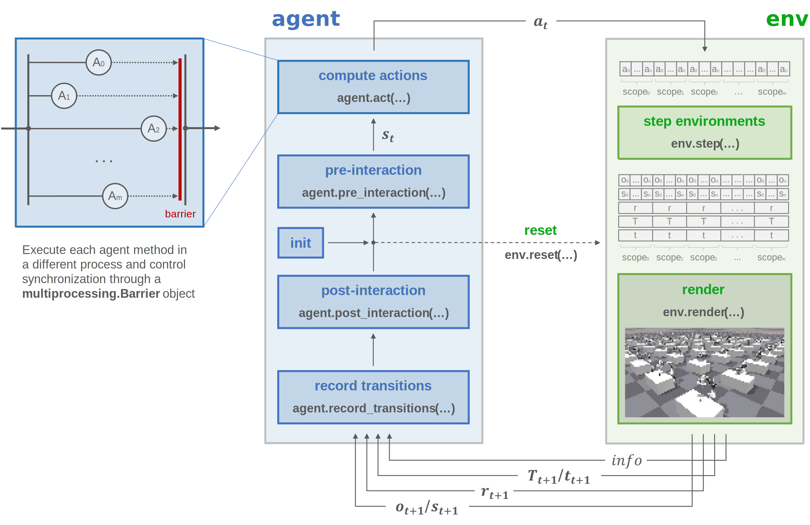
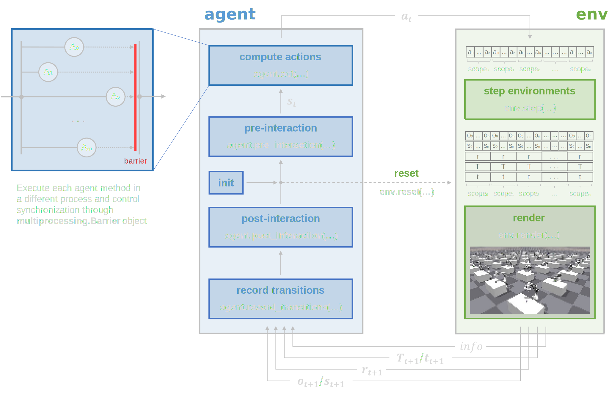

Parallel trainer
================

Train agents in parallel using multiple processes.

.. raw:: html

     

Concept
-------

.. raw:: html

     

Usage
-----

.. note::

    Each process adds a GPU memory overhead (~1GB, although it can be much higher) due to PyTorch's CUDA kernels. See PyTorch `Issue #12873 <https://github.com/pytorch/pytorch/issues/12873>`_ for more details

.. note::

    At the moment, only simultaneous training and evaluation of agents with local memory (no memory sharing) is implemented

.. tabs::

    .. tab:: Snippet

        .. literalinclude:: ../../snippets/trainer.py
            :language: python
            :linenos:
            :start-after: [start-parallel]
            :end-before: [end-parallel]

.. raw:: html

     

Configuration
-------------

.. literalinclude:: ../../../../skrl/trainers/torch/parallel.py
    :language: python
    :lines: 15-19
    :linenos:

.. raw:: html

     

API
---

.. autoclass:: skrl.trainers.torch.parallel.PARALLEL_TRAINER_DEFAULT_CONFIG

.. autoclass:: skrl.trainers.torch.parallel.ParallelTrainer
    :undoc-members:
    :show-inheritance:
    :inherited-members:
    :members:

    .. automethod:: __init__
