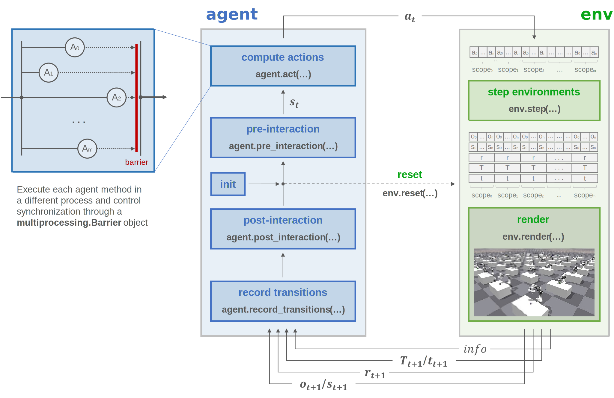
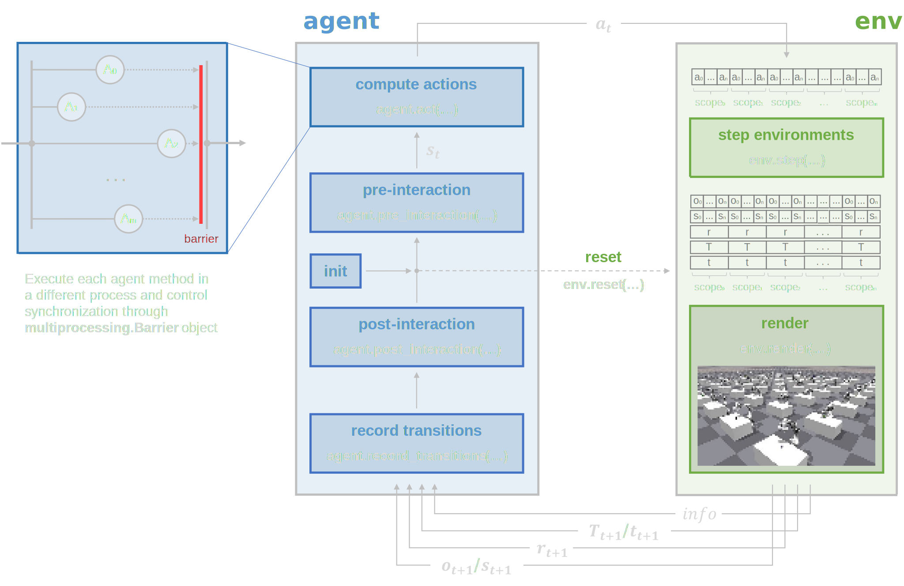

:tocdepth: 4

Parallel trainer
================

Train agents in parallel using multiple processes.

|br| |hr|

Concept
-------

.. raw:: html

     

Usage
-----

.. note::

    Each process adds a GPU memory overhead (~1GB, although it can be much higher) due to PyTorch's CUDA kernels.
    See PyTorch `Issue #12873 <https://github.com/pytorch/pytorch/issues/12873>`_ for more details.

.. note::

    At the moment, only simultaneous training and evaluation of agents with local memory (no memory sharing) is implemented.

.. tabs::

    .. group-tab:: |_4| |pytorch| |_4|

        .. literalinclude:: ../../snippets/trainer.py
            :language: python
            :start-after: [pytorch-start-parallel]
            :end-before: [pytorch-end-parallel]

|

Configuration
-------------

.. list-table::
    :header-rows: 1

    * - Dataclass
      - .. centered:: |_4| |pytorch| |_4|
      - .. centered:: |_4| |jax| |_4|
      - .. centered:: |_4| |warp| |_4|
    * - ``ParallelTrainerCfg``
      - :py:class:`~skrl.trainers.torch.parallel.ParallelTrainerCfg`
      -
      -

|

API
---

|

PyTorch
^^^^^^^

.. automodule:: skrl.trainers.torch.parallel
.. autosummary::
    :nosignatures:

    ParallelTrainerCfg
    ParallelTrainer

.. autoclass:: skrl.trainers.torch.parallel.ParallelTrainerCfg
    :undoc-members:
    :show-inheritance:
    :inherited-members:
    :members:

.. autoclass:: skrl.trainers.torch.parallel.ParallelTrainer
    :undoc-members:
    :show-inheritance:
    :inherited-members:
    :members:
