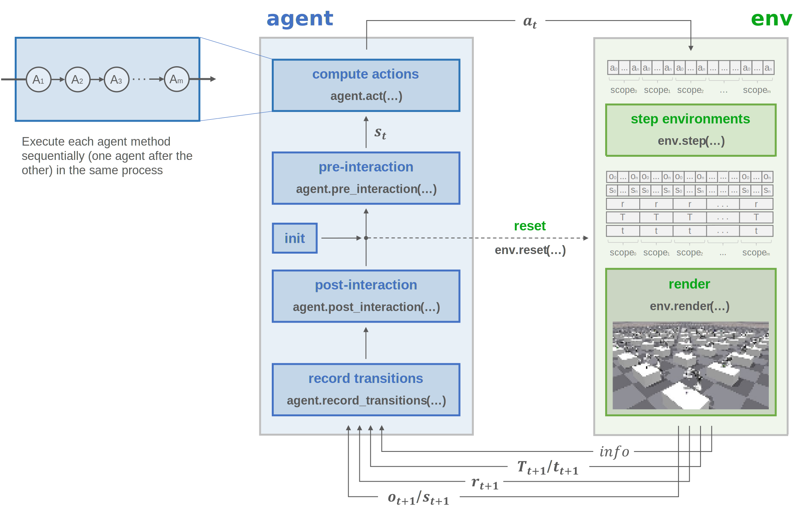
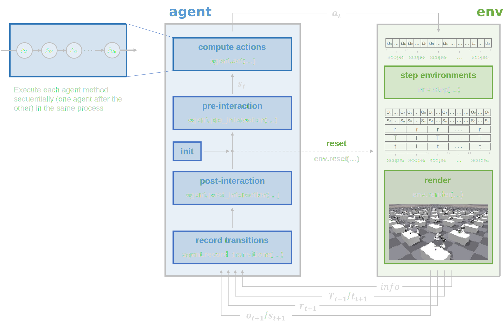

Sequential trainer
==================

Train agents sequentially (i.e., one after the other in each interaction with the environment).

.. raw:: html

     

Concept
-------

.. raw:: html

     

Usage
-----

.. tabs::

    .. group-tab:: |_4| |pytorch| |_4|

        .. literalinclude:: ../../snippets/trainer.py
            :language: python
            :start-after: [pytorch-start-sequential]
            :end-before: [pytorch-end-sequential]

    .. group-tab:: |_4| |jax| |_4|

        .. literalinclude:: ../../snippets/trainer.py
            :language: python
            :start-after: [jax-start-sequential]
            :end-before: [jax-end-sequential]

.. raw:: html

     

Configuration
-------------

.. literalinclude:: ../../../../skrl/trainers/torch/sequential.py
    :language: python
    :lines: 14-19
    :linenos:

.. raw:: html

     

API (PyTorch)
-------------

.. autoclass:: skrl.trainers.torch.sequential.SEQUENTIAL_TRAINER_DEFAULT_CONFIG

.. autoclass:: skrl.trainers.torch.sequential.SequentialTrainer
    :undoc-members:
    :show-inheritance:
    :inherited-members:
    :members:

    .. automethod:: __init__

.. raw:: html

     

API (JAX)
---------

.. autoclass:: skrl.trainers.jax.sequential.SEQUENTIAL_TRAINER_DEFAULT_CONFIG

.. autoclass:: skrl.trainers.jax.sequential.SequentialTrainer
    :undoc-members:
    :show-inheritance:
    :inherited-members:
    :members:

    .. automethod:: __init__
