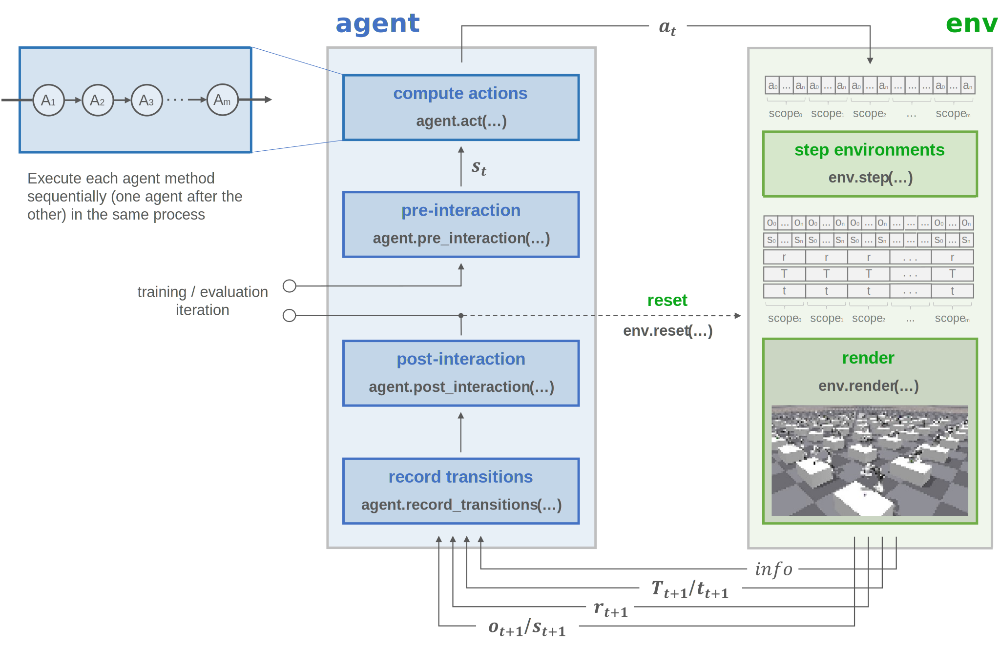
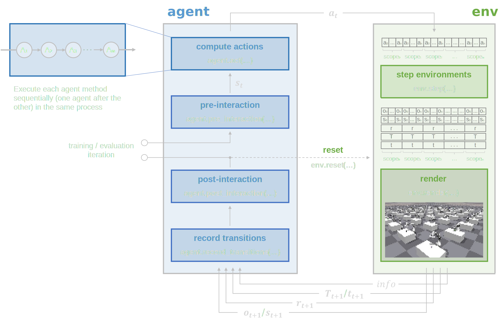

:tocdepth: 4

Step trainer
============

Train agents controlling the training/evaluation loop step-by-step.

|br| |hr|

Concept
-------

.. raw:: html

     

Usage
-----

.. tabs::

    .. group-tab:: |_4| |pytorch| |_4|

        .. literalinclude:: ../../snippets/trainer.py
            :language: python
            :start-after: [pytorch-start-step]
            :end-before: [pytorch-end-step]

    .. group-tab:: |_4| |jax| |_4|

        .. literalinclude:: ../../snippets/trainer.py
            :language: python
            :start-after: [jax-start-step]
            :end-before: [jax-end-step]

|

Configuration
-------------

.. list-table::
    :header-rows: 1

    * - Dataclass
      - .. centered:: |_4| |pytorch| |_4|
      - .. centered:: |_4| |jax| |_4|
      - .. centered:: |_4| |warp| |_4|
    * - ``StepTrainerCfg``
      - :py:class:`~skrl.trainers.torch.step.StepTrainerCfg`
      - :py:class:`~skrl.trainers.jax.step.StepTrainerCfg`
      -

|

API
---

|

PyTorch
^^^^^^^

.. automodule:: skrl.trainers.torch.step
.. autosummary::
    :nosignatures:

    StepTrainerCfg
    StepTrainer

.. autoclass:: skrl.trainers.torch.step.StepTrainerCfg
    :undoc-members:
    :show-inheritance:
    :inherited-members:
    :members:

.. autoclass:: skrl.trainers.torch.step.StepTrainer
    :undoc-members:
    :show-inheritance:
    :inherited-members:
    :members:

|

JAX
^^^

.. automodule:: skrl.trainers.jax.step
.. autosummary::
    :nosignatures:

    StepTrainerCfg
    StepTrainer

.. autoclass:: skrl.trainers.jax.step.StepTrainerCfg
    :undoc-members:
    :show-inheritance:
    :inherited-members:
    :members:

.. autoclass:: skrl.trainers.jax.step.StepTrainer
    :undoc-members:
    :show-inheritance:
    :inherited-members:
    :members:
