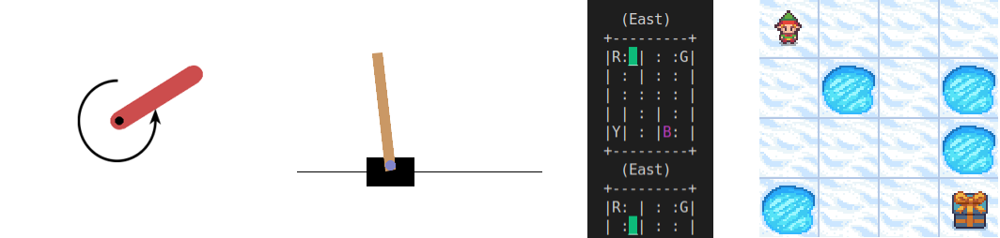
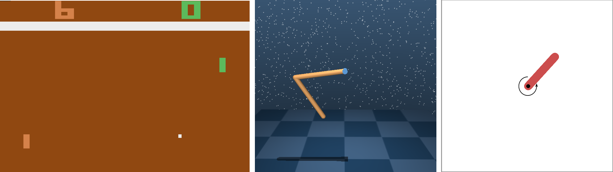
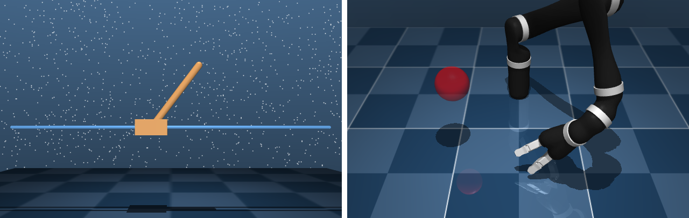
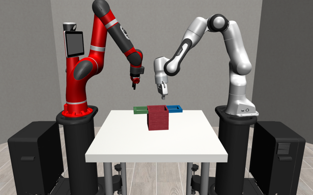
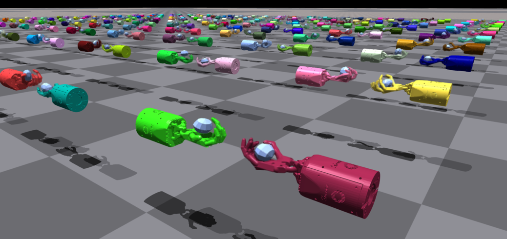
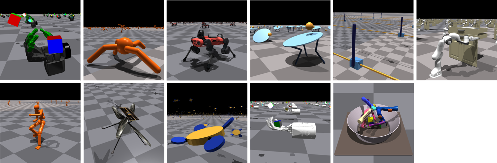
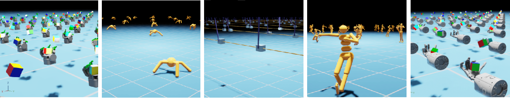
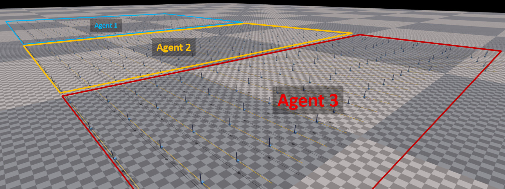

Examples
========

In this section, you will find a variety of examples that demonstrate how to use this library to solve reinforcement learning tasks. With the knowledge and skills you gain from trying these examples, you will be well on your way to using this library to solve your reinforcement learning problems.

.. note::

    It is recommended to use the table of contents in the right sidebar for better navigation.

.. raw:: html

     

**Gymnasium / Gym**
-------------------

.. raw:: html

     

Gymnasium / Gym environments
^^^^^^^^^^^^^^^^^^^^^^^^^^^^

Training/evaluation of an agent in `Gymnasium <https://gymnasium.farama.org/>`_ / `Gym <https://www.gymlibrary.dev/>`_ environments (**one agent, one environment**)

.. raw:: html

     

**Benchmark results** are listed in `Benchmark results #32 (Gymnasium/Gym) <https://github.com/Toni-SM/skrl/discussions/32#discussioncomment-4308370>`_

.. tabs::

    .. group-tab:: Gymnasium

        .. tabs::

            .. group-tab:: |_4| |pytorch| |_4|

                .. list-table::
                    :align: left
                    :header-rows: 1
                    :stub-columns: 1
                    :class: nowrap

                    * - Environment
                      - Script
                      - Checkpoint (Hugging Face)
                    * - CartPole
                      - :download:`torch_gymnasium_cartpole_cem.py <../examples/gymnasium/torch_gymnasium_cartpole_cem.py>`
                        |br| :download:`torch_gymnasium_cartpole_dqn.py <../examples/gymnasium/torch_gymnasium_cartpole_dqn.py>`
                      -
                    * - FrozenLake
                      - :download:`torch_gymnasium_frozen_lake_q_learning.py <../examples/gymnasium/torch_gymnasium_frozen_lake_q_learning.py>`
                      -
                    * - Pendulum
                      - :download:`torch_gymnasium_pendulum_ddpg.py <../examples/gymnasium/torch_gymnasium_pendulum_ddpg.py>`
                        |br| :download:`torch_gymnasium_pendulum_ppo.py <../examples/gymnasium/torch_gymnasium_pendulum_ppo.py>`
                        |br| :download:`torch_gymnasium_pendulum_sac.py <../examples/gymnasium/torch_gymnasium_pendulum_sac.py>`
                        |br| :download:`torch_gymnasium_pendulum_td3.py <../examples/gymnasium/torch_gymnasium_pendulum_td3.py>`
                      -
                    * - PendulumNoVel*
                        |br| (RNN / GRU / LSTM)
                      - :download:`torch_gymnasium_pendulumnovel_ddpg_rnn.py <../examples/gymnasium/torch_gymnasium_pendulumnovel_ddpg_rnn.py>`
                        |br| :download:`torch_gymnasium_pendulumnovel_ddpg_gru.py <../examples/gymnasium/torch_gymnasium_pendulumnovel_ddpg_gru.py>`
                        |br| :download:`torch_gymnasium_pendulumnovel_ddpg_lstm.py <../examples/gymnasium/torch_gymnasium_pendulumnovel_ddpg_lstm.py>`
                        |br| :download:`torch_gymnasium_pendulumnovel_ppo_rnn.py <../examples/gymnasium/torch_gymnasium_pendulumnovel_ppo_rnn.py>`
                        |br| :download:`torch_gymnasium_pendulumnovel_ppo_gru.py <../examples/gymnasium/torch_gymnasium_pendulumnovel_ppo_gru.py>`
                        |br| :download:`torch_gymnasium_pendulumnovel_ppo_lstm.py <../examples/gymnasium/torch_gymnasium_pendulumnovel_ppo_lstm.py>`
                        |br| :download:`torch_gymnasium_pendulumnovel_sac_rnn.py <../examples/gymnasium/torch_gymnasium_pendulumnovel_sac_rnn.py>`
                        |br| :download:`torch_gymnasium_pendulumnovel_sac_gru.py <../examples/gymnasium/torch_gymnasium_pendulumnovel_sac_gru.py>`
                        |br| :download:`torch_gymnasium_pendulumnovel_sac_lstm.py <../examples/gymnasium/torch_gymnasium_pendulumnovel_sac_lstm.py>`
                        |br| :download:`torch_gymnasium_pendulumnovel_td3_rnn.py <../examples/gymnasium/torch_gymnasium_pendulumnovel_td3_rnn.py>`
                        |br| :download:`torch_gymnasium_pendulumnovel_td3_gru.py <../examples/gymnasium/torch_gymnasium_pendulumnovel_td3_gru.py>`
                        |br| :download:`torch_gymnasium_pendulumnovel_td3_lstm.py <../examples/gymnasium/torch_gymnasium_pendulumnovel_td3_lstm.py>`
                      -
                    * - Taxi
                      - :download:`torch_gymnasium_taxi_sarsa.py <../examples/gymnasium/torch_gymnasium_taxi_sarsa.py>`
                      -

            .. group-tab:: |_4| |jax| |_4|

                .. list-table::
                    :align: left
                    :header-rows: 1
                    :stub-columns: 1
                    :class: nowrap

                    * - Environment
                      - Script
                      - Checkpoint (Hugging Face)
                    * - CartPole
                      - :download:`jax_gymnasium_cartpole_cem.py <../examples/gymnasium/jax_gymnasium_cartpole_cem.py>`
                        |br| :download:`jax_gymnasium_cartpole_dqn.py <../examples/gymnasium/jax_gymnasium_cartpole_dqn.py>`
                      -
                    * - FrozenLake
                      -
                      -
                    * - Pendulum
                      - :download:`jax_gymnasium_pendulum_ddpg.py <../examples/gymnasium/jax_gymnasium_pendulum_ddpg.py>`
                        |br| :download:`jax_gymnasium_pendulum_ppo.py <../examples/gymnasium/jax_gymnasium_pendulum_ppo.py>`
                        |br| :download:`jax_gymnasium_pendulum_sac.py <../examples/gymnasium/jax_gymnasium_pendulum_sac.py>`
                        |br| :download:`jax_gymnasium_pendulum_td3.py <../examples/gymnasium/jax_gymnasium_pendulum_td3.py>`
                      -
                    * - PendulumNoVel*
                        |br| (RNN / GRU / LSTM)
                      - |br|
                        |br|
                        |br|
                        |br|
                        |br|
                        |br|
                        |br|
                        |br|
                        |br|
                        |br|
                        |br|
                        |br|
                      -
                    * - Taxi
                      -
                      -

        .. note::

            (*) The examples use a wrapper around the original environment to mask the velocity in the observation. The intention is to make the MDP partially observable and to show the capabilities of recurrent neural networks

    .. group-tab:: Gym

        .. tabs::

            .. group-tab:: |_4| |pytorch| |_4|

                .. list-table::
                    :align: left
                    :header-rows: 1
                    :stub-columns: 1
                    :class: nowrap

                    * - Environment
                      - Script
                      - Checkpoint (Hugging Face)
                    * - CartPole
                      - :download:`torch_gym_cartpole_cem.py <../examples/gym/torch_gym_cartpole_cem.py>`
                        |br| :download:`torch_gym_cartpole_dqn.py <../examples/gym/torch_gym_cartpole_dqn.py>`
                      -
                    * - FrozenLake
                      - :download:`torch_gym_frozen_lake_q_learning.py <../examples/gym/torch_gym_frozen_lake_q_learning.py>`
                      -
                    * - Pendulum
                      - :download:`torch_gym_pendulum_ddpg.py <../examples/gym/torch_gym_pendulum_ddpg.py>`
                        |br| :download:`torch_gym_pendulum_ppo.py <../examples/gym/torch_gym_pendulum_ppo.py>`
                        |br| :download:`torch_gym_pendulum_sac.py <../examples/gym/torch_gym_pendulum_sac.py>`
                        |br| :download:`torch_gym_pendulum_td3.py <../examples/gym/torch_gym_pendulum_td3.py>`
                      -
                    * - PendulumNoVel*
                        |br| (RNN / GRU / LSTM)
                      - :download:`torch_gym_pendulumnovel_ddpg_rnn.py <../examples/gym/torch_gym_pendulumnovel_ddpg_rnn.py>`
                        |br| :download:`torch_gym_pendulumnovel_ddpg_gru.py <../examples/gym/torch_gym_pendulumnovel_ddpg_gru.py>`
                        |br| :download:`torch_gym_pendulumnovel_ddpg_lstm.py <../examples/gym/torch_gym_pendulumnovel_ddpg_lstm.py>`
                        |br| :download:`torch_gym_pendulumnovel_ppo_rnn.py <../examples/gym/torch_gym_pendulumnovel_ppo_rnn.py>`
                        |br| :download:`torch_gym_pendulumnovel_ppo_gru.py <../examples/gym/torch_gym_pendulumnovel_ppo_gru.py>`
                        |br| :download:`torch_gym_pendulumnovel_ppo_lstm.py <../examples/gym/torch_gym_pendulumnovel_ppo_lstm.py>`
                        |br| :download:`torch_gym_pendulumnovel_sac_rnn.py <../examples/gym/torch_gym_pendulumnovel_sac_rnn.py>`
                        |br| :download:`torch_gym_pendulumnovel_sac_gru.py <../examples/gym/torch_gym_pendulumnovel_sac_gru.py>`
                        |br| :download:`torch_gym_pendulumnovel_sac_lstm.py <../examples/gym/torch_gym_pendulumnovel_sac_lstm.py>`
                        |br| :download:`torch_gym_pendulumnovel_td3_rnn.py <../examples/gym/torch_gym_pendulumnovel_td3_rnn.py>`
                        |br| :download:`torch_gym_pendulumnovel_td3_gru.py <../examples/gym/torch_gym_pendulumnovel_td3_gru.py>`
                        |br| :download:`torch_gym_pendulumnovel_td3_lstm.py <../examples/gym/torch_gym_pendulumnovel_td3_lstm.py>`
                      -
                    * - Taxi
                      - :download:`torch_gym_taxi_sarsa.py <../examples/gym/torch_gym_taxi_sarsa.py>`
                      -

            .. group-tab:: |_4| |jax| |_4|

                .. list-table::
                    :align: left
                    :header-rows: 1
                    :stub-columns: 1
                    :class: nowrap

                    * - Environment
                      - Script
                      - Checkpoint (Hugging Face)
                    * - CartPole
                      - :download:`jax_gym_cartpole_cem.py <../examples/gym/jax_gym_cartpole_cem.py>`
                        |br| :download:`jax_gym_cartpole_dqn.py <../examples/gym/jax_gym_cartpole_dqn.py>`
                      -
                    * - FrozenLake
                      -
                      -
                    * - Pendulum
                      - :download:`jax_gym_pendulum_ddpg.py <../examples/gym/jax_gym_pendulum_ddpg.py>`
                        |br| :download:`jax_gym_pendulum_ppo.py <../examples/gym/jax_gym_pendulum_ppo.py>`
                        |br| :download:`jax_gym_pendulum_sac.py <../examples/gym/jax_gym_pendulum_sac.py>`
                        |br| :download:`jax_gym_pendulum_td3.py <../examples/gym/jax_gym_pendulum_td3.py>`
                      -
                    * - PendulumNoVel*
                        |br| (RNN / GRU / LSTM)
                      - |br|
                        |br|
                        |br|
                        |br|
                        |br|
                        |br|
                        |br|
                        |br|
                        |br|
                        |br|
                        |br|
                        |br|
                      -
                    * - Taxi
                      -
                      -

        .. note::

            (*) The examples use a wrapper around the original environment to mask the velocity in the observation. The intention is to make the MDP partially observable and to show the capabilities of recurrent neural networks

.. raw:: html

     

Gymnasium / Gym vectorized environments
^^^^^^^^^^^^^^^^^^^^^^^^^^^^^^^^^^^^^^^

Training/evaluation of an agent in `Gymnasium <https://gymnasium.farama.org/>`_ / `Gym <https://www.gymlibrary.dev/>`_ vectorized environments (**one agent, multiple independent copies of the same environment in parallel**)

.. tabs::

    .. group-tab:: Gymnasium

        .. tabs::

            .. group-tab:: |_4| |pytorch| |_4|

                .. list-table::
                    :align: left
                    :header-rows: 1
                    :stub-columns: 1
                    :class: nowrap

                    * - Environment
                      - Script
                      - Checkpoint (Hugging Face)
                    * - CartPole
                      - :download:`torch_gymnasium_cartpole_vector_dqn.py <../examples/gymnasium/torch_gymnasium_cartpole_vector_dqn.py>`
                      -
                    * - FrozenLake
                      - :download:`torch_gymnasium_frozen_lake_vector_q_learning.py <../examples/gymnasium/torch_gymnasium_frozen_lake_vector_q_learning.py>`
                      -
                    * - Pendulum
                      - :download:`torch_gymnasium_pendulum_vector_ddpg.py <../examples/gymnasium/torch_gymnasium_pendulum_vector_ddpg.py>`
                      -
                    * - Taxi
                      - :download:`torch_gymnasium_taxi_vector_sarsa.py <../examples/gymnasium/torch_gymnasium_taxi_vector_sarsa.py>`
                      -

            .. group-tab:: |_4| |jax| |_4|

                .. list-table::
                    :align: left
                    :header-rows: 1
                    :stub-columns: 1
                    :class: nowrap

                    * - Environment
                      - Script
                      - Checkpoint (Hugging Face)
                    * - CartPole
                      - :download:`jax_gymnasium_cartpole_vector_dqn.py <../examples/gymnasium/jax_gymnasium_cartpole_vector_dqn.py>`
                      -
                    * - FrozenLake
                      -
                      -
                    * - Pendulum
                      - :download:`jax_gymnasium_pendulum_vector_ddpg.py <../examples/gymnasium/jax_gymnasium_pendulum_vector_ddpg.py>`
                      -
                    * - Taxi
                      -
                      -

    .. group-tab:: Gym

        .. tabs::

            .. group-tab:: |_4| |pytorch| |_4|

                .. list-table::
                    :align: left
                    :header-rows: 1
                    :stub-columns: 1
                    :class: nowrap

                    * - Environment
                      - Script
                      - Checkpoint (Hugging Face)
                    * - CartPole
                      - :download:`torch_gym_cartpole_vector_dqn.py <../examples/gym/torch_gym_cartpole_vector_dqn.py>`
                      -
                    * - FrozenLake
                      - :download:`torch_gym_frozen_lake_vector_q_learning.py <../examples/gym/torch_gym_frozen_lake_vector_q_learning.py>`
                      -
                    * - Pendulum
                      - :download:`torch_gym_pendulum_vector_ddpg.py <../examples/gym/torch_gym_pendulum_vector_ddpg.py>`
                      -
                    * - Taxi
                      - :download:`torch_gym_taxi_vector_sarsa.py <../examples/gym/torch_gym_taxi_vector_sarsa.py>`
                      -

            .. group-tab:: |_4| |jax| |_4|

                .. list-table::
                    :align: left
                    :header-rows: 1
                    :stub-columns: 1
                    :class: nowrap

                    * - Environment
                      - Script
                      - Checkpoint (Hugging Face)
                    * - CartPole
                      - :download:`jax_gym_cartpole_vector_dqn.py <../examples/gym/jax_gym_cartpole_vector_dqn.py>`
                      -
                    * - FrozenLake
                      -
                      -
                    * - Pendulum
                      - :download:`jax_gym_pendulum_vector_ddpg.py <../examples/gym/jax_gym_pendulum_vector_ddpg.py>`
                      -
                    * - Taxi
                      -
                      -

.. raw:: html

     

Shimmy (API conversion)
^^^^^^^^^^^^^^^^^^^^^^^

The following examples show the training in several popular environments (Atari, DeepMind Control and OpenAI Gym) that have been converted to the Gymnasium API using the `Shimmy <https://github.com/Farama-Foundation/Shimmy>`_ (API conversion tool) package

.. note::

    From **skrl**, no extra implementation is necessary, since it fully supports Gymnasium API

.. note::

    Because the Gymnasium API requires that the rendering mode be specified during the initialization of the environment, it is not enough to set the :literal:`headless` option in the trainer configuration to render the environment. In this case, it is necessary to call the :literal:`gymnasium.make` function using :literal:`render_mode="human"` or any other supported option

.. tabs::

    .. group-tab:: |_4| |pytorch| |_4|

        .. list-table::
            :align: left
            :header-rows: 1
            :stub-columns: 1
            :class: nowrap

            * - Environment
              - Script
              - Checkpoint (Hugging Face)
            * - Atari: Pong
              - :download:`torch_shimmy_atari_pong_dqn.py <../examples/shimmy/torch_shimmy_atari_pong_dqn.py>`
              -
            * - DeepMind: Acrobot
              - :download:`torch_shimmy_dm_control_acrobot_swingup_sparse_sac.py <../examples/shimmy/torch_shimmy_dm_control_acrobot_swingup_sparse_sac.py>`
              -
            * - Gym-v21 compatibility
              - :download:`torch_shimmy_openai_gym_compatibility_pendulum_ddpg.py <../examples/shimmy/torch_shimmy_openai_gym_compatibility_pendulum_ddpg.py>`
              -

    .. group-tab:: |_4| |jax| |_4|

        .. list-table::
            :align: left
            :header-rows: 1
            :stub-columns: 1
            :class: nowrap

            * - Environment
              - Script
              - Checkpoint (Hugging Face)
            * - Atari: Pong
              - :download:`jax_shimmy_atari_pong_dqn.py <../examples/shimmy/jax_shimmy_atari_pong_dqn.py>`
              -
            * - DeepMind: Acrobot
              - :download:`jax_shimmy_dm_control_acrobot_swingup_sparse_sac.py <../examples/shimmy/jax_shimmy_dm_control_acrobot_swingup_sparse_sac.py>`
              -
            * - Gym-v21 compatibility
              - :download:`jax_shimmy_openai_gym_compatibility_pendulum_ddpg.py <../examples/shimmy/jax_shimmy_openai_gym_compatibility_pendulum_ddpg.py>`
              -

.. raw:: html

     

**Other supported APIs**
------------------------

.. raw:: html

     

DeepMind environments
^^^^^^^^^^^^^^^^^^^^^

These examples perform the training of one agent in a DeepMind environment (**one agent, one environment**)

.. raw:: html

     

.. tabs::

    .. group-tab:: |_4| |pytorch| |_4|

        .. list-table::
            :align: left
            :header-rows: 1
            :stub-columns: 1
            :class: nowrap

            * - Environment
              - Script
              - Checkpoint (Hugging Face)
            * - Control: Cartpole SwingUp
              - :download:`dm_suite_cartpole_swingup_ddpg.py <../examples/deepmind/dm_suite_cartpole_swingup_ddpg.py>`
              -
            * - Manipulation: Reach Site Vision
              - :download:`dm_manipulation_stack_sac.py <../examples/deepmind/dm_manipulation_stack_sac.py>`
              -

.. raw:: html

     

Robosuite environments
^^^^^^^^^^^^^^^^^^^^^^

These examples perform the training of one agent in a robosuite environment (**one agent, one environment**)

.. raw:: html

     

.. tabs::

    .. group-tab:: |_4| |pytorch| |_4|

        .. list-table::
            :align: left
            :header-rows: 1
            :stub-columns: 1
            :class: nowrap

            * - Environment
              - Script
              - Checkpoint (Hugging Face)
            * - TwoArmLift
              - :download:`td3_robosuite_two_arm_lift.py <../examples/robosuite/td3_robosuite_two_arm_lift.py>`
              -

.. raw:: html

     

Bi-DexHands environments
^^^^^^^^^^^^^^^^^^^^^^^^

Multi-agent training/evaluation in a `Bi-DexHands <https://github.com/PKU-MARL/DexterousHands>`_ environment

.. raw:: html

     

.. tabs::

    .. group-tab:: |_4| |pytorch| |_4|

        .. list-table::
            :align: left
            :header-rows: 1
            :stub-columns: 1
            :class: nowrap

            * - Environment
              - Script
              - Checkpoint (Hugging Face)
            * - ShadowHandOver
              - :download:`torch_bidexhands_shadow_hand_over_ippo.py <../examples/bidexhands/torch_bidexhands_shadow_hand_over_ippo.py>`
                |br| :download:`torch_bidexhands_shadow_hand_over_mappo.py <../examples/bidexhands/torch_bidexhands_shadow_hand_over_mappo.py>`
              -

    .. group-tab:: |_4| |jax| |_4|

        .. list-table::
            :align: left
            :header-rows: 1
            :stub-columns: 1
            :class: nowrap

            * - Environment
              - Script
              - Checkpoint (Hugging Face)
            * - ShadowHandOver
              - :download:`jax_bidexhands_shadow_hand_over_ippo.py <../examples/bidexhands/jax_bidexhands_shadow_hand_over_ippo.py>`
                |br| :download:`jax_bidexhands_shadow_hand_over_mappo.py <../examples/bidexhands/jax_bidexhands_shadow_hand_over_mappo.py>`
              -

.. raw:: html

     

**NVIDIA Isaac Gym preview**
----------------------------

.. raw:: html

     

Isaac Gym environments
^^^^^^^^^^^^^^^^^^^^^^

Training/evaluation of an agent in `Isaac Gym environments <https://github.com/NVIDIA-Omniverse/IsaacGymEnvs>`_ (**one agent, multiple environments**)

.. raw:: html

     

The agent configuration is mapped, as far as possible, from the `IsaacGymEnvs configuration <https://github.com/NVIDIA-Omniverse/IsaacGymEnvs/tree/main/isaacgymenvs/cfg/train>`_ for rl_games. Shared models or separated models are used depending on the value of the :literal:`network.separate` variable. The following list shows the mapping between the two configurations:

.. tabs::

    .. tab:: PPO

        .. code-block:: bash

            # memory
            memory_size = horizon_length

            # agent
            rollouts = horizon_length
            learning_epochs = mini_epochs
            mini_batches = horizon_length * num_actors / minibatch_size
            discount_factor = gamma
            lambda = tau
            learning_rate = learning_rate
            learning_rate_scheduler = skrl.resources.schedulers.torch.KLAdaptiveLR
            learning_rate_scheduler_kwargs = {"kl_threshold": kl_threshold}
            random_timesteps = 0
            learning_starts = 0
            grad_norm_clip = grad_norm  # if truncate_grads else 0
            ratio_clip = e_clip
            value_clip = e_clip
            clip_predicted_values = clip_value
            entropy_loss_scale = entropy_coef
            value_loss_scale = 0.5 * critic_coef
            kl_threshold = 0
            rewards_shaper = lambda rewards, timestep, timesteps: rewards * scale_value

            # trainer
            timesteps = horizon_length * max_epochs

    .. tab:: DDPG / TD3 / SAC

        .. code-block:: bash

            # memory
            memory_size = replay_buffer_size / num_envs

            # agent
            gradient_steps = 1
            batch_size = batch_size
            discount_factor = gamma
            polyak = critic_tau
            actor_learning_rate = actor_lr
            critic_learning_rate = critic_lr
            random_timesteps = num_warmup_steps * num_steps_per_episode
            learning_starts = num_warmup_steps * num_steps_per_episode
            grad_norm_clip = 0
            learn_entropy = learnable_temperature
            entropy_learning_rate = alpha_lr
            initial_entropy_value = init_alpha
            target_entropy = None
            rewards_shaper = lambda rewards, timestep, timesteps: rewards * scale_value

            # trainer
            timesteps = num_steps_per_episode * max_epochs

**Benchmark results** are listed in `Benchmark results #32 (NVIDIA Isaac Gym) <https://github.com/Toni-SM/skrl/discussions/32#discussioncomment-3774815>`_

.. note::

    Isaac Gym environments implement a functionality to get their configuration from the command line. Because of this feature, setting the :literal:`headless` option from the trainer configuration will not work. In this case, it is necessary to invoke the scripts as follows: :literal:`python script.py headless=True` for Isaac Gym environments (preview 3 and preview 4) or :literal:`python script.py --headless` for Isaac Gym environments (preview 2)

.. tabs::

    .. group-tab:: |_4| |pytorch| |_4|

        .. list-table::
            :align: left
            :header-rows: 1
            :stub-columns: 1
            :class: nowrap

            * - Environment
              - Script
              - Checkpoint (Hugging Face)
            * - AllegroHand
              - :download:`torch_allegro_hand_ppo.py <../examples/isaacgym/torch_allegro_hand_ppo.py>`
              -
            * - Ant
              - :download:`torch_ant_ppo.py <../examples/isaacgym/torch_ant_ppo.py>`
                |br| :download:`torch_ant_ddpg.py <../examples/isaacgym/torch_ant_ddpg.py>`
                |br| :download:`torch_ant_td3.py <../examples/isaacgym/torch_ant_td3.py>`
                |br| :download:`torch_ant_sac.py <../examples/isaacgym/torch_ant_sac.py>`
              - `IsaacGymEnvs-Ant-PPO <https://huggingface.co/skrl/IsaacGymEnvs-Ant-PPO>`_
                |br|
                |br|
                |br|
            * - Anymal
              - :download:`torch_anymal_ppo.py <../examples/isaacgym/torch_anymal_ppo.py>`
              - `IsaacGymEnvs-Anymal-PPO <https://huggingface.co/skrl/IsaacGymEnvs-Anymal-PPO>`_
            * - AnymalTerrain
              - :download:`torch_anymal_terrain_ppo.py <../examples/isaacgym/torch_anymal_terrain_ppo.py>`
              - `IsaacGymEnvs-AnymalTerrain-PPO <https://huggingface.co/skrl/IsaacGymEnvs-AnymalTerrain-PPO>`_
            * - BallBalance
              - :download:`torch_ball_balance_ppo.py <../examples/isaacgym/torch_ball_balance_ppo.py>`
              - `IsaacGymEnvs-BallBalance-PPO <https://huggingface.co/skrl/IsaacGymEnvs-BallBalance-PPO>`_
            * - Cartpole
              - :download:`torch_cartpole_ppo.py <../examples/isaacgym/torch_cartpole_ppo.py>`
              - `IsaacGymEnvs-Cartpole-PPO <https://huggingface.co/skrl/IsaacGymEnvs-Cartpole-PPO>`_
            * - FactoryTaskNutBoltPick
              - :download:`torch_factory_task_nut_bolt_pick_ppo.py <../examples/isaacgym/torch_factory_task_nut_bolt_pick_ppo.py>`
              - `IsaacGymEnvs-FactoryTaskNutBoltPick-PPO <https://huggingface.co/skrl/IsaacGymEnvs-FactoryTaskNutBoltPick-PPO>`_
            * - FactoryTaskNutBoltPlace
              - :download:`torch_factory_task_nut_bolt_place_ppo.py <../examples/isaacgym/torch_factory_task_nut_bolt_place_ppo.py>`
              - `IsaacGymEnvs-FactoryTaskNutBoltPlace-PPO <https://huggingface.co/skrl/IsaacGymEnvs-FactoryTaskNutBoltPlace-PPO>`_
            * - FactoryTaskNutBoltScrew
              - :download:`torch_factory_task_nut_bolt_screw_ppo.py <../examples/isaacgym/torch_factory_task_nut_bolt_screw_ppo.py>`
              - `IsaacGymEnvs-FactoryTaskNutBoltScrew-PPO <https://huggingface.co/skrl/IsaacGymEnvs-FactoryTaskNutBoltScrew-PPO>`_
            * - FrankaCabinet
              - :download:`torch_franka_cabinet_ppo.py <../examples/isaacgym/torch_franka_cabinet_ppo.py>`
              - `IsaacGymEnvs-FrankaCabinet-PPO <https://huggingface.co/skrl/IsaacGymEnvs-FrankaCabinet-PPO>`_
            * - FrankaCubeStack
              - :download:`torch_franka_cube_stack_ppo.py <../examples/isaacgym/torch_franka_cube_stack_ppo.py>`
              -
            * - Humanoid
              - :download:`torch_humanoid_ppo.py <../examples/isaacgym/torch_humanoid_ppo.py>`
              - `IsaacGymEnvs-Humanoid-PPO <https://huggingface.co/skrl/IsaacGymEnvs-Humanoid-PPO>`_
            * - Humanoid-AMP
              - :download:`torch_humanoid_amp.py <../examples/isaacgym/torch_humanoid_amp.py>`
              -
            * - Ingenuity
              - :download:`torch_ingenuity_ppo.py <../examples/isaacgym/torch_ingenuity_ppo.py>`
              - `IsaacGymEnvs-Ingenuity-PPO <https://huggingface.co/skrl/IsaacGymEnvs-Ingenuity-PPO>`_
            * - Quadcopter
              - :download:`torch_quadcopter_ppo.py <../examples/isaacgym/torch_quadcopter_ppo.py>`
              - `IsaacGymEnvs-Quadcopter-PPO <https://huggingface.co/skrl/IsaacGymEnvs-Quadcopter-PPO>`_
            * - ShadowHand
              - :download:`torch_shadow_hand_ppo.py <../examples/isaacgym/torch_shadow_hand_ppo.py>`
              -
            * - Trifinger
              - :download:`torch_trifinger_ppo.py <../examples/isaacgym/torch_trifinger_ppo.py>`
              -

    .. group-tab:: |_4| |jax| |_4|

        .. list-table::
            :align: left
            :header-rows: 1
            :stub-columns: 1
            :class: nowrap

            * - Environment
              - Script
              - Checkpoint (Hugging Face)
            * - AllegroHand
              - :download:`jax_allegro_hand_ppo.py <../examples/isaacgym/jax_allegro_hand_ppo.py>`
              -
            * - Ant
              - :download:`jax_ant_ppo.py <../examples/isaacgym/jax_ant_ppo.py>`
                |br| :download:`jax_ant_ddpg.py <../examples/isaacgym/jax_ant_ddpg.py>`
                |br| :download:`jax_ant_td3.py <../examples/isaacgym/jax_ant_sac.py>`
                |br| :download:`jax_ant_sac.py <../examples/isaacgym/jax_ant_td3.py>`
              - `IsaacGymEnvs-Ant-PPO <https://huggingface.co/skrl/IsaacGymEnvs-Ant-PPO>`_
                |br|
                |br|
                |br|
            * - Anymal
              - :download:`jax_anymal_ppo.py <../examples/isaacgym/jax_anymal_ppo.py>`
              - `IsaacGymEnvs-Anymal-PPO <https://huggingface.co/skrl/IsaacGymEnvs-Anymal-PPO>`_
            * - AnymalTerrain
              - :download:`jax_anymal_terrain_ppo.py <../examples/isaacgym/jax_anymal_terrain_ppo.py>`
              - `IsaacGymEnvs-AnymalTerrain-PPO <https://huggingface.co/skrl/IsaacGymEnvs-AnymalTerrain-PPO>`_
            * - BallBalance
              - :download:`jax_ball_balance_ppo.py <../examples/isaacgym/jax_ball_balance_ppo.py>`
              - `IsaacGymEnvs-BallBalance-PPO <https://huggingface.co/skrl/IsaacGymEnvs-BallBalance-PPO>`_
            * - Cartpole
              - :download:`jax_cartpole_ppo.py <../examples/isaacgym/jax_cartpole_ppo.py>`
              - `IsaacGymEnvs-Cartpole-PPO <https://huggingface.co/skrl/IsaacGymEnvs-Cartpole-PPO>`_
            * - FactoryTaskNutBoltPick
              - :download:`jax_factory_task_nut_bolt_pick_ppo.py <../examples/isaacgym/jax_factory_task_nut_bolt_pick_ppo.py>`
              - `IsaacGymEnvs-FactoryTaskNutBoltPick-PPO <https://huggingface.co/skrl/IsaacGymEnvs-FactoryTaskNutBoltPick-PPO>`_
            * - FactoryTaskNutBoltPlace
              - :download:`jax_factory_task_nut_bolt_place_ppo.py <../examples/isaacgym/jax_factory_task_nut_bolt_place_ppo.py>`
              - `IsaacGymEnvs-FactoryTaskNutBoltPlace-PPO <https://huggingface.co/skrl/IsaacGymEnvs-FactoryTaskNutBoltPlace-PPO>`_
            * - FactoryTaskNutBoltScrew
              - :download:`jax_factory_task_nut_bolt_screw_ppo.py <../examples/isaacgym/jax_factory_task_nut_bolt_screw_ppo.py>`
              - `IsaacGymEnvs-FactoryTaskNutBoltScrew-PPO <https://huggingface.co/skrl/IsaacGymEnvs-FactoryTaskNutBoltScrew-PPO>`_
            * - FrankaCabinet
              - :download:`jax_franka_cabinet_ppo.py <../examples/isaacgym/jax_franka_cabinet_ppo.py>`
              - `IsaacGymEnvs-FrankaCabinet-PPO <https://huggingface.co/skrl/IsaacGymEnvs-FrankaCabinet-PPO>`_
            * - FrankaCubeStack
              - :download:`jax_franka_cube_stack_ppo.py <../examples/isaacgym/jax_franka_cube_stack_ppo.py>`
              -
            * - Humanoid
              - :download:`jax_humanoid_ppo.py <../examples/isaacgym/jax_humanoid_ppo.py>`
              - `IsaacGymEnvs-Humanoid-PPO <https://huggingface.co/skrl/IsaacGymEnvs-Humanoid-PPO>`_
            * - Humanoid-AMP
              -
              -
            * - Ingenuity
              - :download:`jax_ingenuity_ppo.py <../examples/isaacgym/jax_ingenuity_ppo.py>`
              - `IsaacGymEnvs-Ingenuity-PPO <https://huggingface.co/skrl/IsaacGymEnvs-Ingenuity-PPO>`_
            * - Quadcopter
              - :download:`jax_quadcopter_ppo.py <../examples/isaacgym/jax_quadcopter_ppo.py>`
              - `IsaacGymEnvs-Quadcopter-PPO <https://huggingface.co/skrl/IsaacGymEnvs-Quadcopter-PPO>`_
            * - ShadowHand
              - :download:`jax_shadow_hand_ppo.py <../examples/isaacgym/jax_shadow_hand_ppo.py>`
              -
            * - Trifinger
              - :download:`jax_trifinger_ppo.py <../examples/isaacgym/jax_trifinger_ppo.py>`
              -

.. raw:: html

     

**NVIDIA Isaac Orbit**
----------------------

.. raw:: html

     

Isaac Orbit environments
^^^^^^^^^^^^^^^^^^^^^^^^

Training/evaluation of an agent in `Isaac Orbit environments <https://isaac-orbit.github.io/orbit/index.html>`_ (**one agent, multiple environments**)

.. image:: ../_static/imgs/example_isaac_orbit.png
    :width: 100%
    :align: center
    :alt: Isaac Orbit environments

.. raw:: html

     

The agent configuration is mapped, as far as possible, from the `Isaac Orbit configuration <https://github.com/NVIDIA-Omniverse/Orbit/tree/main/source/extensions/omni.isaac.orbit_envs/data/rl_games>`_ for rl_games. Shared models or separated models are used depending on the value of the :literal:`network.separate` variable. The following list shows the mapping between the two configurations:

.. tabs::

    .. tab:: PPO

        .. code-block:: bash

            # memory
            memory_size = horizon_length

            # agent
            rollouts = horizon_length
            learning_epochs = mini_epochs
            mini_batches = horizon_length * num_actors / minibatch_size
            discount_factor = gamma
            lambda = tau
            learning_rate = learning_rate
            learning_rate_scheduler = skrl.resources.schedulers.torch.KLAdaptiveLR
            learning_rate_scheduler_kwargs = {"kl_threshold": kl_threshold}
            random_timesteps = 0
            learning_starts = 0
            grad_norm_clip = grad_norm  # if truncate_grads else 0
            ratio_clip = e_clip
            value_clip = e_clip
            clip_predicted_values = clip_value
            entropy_loss_scale = entropy_coef
            value_loss_scale = 0.5 * critic_coef
            kl_threshold = 0
            rewards_shaper = lambda rewards, timestep, timesteps: rewards * scale_value

            # trainer
            timesteps = horizon_length * max_epochs

    .. tab:: DDPG / TD3 / SAC

        .. code-block:: bash

            # memory
            memory_size = replay_buffer_size / num_envs

            # agent
            gradient_steps = 1
            batch_size = batch_size
            discount_factor = gamma
            polyak = critic_tau
            actor_learning_rate = actor_lr
            critic_learning_rate = critic_lr
            random_timesteps = num_warmup_steps * num_steps_per_episode
            learning_starts = num_warmup_steps * num_steps_per_episode
            grad_norm_clip = 0
            learn_entropy = learnable_temperature
            entropy_learning_rate = alpha_lr
            initial_entropy_value = init_alpha
            target_entropy = None
            rewards_shaper = lambda rewards, timestep, timesteps: rewards * scale_value

            # trainer
            timesteps = num_steps_per_episode * max_epochs

**Benchmark results** are listed in `Benchmark results #32 (NVIDIA Isaac Orbit) <https://github.com/Toni-SM/skrl/discussions/32#discussioncomment-4744446>`_

.. note::

    Isaac Orbit environments implement a functionality to get their configuration from the command line. Because of this feature, setting the :literal:`headless` option from the trainer configuration will not work. In this case, it is necessary to invoke the scripts as follows: :literal:`orbit -p script.py --headless`

.. tabs::

    .. group-tab:: |_4| |pytorch| |_4|

        .. list-table::
            :align: left
            :header-rows: 1
            :stub-columns: 1
            :class: nowrap

            * - Environment
              - Script
              - Checkpoint (Hugging Face)
            * - Isaac-Ant-v0
              - :download:`torch_ant_ppo.py <../examples/isaacorbit/torch_ant_ppo.py>`
                |br| :download:`torch_ant_ddpg.py <../examples/isaacorbit/torch_ant_ddpg.py>`
                |br| :download:`torch_ant_td3.py <../examples/isaacorbit/torch_ant_td3.py>`
                |br| :download:`torch_ant_sac.py <../examples/isaacorbit/torch_ant_sac.py>`
              - `IsaacOrbit-Isaac-Ant-v0-PPO <https://huggingface.co/skrl/IsaacOrbit-Isaac-Ant-v0-PPO>`_
                |br|
                |br|
                |br|
            * - Isaac-Cartpole-v0
              - :download:`torch_cartpole_ppo.py <../examples/isaacorbit/torch_cartpole_ppo.py>`
              - `IsaacOrbit-Isaac-Cartpole-v0-PPO <https://huggingface.co/skrl/IsaacOrbit-Isaac-Cartpole-v0-PPO>`_
            * - Isaac-Humanoid-v0
              - :download:`torch_humanoid_ppo.py <../examples/isaacorbit/torch_humanoid_ppo.py>`
              - `IsaacOrbit-Isaac-Humanoid-v0-PPO <https://huggingface.co/skrl/IsaacOrbit-Isaac-Humanoid-v0-PPO>`_
            * - Isaac-Lift-Franka-v0
              - :download:`torch_lift_franka_ppo.py <../examples/isaacorbit/torch_lift_franka_ppo.py>`
              - `IsaacOrbit-Isaac-Lift-Franka-v0-PPO <https://huggingface.co/skrl/IsaacOrbit-Isaac-Lift-Franka-v0-PPO>`_
            * - Isaac-Reach-Franka-v0
              - :download:`torch_reach_franka_ppo.py <../examples/isaacorbit/torch_reach_franka_ppo.py>`
              - `IsaacOrbit-Isaac-Reach-Franka-v0-PPO <https://huggingface.co/skrl/IsaacOrbit-Isaac-Reach-Franka-v0-PPO>`_
            * - Isaac-Velocity-Anymal-C-v0
              - :download:`torch_velocity_anymal_c_ppo.py <../examples/isaacorbit/torch_velocity_anymal_c_ppo.py>`
              -

    .. group-tab:: |_4| |jax| |_4|

        .. list-table::
            :align: left
            :header-rows: 1
            :stub-columns: 1
            :class: nowrap

            * - Environment
              - Script
              - Checkpoint (Hugging Face)
            * - Isaac-Ant-v0
              - :download:`jax_ant_ppo.py <../examples/isaacorbit/jax_ant_ppo.py>`
                |br| :download:`jax_ant_ddpg.py <../examples/isaacorbit/jax_ant_ddpg.py>`
                |br| :download:`jax_ant_td3.py <../examples/isaacorbit/jax_ant_td3.py>`
                |br| :download:`jax_ant_sac.py <../examples/isaacorbit/jax_ant_sac.py>`
              - `IsaacOrbit-Isaac-Ant-v0-PPO <https://huggingface.co/skrl/IsaacOrbit-Isaac-Ant-v0-PPO>`_
                |br|
                |br|
                |br|
            * - Isaac-Cartpole-v0
              - :download:`jax_cartpole_ppo.py <../examples/isaacorbit/jax_cartpole_ppo.py>`
              - `IsaacOrbit-Isaac-Cartpole-v0-PPO <https://huggingface.co/skrl/IsaacOrbit-Isaac-Cartpole-v0-PPO>`_
            * - Isaac-Humanoid-v0
              - :download:`jax_humanoid_ppo.py <../examples/isaacorbit/jax_humanoid_ppo.py>`
              - `IsaacOrbit-Isaac-Humanoid-v0-PPO <https://huggingface.co/skrl/IsaacOrbit-Isaac-Humanoid-v0-PPO>`_
            * - Isaac-Lift-Franka-v0
              - :download:`jax_lift_franka_ppo.py <../examples/isaacorbit/jax_lift_franka_ppo.py>`
              - `IsaacOrbit-Isaac-Lift-Franka-v0-PPO <https://huggingface.co/skrl/IsaacOrbit-Isaac-Lift-Franka-v0-PPO>`_
            * - Isaac-Reach-Franka-v0
              - :download:`jax_reach_franka_ppo.py <../examples/isaacorbit/jax_reach_franka_ppo.py>`
              - `IsaacOrbit-Isaac-Reach-Franka-v0-PPO <https://huggingface.co/skrl/IsaacOrbit-Isaac-Reach-Franka-v0-PPO>`_
            * - Isaac-Velocity-Anymal-C-v0
              - :download:`jax_velocity_anymal_c_ppo.py <../examples/isaacorbit/jax_velocity_anymal_c_ppo.py>`
              -

.. raw:: html

     

**NVIDIA Omniverse Isaac Gym**
------------------------------

.. raw:: html

     

Omniverse Isaac Gym environments (OIGE)
^^^^^^^^^^^^^^^^^^^^^^^^^^^^^^^^^^^^^^^

Training/evaluation of an agent in `Omniverse Isaac Gym environments (OIGE) <https://github.com/NVIDIA-Omniverse/OmniIsaacGymEnvs>`_ (**one agent, multiple environments**)

.. raw:: html

     

The agent configuration is mapped, as far as possible, from the `OmniIsaacGymEnvs configuration <https://github.com/NVIDIA-Omniverse/OmniIsaacGymEnvs/tree/main/omniisaacgymenvs/cfg/train>`_ for rl_games. Shared models or separated models are used depending on the value of the :literal:`network.separate` variable. The following list shows the mapping between the two configurations:

.. tabs::

    .. tab:: PPO

        .. code-block:: bash

            # memory
            memory_size = horizon_length

            # agent
            rollouts = horizon_length
            learning_epochs = mini_epochs
            mini_batches = horizon_length * num_actors / minibatch_size
            discount_factor = gamma
            lambda = tau
            learning_rate = learning_rate
            learning_rate_scheduler = skrl.resources.schedulers.torch.KLAdaptiveLR
            learning_rate_scheduler_kwargs = {"kl_threshold": kl_threshold}
            random_timesteps = 0
            learning_starts = 0
            grad_norm_clip = grad_norm  # if truncate_grads else 0
            ratio_clip = e_clip
            value_clip = e_clip
            clip_predicted_values = clip_value
            entropy_loss_scale = entropy_coef
            value_loss_scale = 0.5 * critic_coef
            kl_threshold = 0
            rewards_shaper = lambda rewards, timestep, timesteps: rewards * scale_value

            # trainer
            timesteps = horizon_length * max_epochs

    .. tab:: DDPG / TD3 / SAC

        .. code-block:: bash

            # memory
            memory_size = replay_buffer_size / num_envs

            # agent
            gradient_steps = 1
            batch_size = batch_size
            discount_factor = gamma
            polyak = critic_tau
            actor_learning_rate = actor_lr
            critic_learning_rate = critic_lr
            random_timesteps = num_warmup_steps * num_steps_per_episode
            learning_starts = num_warmup_steps * num_steps_per_episode
            grad_norm_clip = 0
            learn_entropy = learnable_temperature
            entropy_learning_rate = alpha_lr
            initial_entropy_value = init_alpha
            target_entropy = None
            rewards_shaper = lambda rewards, timestep, timesteps: rewards * scale_value

            # trainer
            timesteps = num_steps_per_episode * max_epochs

**Benchmark results** are listed in `Benchmark results #32 (NVIDIA Omniverse Isaac Gym) <https://github.com/Toni-SM/skrl/discussions/32#discussioncomment-3774894>`_

.. note::

    Omniverse Isaac Gym environments implement a functionality to get their configuration from the command line. Because of this feature, setting the :literal:`headless` option from the trainer configuration will not work. In this case, it is necessary to invoke the scripts as follows: :literal:`python script.py headless=True`

.. tabs::

    .. group-tab:: |_4| |pytorch| |_4|

        .. list-table::
            :align: left
            :header-rows: 1
            :stub-columns: 1
            :class: nowrap

            * - Environment
              - Script
              - Checkpoint (Hugging Face)
            * - AllegroHand
              - :download:`torch_allegro_hand_ppo.py <../examples/omniisaacgym/torch_allegro_hand_ppo.py>`
              - `OmniIsaacGymEnvs-AllegroHand-PPO <https://huggingface.co/skrl/OmniIsaacGymEnvs-AllegroHand-PPO>`_
            * - Ant
              - :download:`torch_ant_ppo.py <../examples/omniisaacgym/torch_ant_ppo.py>`
                |br| :download:`torch_ant_ddpg.py <../examples/omniisaacgym/torch_ant_ddpg.py>`
                |br| :download:`torch_ant_td3.py <../examples/omniisaacgym/torch_ant_td3.py>`
                |br| :download:`torch_ant_sac.py <../examples/omniisaacgym/torch_ant_sac.py>`
              - `OmniIsaacGymEnvs-Ant-PPO <https://huggingface.co/skrl/OmniIsaacGymEnvs-Ant-PPO>`_
                |br|
                |br|
                |br|
            * - Ant (multi-threaded)
              - :download:`torch_ant_mt_ppo.py <../examples/omniisaacgym/torch_ant_mt_ppo.py>`
              - `OmniIsaacGymEnvs-Ant-PPO <https://huggingface.co/skrl/OmniIsaacGymEnvs-Ant-PPO>`_
            * - Anymal
              - :download:`torch_anymal_ppo.py <../examples/omniisaacgym/torch_anymal_ppo.py>`
              -
            * - AnymalTerrain
              - :download:`torch_anymal_terrain_ppo.py <../examples/omniisaacgym/torch_anymal_terrain_ppo.py>`
              -
            * - BallBalance
              - :download:`torch_ball_balance_ppo.py <../examples/omniisaacgym/torch_ball_balance_ppo.py>`
              - `OmniIsaacGymEnvs-BallBalance-PPO <https://huggingface.co/skrl/OmniIsaacGymEnvs-BallBalance-PPO>`_
            * - Cartpole
              - :download:`torch_cartpole_ppo.py <../examples/omniisaacgym/torch_cartpole_ppo.py>`
              - `OmniIsaacGymEnvs-Cartpole-PPO <https://huggingface.co/skrl/OmniIsaacGymEnvs-Cartpole-PPO>`_
            * - Cartpole (multi-threaded)
              - :download:`torch_cartpole_mt_ppo.py <../examples/omniisaacgym/torch_cartpole_mt_ppo.py>`
              - `OmniIsaacGymEnvs-Cartpole-PPO <https://huggingface.co/skrl/OmniIsaacGymEnvs-Cartpole-PPO>`_
            * - Crazyflie
              - :download:`torch_crazyflie_ppo.py <../examples/omniisaacgym/torch_crazyflie_ppo.py>`
              - `OmniIsaacGymEnvs-Crazyflie-PPO <https://huggingface.co/skrl/OmniIsaacGymEnvs-Crazyflie-PPO>`_
            * - FactoryTaskNutBoltPick
              - :download:`torch_factory_task_nut_bolt_pick_ppo.py <../examples/omniisaacgym/torch_factory_task_nut_bolt_pick_ppo.py>`
              -
            * - FrankaCabinet
              - :download:`torch_franka_cabinet_ppo.py <../examples/omniisaacgym/torch_franka_cabinet_ppo.py>`
              - `OmniIsaacGymEnvs-FrankaCabinet-PPO <https://huggingface.co/skrl/OmniIsaacGymEnvs-FrankaCabinet-PPO>`_
            * - Humanoid
              - :download:`torch_humanoid_ppo.py <../examples/omniisaacgym/torch_humanoid_ppo.py>`
              - `OmniIsaacGymEnvs-Humanoid-PPO <https://huggingface.co/skrl/OmniIsaacGymEnvs-Humanoid-PPO>`_
            * - Ingenuity
              - :download:`torch_ingenuity_ppo.py <../examples/omniisaacgym/torch_ingenuity_ppo.py>`
              - `OmniIsaacGymEnvs-Ingenuity-PPO <https://huggingface.co/skrl/OmniIsaacGymEnvs-Ingenuity-PPO>`_
            * - Quadcopter
              - :download:`torch_quadcopter_ppo.py <../examples/omniisaacgym/torch_quadcopter_ppo.py>`
              - `OmniIsaacGymEnvs-Quadcopter-PPO <https://huggingface.co/skrl/OmniIsaacGymEnvs-Quadcopter-PPO>`_
            * - ShadowHand
              - :download:`torch_shadow_hand_ppo.py <../examples/omniisaacgym/torch_shadow_hand_ppo.py>`
              - `OmniIsaacGymEnvs-ShadowHand-PPO <https://huggingface.co/skrl/OmniIsaacGymEnvs-ShadowHand-PPO>`_

    .. group-tab:: |_4| |jax| |_4|

        .. list-table::
            :align: left
            :header-rows: 1
            :stub-columns: 1
            :class: nowrap

            * - Environment
              - Script
              - Checkpoint (Hugging Face)
            * - AllegroHand
              - :download:`jax_allegro_hand_ppo.py <../examples/omniisaacgym/jax_allegro_hand_ppo.py>`
              -
            * - Ant
              - :download:`jax_ant_ppo.py <../examples/omniisaacgym/jax_ant_ppo.py>`
                |br| :download:`jax_ant_ddpg.py <../examples/omniisaacgym/jax_ant_ddpg.py>`
                |br| :download:`jax_ant_td3.py <../examples/omniisaacgym/jax_ant_sac.py>`
                |br| :download:`jax_ant_sac.py <../examples/omniisaacgym/jax_ant_td3.py>`
              - |br|
                |br|
                |br|
                |br|
            * - Ant (multi-threaded)
              - :download:`jax_ant_mt_ppo.py <../examples/omniisaacgym/jax_ant_mt_ppo.py>`
              -
            * - Anymal
              - :download:`jax_anymal_ppo.py <../examples/omniisaacgym/jax_anymal_ppo.py>`
              -
            * - AnymalTerrain
              - :download:`jax_anymal_terrain_ppo.py <../examples/omniisaacgym/jax_anymal_terrain_ppo.py>`
              -
            * - BallBalance
              - :download:`jax_ball_balance_ppo.py <../examples/omniisaacgym/jax_ball_balance_ppo.py>`
              -
            * - Cartpole
              - :download:`jax_cartpole_ppo.py <../examples/omniisaacgym/jax_cartpole_ppo.py>`
              -
            * - Cartpole (multi-threaded)
              - :download:`jax_cartpole_mt_ppo.py <../examples/omniisaacgym/jax_cartpole_mt_ppo.py>`
              -
            * - Crazyflie
              - :download:`jax_crazyflie_ppo.py <../examples/omniisaacgym/jax_crazyflie_ppo.py>`
              -
            * - FactoryTaskNutBoltPick
              - :download:`jax_factory_task_nut_bolt_pick_ppo.py <../examples/omniisaacgym/jax_factory_task_nut_bolt_pick_ppo.py>`
              -
            * - FrankaCabinet
              - :download:`jax_franka_cabinet_ppo.py <../examples/omniisaacgym/jax_franka_cabinet_ppo.py>`
              -
            * - Humanoid
              - :download:`jax_humanoid_ppo.py <../examples/omniisaacgym/jax_humanoid_ppo.py>`
              -
            * - Ingenuity
              - :download:`jax_ingenuity_ppo.py <../examples/omniisaacgym/jax_ingenuity_ppo.py>`
              -
            * - Quadcopter
              - :download:`jax_quadcopter_ppo.py <../examples/omniisaacgym/jax_quadcopter_ppo.py>`
              -
            * - ShadowHand
              - :download:`jax_shadow_hand_ppo.py <../examples/omniisaacgym/jax_shadow_hand_ppo.py>`
              -

.. raw:: html

     

Omniverse Isaac Gym environments (simultaneous learning by scope)
^^^^^^^^^^^^^^^^^^^^^^^^^^^^^^^^^^^^^^^^^^^^^^^^^^^^^^^^^^^^^^^^^

Simultaneous training/evaluation by scopes (subsets of environments among all available environments) of several agents in the same run in `OIGE <https://github.com/NVIDIA-Omniverse/OmniIsaacGymEnvs>`_'s Ant environment (**multiple agents and environments**)

.. raw:: html

     

Three cases are presented:

* Simultaneous (**sequential**) training of agents that **share the same memory** and whose scopes are automatically selected to be as equal as possible.
* Simultaneous (**sequential**) training of agents **without sharing memory** and whose scopes are specified manually.
* Simultaneous (**parallel**) training of agents **without sharing memory** and whose scopes are specified manually.

.. note::

    Omniverse Isaac Gym environments implement a functionality to get their configuration from the command line. Because of this feature, setting the :literal:`headless` option from the trainer configuration will not work. In this case, it is necessary to invoke the scripts as follows: :literal:`python script.py headless=True`

.. tabs::

    .. group-tab:: |_4| |pytorch| |_4|

        .. list-table::
            :align: left
            :header-rows: 1
            :stub-columns: 1
            :class: nowrap

            * - Type
              - Script
            * - Sequential training (shared memory)
              - :download:`torch_ant_ddpg_td3_sac_sequential_shared_memory.py <../examples/omniisaacgym/torch_ant_ddpg_td3_sac_sequential_shared_memory.py>`
            * - Sequential training (unshared memory)
              - :download:`torch_ant_ddpg_td3_sac_sequential_unshared_memory.py <../examples/omniisaacgym/torch_ant_ddpg_td3_sac_sequential_unshared_memory.py>`
            * - Parallel training (unshared memory)
              - :download:`torch_ant_ddpg_td3_sac_parallel_unshared_memory.py <../examples/omniisaacgym/torch_ant_ddpg_td3_sac_parallel_unshared_memory.py>`

.. raw:: html

     

Omniverse Isaac Sim (single environment)
^^^^^^^^^^^^^^^^^^^^^^^^^^^^^^^^^^^^^^^^

Training/evaluation of an agent in Omniverse Isaac Sim environment implemented using the Gym interface (**one agent, one environment**)

.. tabs::

    .. tab:: Isaac Sim 2022.X.X (Cartpole)

        This example performs the training of an agent in the Isaac Sim's Cartpole environment described in the `Creating New RL Environment <https://docs.omniverse.nvidia.com/isaacsim/latest/tutorial_gym_new_rl_example.html>`_ tutorial

        Use the steps described below to setup and launch the experiment after follow the tutorial

        .. code-block:: bash

            # download the sample code from GitHub in the directory containing the cartpole_task.py script
            wget https://raw.githubusercontent.com/Toni-SM/skrl/main/docs/source/examples/isaacsim/torch_isaacsim_cartpole_ppo.py

            # run the experiment
            PYTHON_PATH torch_isaacsim_cartpole_ppo.py

        .. raw:: html

             

        .. tabs::

            .. group-tab:: |_4| |pytorch| |_4|

                .. list-table::
                    :align: left
                    :header-rows: 1
                    :stub-columns: 1
                    :class: nowrap

                    * - Environment
                      - Script
                      - Checkpoint (Hugging Face)
                    * - Cartpole
                      - :download:`torch_isaacsim_cartpole_ppo.py <../examples/isaacsim/torch_isaacsim_cartpole_ppo.py>`
                      -

    .. tab:: Isaac Sim 2021.2.1 (JetBot)

        This example performs the training of an agent in the Isaac Sim's JetBot environment. The following components or practices are exemplified (highlighted):

        - Define and instantiate Convolutional Neural Networks (CNN) to learn from 128 X 128 RGB images

        Use the steps described below (for a local workstation or a remote container) to setup and launch the experiment

        .. tabs::

            .. tab:: Local workstation (setup)

                .. code-block:: bash

                    # create a working directory and change to it
                    mkdir ~/.local/share/ov/pkg/isaac_sim-2021.2.1/standalone_examples/api/omni.isaac.jetbot/skrl_example
                    cd ~/.local/share/ov/pkg/isaac_sim-2021.2.1/standalone_examples/api/omni.isaac.jetbot/skrl_example

                    # install the skrl library in editable mode from the working directory
                    ~/.local/share/ov/pkg/isaac_sim-2021.2.1/python.sh -m pip install -e git+https://github.com/Toni-SM/skrl.git#egg=skrl

                    # download the sample code from GitHub
                    wget https://raw.githubusercontent.com/Toni-SM/skrl/main/docs/source/examples/isaacsim/torch_isaacsim_jetbot_ppo.py

                    # copy the Isaac Sim sample environment (JetBotEnv) to the working directory
                    cp ../stable_baselines_example/env.py .

                    # run the experiment
                    ~/.local/share/ov/pkg/isaac_sim-2021.2.1/python.sh torch_isaacsim_jetbot_ppo.py

            .. tab:: Remote container (setup)

                .. code-block:: bash

                    # create a working directory and change to it
                    mkdir /isaac-sim/standalone_examples/api/omni.isaac.jetbot/skrl_example
                    cd /isaac-sim/standalone_examples/api/omni.isaac.jetbot/skrl_example

                    # install the skrl library in editable mode from the working directory
                    /isaac-sim/kit/python/bin/python3 -m pip install -e git+https://github.com/Toni-SM/skrl.git#egg=skrl

                    # download the sample code from GitHub
                    wget https://raw.githubusercontent.com/Toni-SM/skrl/main/docs/source/examples/isaacsim/torch_isaacsim_jetbot_ppo.py

                    # copy the Isaac Sim sample environment (JetBotEnv) to the working directory
                    cp ../stable_baselines_example/env.py .

                    # run the experiment
                    /isaac-sim/python.sh torch_isaacsim_jetbot_ppo.py

        .. raw:: html

             

        .. tabs::

            .. group-tab:: |_4| |pytorch| |_4|

                .. list-table::
                    :align: left
                    :header-rows: 1
                    :stub-columns: 1
                    :class: nowrap

                    * - Environment
                      - Script
                      - Checkpoint (Hugging Face)
                    * - JetBot
                      - :download:`torch_isaacsim_jetbot_ppo.py <../examples/isaacsim/torch_isaacsim_jetbot_ppo.py>`
                      -

.. raw:: html

     

**Real-world examples**
-----------------------

These examples show basic real-world and sim2real use cases to guide and support advanced RL implementations

.. raw:: html

     

.. tabs::

    .. tab:: Franka Emika Panda

        **3D reaching task (Franka's gripper must reach a certain target point in space)**. The training was done in Omniverse Isaac Gym. The real robot control is performed through the Python API of a modified version of *frankx* (see `frankx's pull request #44 <https://github.com/pantor/frankx/pull/44>`_), a high-level motion library around *libfranka*. Training and evaluation is performed for both Cartesian and joint control space

        .. raw:: html

             

        **Implementation** (see details in the table below):

        * The observation space is composed of the episode's normalized progress, the robot joints' normalized positions (:math:`q`) in the interval -1 to 1, the robot joints' velocities (:math:`\dot{q}`) affected by a random uniform scale for generalization, and the target's position in space (:math:`target_{_{XYZ}}`) with respect to the robot's base

        * The action space, bounded in the range -1 to 1, consists of the following. For the joint control it's robot joints' position scaled change. For the Cartesian control it's the end-effector's position (:math:`ee_{_{XYZ}}`) scaled change. The end-effector position frame corresponds to the point where the left finger connects to the gripper base in simulation, whereas in the real world it corresponds to the end of the fingers. The gripper fingers remain closed all the time in both cases

        * The instantaneous reward is the negative value of the Euclidean distance (:math:`\text{d}`) between the robot end-effector and the target point position. The episode terminates when this distance is less than 0.035 meters in simulation (0.075 meters in real-world) or when the defined maximum timestep is reached

        * The target position lies within a rectangular cuboid of dimensions 0.5 x 0.5 x 0.2 meters centered at (0.5, 0.0, 0.2) meters with respect to the robot's base. The robot joints' positions are drawn from an initial configuration [0º, -45º, 0º, -135º, 0º, 90º, 45º] modified with uniform random values between -7º and 7º approximately

        .. list-table::
            :header-rows: 1

            * - Variable
              - Formula / value
              - Size
            * - Observation space
              - :math:`\dfrac{t}{t_{max}},\; 2 \dfrac{q - q_{min}}{q_{max} - q_{min}} - 1,\; 0.1\,\dot{q}\,U(0.5,1.5),\; target_{_{XYZ}}`
              - 18
            * - Action space (joint)
              - :math:`\dfrac{2.5}{120} \, \Delta q`
              - 7
            * - Action space (Cartesian)
              - :math:`\dfrac{1}{100} \, \Delta ee_{_{XYZ}}`
              - 3
            * - Reward
              - :math:`-\text{d}(ee_{_{XYZ}},\; target_{_{XYZ}})`
              -
            * - Episode termination
              - :math:`\text{d}(ee_{_{XYZ}},\; target_{_{XYZ}}) \le 0.035 \quad` or :math:`\quad t \ge t_{max} - 1`
              -
            * - Maximum timesteps (:math:`t_{max}`)
              - 100
              -

        .. raw:: html

             

        **Workflows:**

        .. tabs::

            .. tab:: Real-world

                .. warning::

                    Make sure you have the e-stop on hand in case something goes wrong in the run. **Control via RL can be dangerous and unsafe for both the operator and the robot**

                .. raw:: html

                    <video width="100%" controls autoplay>
                        <source src="https://user-images.githubusercontent.com/22400377/190899202-6b80c48d-fc49-48e9-b277-24814d0adab1.mp4" type="video/mp4">
                    </video>
                    <strong>Target position entered via the command prompt or generated randomly</strong>
                      
                    <video width="100%" controls autoplay>
                        <source src="https://user-images.githubusercontent.com/22400377/190899205-752f654e-9310-4696-a6b2-bfa57d5325f2.mp4" type="video/mp4">
                    </video>
                    <strong>Target position in X and Y obtained with a USB-camera (position in Z fixed at 0.2 m)</strong>

                |

                **Prerequisites:**

                A physical Franka Emika Panda robot with `Franka Control Interface (FCI) <https://frankaemika.github.io/docs/index.html>`_ is required. Additionally, the *frankx* library must be available in the python environment (see `frankx's pull request #44 <https://github.com/pantor/frankx/pull/44>`_ for the RL-compatible version installation)

                **Files**

                * Environment: :download:`reaching_franka_real_env.py <../examples/real_world/franka_emika_panda/reaching_franka_real_env.py>`
                * Evaluation script: :download:`reaching_franka_real_skrl_eval.py <../examples/real_world/franka_emika_panda/reaching_franka_real_skrl_eval.py>`
                * Checkpoints (:literal:`agent_joint.pt`, :literal:`agent_cartesian.pt`): :download:`trained_checkpoints.zip <https://github.com/Toni-SM/skrl/files/9595293/trained_checkpoints.zip>`

                **Evaluation:**

                .. code-block:: bash

                    python3 reaching_franka_real_skrl_eval.py

                **Main environment configuration:**

                .. note::

                    In the joint control space the final control of the robot is performed through the Cartesian pose (forward kinematics from specified values for the joints)

                The control space (Cartesian or joint), the robot motion type (waypoint or impedance) and the target position acquisition (command prompt / automatically generated or USB-camera) can be specified in the environment class constructor (from :literal:`reaching_franka_real_skrl_eval.py`) as follow:

                .. code-block:: python

                    control_space = "joint"   # joint or cartesian
                    motion_type = "waypoint"  # waypoint or impedance
                    camera_tracking = False   # True for USB-camera tracking

            .. tab:: Simulation (Omniverse Isaac Gym)

                .. raw:: html

                    <video width="100%" controls autoplay>
                        <source src="https://user-images.githubusercontent.com/22400377/211668430-7cd4668b-e79a-46a9-bdbc-3212388b6b6d.mp4" type="video/mp4">
                    </video>

                .. raw:: html

                    

                |

                **Prerequisites:**

                All installation steps described in Omniverse Isaac Gym's `Overview & Getting Started <https://docs.omniverse.nvidia.com/isaacsim/latest/tutorial_gym_isaac_gym.html>`_ section must be fulfilled (especially the subsection 1.3. Installing Examples Repository)

                **Files** (the implementation is self-contained so no specific location is required):

                * Environment: :download:`reaching_franka_omniverse_isaacgym_env.py <../examples/real_world/franka_emika_panda/reaching_franka_omniverse_isaacgym_env.py>`
                * Training script: :download:`reaching_franka_omniverse_isaacgym_skrl_train.py <../examples/real_world/franka_emika_panda/reaching_franka_omniverse_isaacgym_skrl_train.py>`
                * Evaluation script: :download:`reaching_franka_omniverse_isaacgym_skrl_eval.py <../examples/real_world/franka_emika_panda/reaching_franka_omniverse_isaacgym_skrl_eval.py>`
                * Checkpoints (:literal:`agent_joint.pt`, :literal:`agent_cartesian.pt`): :download:`trained_checkpoints.zip <https://github.com/Toni-SM/skrl/files/9595293/trained_checkpoints.zip>`

                **Training and evaluation:**

                .. code-block:: bash

                    # training (local workstation)
                    ~/.local/share/ov/pkg/isaac_sim-*/python.sh reaching_franka_omniverse_isaacgym_skrl_train.py

                    # training (docker container)
                    /isaac-sim/python.sh reaching_franka_omniverse_isaacgym_skrl_train.py

                .. code-block:: bash

                    # evaluation (local workstation)
                    ~/.local/share/ov/pkg/isaac_sim-*/python.sh reaching_franka_omniverse_isaacgym_skrl_eval.py

                    # evaluation (docker container)
                    /isaac-sim/python.sh reaching_franka_omniverse_isaacgym_skrl_eval.py

                **Main environment configuration:**

                The control space (Cartesian or joint) can be specified in the task configuration dictionary (from :literal:`reaching_franka_omniverse_isaacgym_skrl_train.py`) as follow:

                .. code-block:: python

                    TASK_CFG["task"]["env"]["controlSpace"] = "joint"  # "joint" or "cartesian"

            .. tab:: Simulation (Isaac Gym)

                .. raw:: html

                    <video width="100%" controls autoplay>
                        <source src="https://user-images.githubusercontent.com/22400377/193537523-e0f0f8ad-2295-410c-ba9a-2a16c827a498.mp4" type="video/mp4">
                    </video>

                .. raw:: html

                    

                |

                **Prerequisites:**

                All installation steps described in Isaac Gym's `Installation <https://github.com/NVIDIA-Omniverse/IsaacGymEnvs#installation>`_ section must be fulfilled

                **Files** (the implementation is self-contained so no specific location is required):

                * Environment: :download:`reaching_franka_isaacgym_env.py <../examples/real_world/franka_emika_panda/reaching_franka_isaacgym_env.py>`
                * Training script: :download:`reaching_franka_isaacgym_skrl_train.py <../examples/real_world/franka_emika_panda/reaching_franka_isaacgym_skrl_train.py>`
                * Evaluation script: :download:`reaching_franka_isaacgym_skrl_eval.py <../examples/real_world/franka_emika_panda/reaching_franka_isaacgym_skrl_eval.py>`

                **Training and evaluation:**

                .. note::

                    The checkpoints obtained in Isaac Gym were not evaluated with the real robot. However, they were evaluated in Omniverse Isaac Gym showing successful performance

                .. code-block:: bash

                    # training (with the Python virtual environment active)
                    python reaching_franka_isaacgym_skrl_train.py

                .. code-block:: bash

                    # evaluation (with the Python virtual environment active)
                    python reaching_franka_isaacgym_skrl_eval.py

                **Main environment configuration:**

                The control space (Cartesian or joint) can be specified in the task configuration dictionary (from :literal:`reaching_franka_isaacgym_skrl_train.py`) as follow:

                .. code-block:: python

                    TASK_CFG["env"]["controlSpace"] = "joint"  # "joint" or "cartesian"

    .. tab:: Kuka LBR iiwa

        **3D reaching task (iiwa's end-effector must reach a certain target point in space)**. The training was done in Omniverse Isaac Gym. The real robot control is performed through the Python, ROS and ROS2 APIs of `libiiwa <https://libiiwa.readthedocs.io>`_, a scalable multi-control framework for the KUKA LBR Iiwa robots. Training and evaluation is performed for both Cartesian and joint control space

        .. raw:: html

             

        **Implementation** (see details in the table below):

        * The observation space is composed of the episode's normalized progress, the robot joints' normalized positions (:math:`q`) in the interval -1 to 1, the robot joints' velocities (:math:`\dot{q}`) affected by a random uniform scale for generalization, and the target's position in space (:math:`target_{_{XYZ}}`) with respect to the robot's base

        * The action space, bounded in the range -1 to 1, consists of the following. For the joint control it's robot joints' position scaled change. For the Cartesian control it's the end-effector's position (:math:`ee_{_{XYZ}}`) scaled change

        * The instantaneous reward is the negative value of the Euclidean distance (:math:`\text{d}`) between the robot end-effector and the target point position. The episode terminates when this distance is less than 0.035 meters in simulation (0.075 meters in real-world) or when the defined maximum timestep is reached

        * The target position lies within a rectangular cuboid of dimensions 0.2 x 0.4 x 0.4 meters centered at (0.6, 0.0, 0.4) meters with respect to the robot's base. The robot joints' positions are drawn from an initial configuration [0º, 0º, 0º, -90º, 0º, 90º, 0º] modified with uniform random values between -7º and 7º approximately

        .. list-table::
            :header-rows: 1

            * - Variable
              - Formula / value
              - Size
            * - Observation space
              - :math:`\dfrac{t}{t_{max}},\; 2 \dfrac{q - q_{min}}{q_{max} - q_{min}} - 1,\; 0.1\,\dot{q}\,U(0.5,1.5),\; target_{_{XYZ}}`
              - 18
            * - Action space (joint)
              - :math:`\dfrac{2.5}{120} \, \Delta q`
              - 7
            * - Action space (Cartesian)
              - :math:`\dfrac{1}{100} \, \Delta ee_{_{XYZ}}`
              - 3
            * - Reward
              - :math:`-\text{d}(ee_{_{XYZ}},\; target_{_{XYZ}})`
              -
            * - Episode termination
              - :math:`\text{d}(ee_{_{XYZ}},\; target_{_{XYZ}}) \le 0.035 \quad` or :math:`\quad t \ge t_{max} - 1`
              -
            * - Maximum timesteps (:math:`t_{max}`)
              - 100
              -

        .. raw:: html

             

        **Workflows:**

        .. tabs::

            .. tab:: Real-world

                .. warning::

                    Make sure you have the smartHMI on hand in case something goes wrong in the run. **Control via RL can be dangerous and unsafe for both the operator and the robot**

                .. raw:: html

                    <video width="100%" controls autoplay>
                        <source src="https://user-images.githubusercontent.com/22400377/212192766-9698bfba-af27-41b8-8a11-17ed3d22c020.mp4" type="video/mp4">
                    </video>

                **Prerequisites:**

                A physical Kuka LBR iiwa robot is required. Additionally, the *libiiwa* library must be installed (visit the `libiiwa <https://libiiwa.readthedocs.io>`_ documentation for installation details)

                **Files**

                * Environment: :download:`reaching_iiwa_real_env.py <../examples/real_world/kuka_lbr_iiwa/reaching_iiwa_real_env.py>`
                * Evaluation script: :download:`reaching_iiwa_real_skrl_eval.py <../examples/real_world/kuka_lbr_iiwa/reaching_iiwa_real_skrl_eval.py>`
                * Checkpoints (:literal:`agent_joint.pt`, :literal:`agent_cartesian.pt`): :download:`trained_checkpoints.zip <https://github.com/Toni-SM/skrl/files/10406561/trained_checkpoints.zip>`

                **Evaluation:**

                .. code-block:: bash

                    python3 reaching_iiwa_real_skrl_eval.py

                **Main environment configuration:**

                The control space (Cartesian or joint) can be specified in the environment class constructor (from :literal:`reaching_iiwa_real_skrl_eval.py`) as follow:

                .. code-block:: python

                    control_space = "joint"   # joint or cartesian

            .. tab:: Real-world (ROS/ROS2)

                .. warning::

                    Make sure you have the smartHMI on hand in case something goes wrong in the run. **Control via RL can be dangerous and unsafe for both the operator and the robot**

                .. raw:: html

                    <video width="100%" controls autoplay>
                        <source src="https://user-images.githubusercontent.com/22400377/212192817-12115478-e6a8-4502-b33f-b072664b1959.mp4" type="video/mp4">
                    </video>

                **Prerequisites:**

                A physical Kuka LBR iiwa robot is required. Additionally, the *libiiwa* library must be installed (visit the `libiiwa <https://libiiwa.readthedocs.io>`_ documentation for installation details) and a Robot Operating System (ROS or ROS2) distribution must be available

                **Files**

                * Environment (ROS): :download:`reaching_iiwa_real_ros_env.py <../examples/real_world/kuka_lbr_iiwa/reaching_iiwa_real_ros_env.py>`
                * Environment (ROS2): :download:`reaching_iiwa_real_ros2_env.py <../examples/real_world/kuka_lbr_iiwa/reaching_iiwa_real_ros2_env.py>`
                * Evaluation script: :download:`reaching_iiwa_real_ros_ros2_skrl_eval.py <../examples/real_world/kuka_lbr_iiwa/reaching_iiwa_real_ros_ros2_skrl_eval.py>`
                * Checkpoints (:literal:`agent_joint.pt`, :literal:`agent_cartesian.pt`): :download:`trained_checkpoints.zip <https://github.com/Toni-SM/skrl/files/10406561/trained_checkpoints.zip>`

                .. note::

                    Source the ROS/ROS2 distribution and the ROS/ROS workspace containing the libiiwa packages before executing the scripts

                **Evaluation:**

                .. note::

                    The environment (:literal:`reaching_iiwa_real_ros_env.py` or :literal:`reaching_iiwa_real_ros2_env.py`) to be loaded will be automatically selected based on the sourced ROS distribution (ROS or ROS2) at script execution

                .. code-block:: bash

                    python3 reaching_iiwa_real_ros_ros2_skrl_eval.py

                **Main environment configuration:**

                The control space (Cartesian or joint) can be specified in the environment class constructor (from :literal:`reaching_iiwa_real_ros_ros2_skrl_eval.py`) as follow:

                .. code-block:: python

                    control_space = "joint"   # joint or cartesian

            .. tab:: Simulation (Omniverse Isaac Gym)

                .. raw:: html

                    <video width="100%" controls autoplay>
                        <source src="https://user-images.githubusercontent.com/22400377/211668313-7bcbcd41-cde5-441e-abb4-82fff7616f06.mp4" type="video/mp4">
                    </video>

                .. raw:: html

                    

                |

                **Prerequisites:**

                All installation steps described in Omniverse Isaac Gym's `Overview & Getting Started <https://docs.omniverse.nvidia.com/isaacsim/latest/tutorial_gym_isaac_gym.html>`_ section must be fulfilled (especially the subsection 1.3. Installing Examples Repository)

                **Files** (the implementation is self-contained so no specific location is required):

                * Environment: :download:`reaching_iiwa_omniverse_isaacgym_env.py <../examples/real_world/kuka_lbr_iiwa/reaching_iiwa_omniverse_isaacgym_env.py>`
                * Training script: :download:`reaching_iiwa_omniverse_isaacgym_skrl_train.py <../examples/real_world/kuka_lbr_iiwa/reaching_iiwa_omniverse_isaacgym_skrl_train.py>`
                * Evaluation script: :download:`reaching_iiwa_omniverse_isaacgym_skrl_eval.py <../examples/real_world/kuka_lbr_iiwa/reaching_iiwa_omniverse_isaacgym_skrl_eval.py>`
                * Checkpoints (:literal:`agent_joint.pt`, :literal:`agent_cartesian.pt`): :download:`trained_checkpoints.zip <https://github.com/Toni-SM/skrl/files/10406561/trained_checkpoints.zip>`
                * Simulation files: (.usd assets and robot class): :download:`simulation_files.zip <https://github.com/Toni-SM/skrl/files/10409551/simulation_files.zip>`

                Simulation files must be structured as follows:

                .. code-block::

                    <some_folder>
                        ├── agent_cartesian.pt
                        ├── agent_joint.pt
                        ├── assets
                        │   ├── iiwa14_instanceable_meshes.usd
                        │   └── iiwa14.usd
                        ├── reaching_iiwa_omniverse_isaacgym_env.py
                        ├── reaching_iiwa_omniverse_isaacgym_skrl_eval.py
                        ├── reaching_iiwa_omniverse_isaacgym_skrl_train.py
                        ├── robots
                        │   ├── iiwa14.py
                        │   └── __init__.py

                **Training and evaluation:**

                .. code-block:: bash

                    # training (local workstation)
                    ~/.local/share/ov/pkg/isaac_sim-*/python.sh reaching_iiwa_omniverse_isaacgym_skrl_train.py

                    # training (docker container)
                    /isaac-sim/python.sh reaching_iiwa_omniverse_isaacgym_skrl_train.py

                .. code-block:: bash

                    # evaluation (local workstation)
                    ~/.local/share/ov/pkg/isaac_sim-*/python.sh reaching_iiwa_omniverse_isaacgym_skrl_eval.py

                    # evaluation (docker container)
                    /isaac-sim/python.sh reaching_iiwa_omniverse_isaacgym_skrl_eval.py

                **Main environment configuration:**

                The control space (Cartesian or joint) can be specified in the task configuration dictionary (from :literal:`reaching_iiwa_omniverse_isaacgym_skrl_train.py`) as follow:

                .. code-block:: python

                    TASK_CFG["task"]["env"]["controlSpace"] = "joint"  # "joint" or "cartesian"

.. raw:: html

     

.. _library_utilities:

**Library utilities (skrl.utils module)**
-----------------------------------------

This example shows how to use the library utilities to carry out the post-processing of files and data generated by the experiments

.. raw:: html

     

.. tabs::

    .. tab:: Tensorboard files

        .. image:: ../_static/imgs/utils_tensorboard_file_iterator.svg
            :width: 100%
            :alt: Tensorboard file iterator

        .. raw:: html

              

        Example of a figure, generated by the code, showing the total reward (left) and the mean and standard deviation (right) of all experiments located in the runs folder

        :download:`tensorboard_file_iterator.py <../examples/utils/tensorboard_file_iterator.py>`

        **Note:** The code will load all the Tensorboard files of the experiments located in the :literal:`runs` folder. It is necessary to adjust the iterator's parameters for other paths

        .. literalinclude:: ../examples/utils/tensorboard_file_iterator.py
            :language: python
            :emphasize-lines: 4, 11-13
