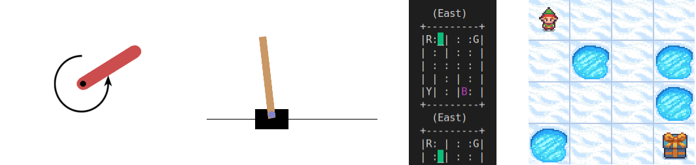
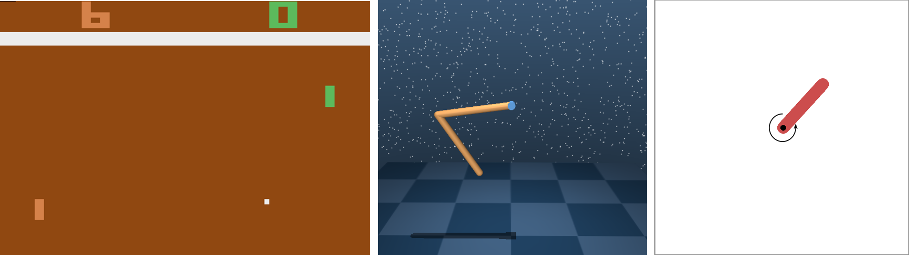
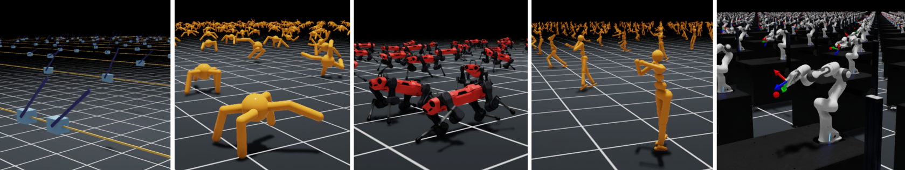
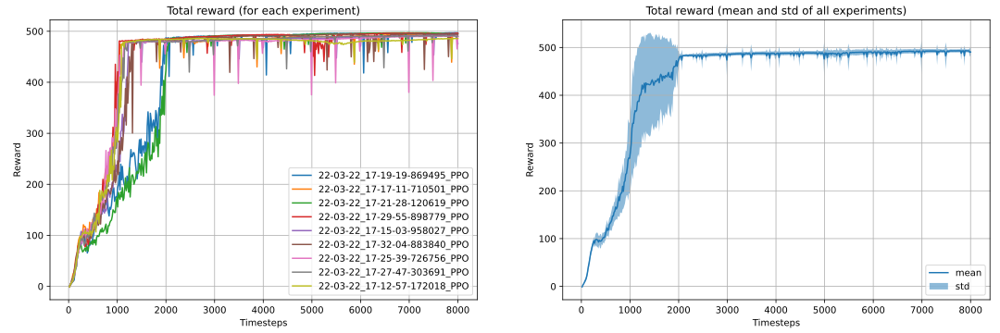

Examples
========

In this section, you will find a variety of examples that demonstrate how to use this library to solve reinforcement learning tasks.
With the knowledge and skills you gain from trying these examples, you will be well on your way to using this library to
solve your reinforcement learning problems.

.. note::

    It is recommended to use the table of contents in the right sidebar for better navigation.

|br| |hr|

Gymnasium / Gym
---------------

|

Gymnasium / Gym environments
^^^^^^^^^^^^^^^^^^^^^^^^^^^^

Training/evaluation of agents in `Gymnasium <https://gymnasium.farama.org/>`_ / `Gym <https://www.gymlibrary.dev/>`_
environments (single and vectorized).

|

**Benchmark results** are listed in `Benchmark results #32 (Gymnasium/Gym) <https://github.com/Toni-SM/skrl/discussions/32#discussioncomment-4308370>`_.

The scripts define and parse the following command line arguments:

* ``--num_envs``: Number of environments. Default: 1.
* ``--headless``: Run in headless mode (no rendering). Default: False.
* ``--seed``: Random seed. Default: None.
* ``--checkpoint``: Load checkpoint from path. Default: None.
* ``--eval``: Run in evaluation mode (logging/checkpointing disabled). Default: False.

|

.. tabs::

    .. group-tab:: Gymnasium

        .. tabs::

            .. group-tab:: |_4| |pytorch| |_4|

                .. list-table::
                    :align: left
                    :header-rows: 1
                    :stub-columns: 1
                    :class: nowrap

                    * - Environment
                      - Script
                      - Checkpoint (Hugging Face)
                    * - CartPole
                      - :download:`torch_gymnasium_cartpole_cem.py <../../../examples/gymnasium/torch_gymnasium_cartpole_cem.py>`
                        |br| :download:`torch_gymnasium_cartpole_dqn.py <../../../examples/gymnasium/torch_gymnasium_cartpole_dqn.py>`
                      -
                    * - FrozenLake
                      - :download:`torch_gymnasium_frozen_lake_q_learning.py <../../../examples/gymnasium/torch_gymnasium_frozen_lake_q_learning.py>`
                      -
                    * - Pendulum
                      - :download:`torch_gymnasium_pendulum_ddpg.py <../../../examples/gymnasium/torch_gymnasium_pendulum_ddpg.py>`
                        |br| :download:`torch_gymnasium_pendulum_ppo.py <../../../examples/gymnasium/torch_gymnasium_pendulum_ppo.py>`
                        |br| :download:`torch_gymnasium_pendulum_sac.py <../../../examples/gymnasium/torch_gymnasium_pendulum_sac.py>`
                        |br| :download:`torch_gymnasium_pendulum_td3.py <../../../examples/gymnasium/torch_gymnasium_pendulum_td3.py>`
                      -
                    * - PendulumNoVel*
                        |br| (RNN / GRU / LSTM)
                      - :download:`torch_gymnasium_pendulumnovel_ddpg_rnn.py <../../../examples/gymnasium/torch_gymnasium_pendulumnovel_ddpg_rnn.py>`
                        |br| :download:`torch_gymnasium_pendulumnovel_ddpg_gru.py <../../../examples/gymnasium/torch_gymnasium_pendulumnovel_ddpg_gru.py>`
                        |br| :download:`torch_gymnasium_pendulumnovel_ddpg_lstm.py <../../../examples/gymnasium/torch_gymnasium_pendulumnovel_ddpg_lstm.py>`
                        |br| :download:`torch_gymnasium_pendulumnovel_ppo_rnn.py <../../../examples/gymnasium/torch_gymnasium_pendulumnovel_ppo_rnn.py>`
                        |br| :download:`torch_gymnasium_pendulumnovel_ppo_gru.py <../../../examples/gymnasium/torch_gymnasium_pendulumnovel_ppo_gru.py>`
                        |br| :download:`torch_gymnasium_pendulumnovel_ppo_lstm.py <../../../examples/gymnasium/torch_gymnasium_pendulumnovel_ppo_lstm.py>`
                        |br| :download:`torch_gymnasium_pendulumnovel_sac_rnn.py <../../../examples/gymnasium/torch_gymnasium_pendulumnovel_sac_rnn.py>`
                        |br| :download:`torch_gymnasium_pendulumnovel_sac_gru.py <../../../examples/gymnasium/torch_gymnasium_pendulumnovel_sac_gru.py>`
                        |br| :download:`torch_gymnasium_pendulumnovel_sac_lstm.py <../../../examples/gymnasium/torch_gymnasium_pendulumnovel_sac_lstm.py>`
                        |br| :download:`torch_gymnasium_pendulumnovel_td3_rnn.py <../../../examples/gymnasium/torch_gymnasium_pendulumnovel_td3_rnn.py>`
                        |br| :download:`torch_gymnasium_pendulumnovel_td3_gru.py <../../../examples/gymnasium/torch_gymnasium_pendulumnovel_td3_gru.py>`
                        |br| :download:`torch_gymnasium_pendulumnovel_td3_lstm.py <../../../examples/gymnasium/torch_gymnasium_pendulumnovel_td3_lstm.py>`
                      -
                    * - Taxi
                      - :download:`torch_gymnasium_taxi_sarsa.py <../../../examples/gymnasium/torch_gymnasium_taxi_sarsa.py>`
                      -

            .. group-tab:: |_4| |jax| |_4|

                .. list-table::
                    :align: left
                    :header-rows: 1
                    :stub-columns: 1
                    :class: nowrap

                    * - Environment
                      - Script
                      - Checkpoint (Hugging Face)
                    * - CartPole
                      - :download:`jax_gymnasium_cartpole_cem.py <../../../examples/gymnasium/jax_gymnasium_cartpole_cem.py>`
                        |br| :download:`jax_gymnasium_cartpole_dqn.py <../../../examples/gymnasium/jax_gymnasium_cartpole_dqn.py>`
                      -
                    * - FrozenLake
                      -
                      -
                    * - Pendulum
                      - :download:`jax_gymnasium_pendulum_ddpg.py <../../../examples/gymnasium/jax_gymnasium_pendulum_ddpg.py>`
                        |br| :download:`jax_gymnasium_pendulum_ppo.py <../../../examples/gymnasium/jax_gymnasium_pendulum_ppo.py>`
                        |br| :download:`jax_gymnasium_pendulum_sac.py <../../../examples/gymnasium/jax_gymnasium_pendulum_sac.py>`
                        |br| :download:`jax_gymnasium_pendulum_td3.py <../../../examples/gymnasium/jax_gymnasium_pendulum_td3.py>`
                      -
                    * - PendulumNoVel*
                        |br| (RNN / GRU / LSTM)
                      - |br|
                        |br|
                        |br|
                        |br|
                        |br|
                        |br|
                        |br|
                        |br|
                        |br|
                        |br|
                        |br|
                        |br|
                      -
                    * - Taxi
                      -
                      -

            .. group-tab:: |_4| |warp| |_4|

                .. list-table::
                    :align: left
                    :header-rows: 1
                    :stub-columns: 1
                    :class: nowrap

                    * - Environment
                      - Script
                      - Checkpoint (Hugging Face)
                    * - CartPole
                      - |br|
                        |br|
                      -
                    * - FrozenLake
                      -
                      -
                    * - Pendulum
                      - :download:`warp_gymnasium_pendulum_ddpg.py <../../../examples/gymnasium/warp_gymnasium_pendulum_ddpg.py>`
                        |br| :download:`warp_gymnasium_pendulum_ppo.py <../../../examples/gymnasium/warp_gymnasium_pendulum_ppo.py>`
                        |br| :download:`warp_gymnasium_pendulum_sac.py <../../../examples/gymnasium/warp_gymnasium_pendulum_sac.py>`
                        |br|
                        |br|
                      -
                    * - PendulumNoVel*
                        |br| (RNN / GRU / LSTM)
                      - |br|
                        |br|
                        |br|
                        |br|
                        |br|
                        |br|
                        |br|
                        |br|
                        |br|
                        |br|
                        |br|
                        |br|
                      -
                    * - Taxi
                      -
                      -

        .. note::

            (*) The examples use a wrapper around the original environment to mask the velocity in the observation.
            The intention is to make the MDP partially observable and to show the capabilities of recurrent neural networks.

    .. group-tab:: Gym

        .. tabs::

            .. group-tab:: |_4| |pytorch| |_4|

                .. list-table::
                    :align: left
                    :header-rows: 1
                    :stub-columns: 1
                    :class: nowrap

                    * - Environment
                      - Script
                      - Checkpoint (Hugging Face)
                    * - CartPole
                      - :download:`torch_gym_cartpole_cem.py <../../../examples/gym/torch_gym_cartpole_cem.py>`
                        |br| :download:`torch_gym_cartpole_dqn.py <../../../examples/gym/torch_gym_cartpole_dqn.py>`
                      -
                    * - FrozenLake
                      - :download:`torch_gym_frozen_lake_q_learning.py <../../../examples/gym/torch_gym_frozen_lake_q_learning.py>`
                      -
                    * - Pendulum
                      - :download:`torch_gym_pendulum_ddpg.py <../../../examples/gym/torch_gym_pendulum_ddpg.py>`
                        |br| :download:`torch_gym_pendulum_ppo.py <../../../examples/gym/torch_gym_pendulum_ppo.py>`
                        |br| :download:`torch_gym_pendulum_sac.py <../../../examples/gym/torch_gym_pendulum_sac.py>`
                        |br| :download:`torch_gym_pendulum_td3.py <../../../examples/gym/torch_gym_pendulum_td3.py>`
                      -
                    * - PendulumNoVel*
                        |br| (RNN / GRU / LSTM)
                      - :download:`torch_gym_pendulumnovel_ddpg_rnn.py <../../../examples/gym/torch_gym_pendulumnovel_ddpg_rnn.py>`
                        |br| :download:`torch_gym_pendulumnovel_ddpg_gru.py <../../../examples/gym/torch_gym_pendulumnovel_ddpg_gru.py>`
                        |br| :download:`torch_gym_pendulumnovel_ddpg_lstm.py <../../../examples/gym/torch_gym_pendulumnovel_ddpg_lstm.py>`
                        |br| :download:`torch_gym_pendulumnovel_ppo_rnn.py <../../../examples/gym/torch_gym_pendulumnovel_ppo_rnn.py>`
                        |br| :download:`torch_gym_pendulumnovel_ppo_gru.py <../../../examples/gym/torch_gym_pendulumnovel_ppo_gru.py>`
                        |br| :download:`torch_gym_pendulumnovel_ppo_lstm.py <../../../examples/gym/torch_gym_pendulumnovel_ppo_lstm.py>`
                        |br| :download:`torch_gym_pendulumnovel_sac_rnn.py <../../../examples/gym/torch_gym_pendulumnovel_sac_rnn.py>`
                        |br| :download:`torch_gym_pendulumnovel_sac_gru.py <../../../examples/gym/torch_gym_pendulumnovel_sac_gru.py>`
                        |br| :download:`torch_gym_pendulumnovel_sac_lstm.py <../../../examples/gym/torch_gym_pendulumnovel_sac_lstm.py>`
                        |br| :download:`torch_gym_pendulumnovel_td3_rnn.py <../../../examples/gym/torch_gym_pendulumnovel_td3_rnn.py>`
                        |br| :download:`torch_gym_pendulumnovel_td3_gru.py <../../../examples/gym/torch_gym_pendulumnovel_td3_gru.py>`
                        |br| :download:`torch_gym_pendulumnovel_td3_lstm.py <../../../examples/gym/torch_gym_pendulumnovel_td3_lstm.py>`
                      -
                    * - Taxi
                      - :download:`torch_gym_taxi_sarsa.py <../../../examples/gym/torch_gym_taxi_sarsa.py>`
                      -

            .. group-tab:: |_4| |jax| |_4|

                .. list-table::
                    :align: left
                    :header-rows: 1
                    :stub-columns: 1
                    :class: nowrap

                    * - Environment
                      - Script
                      - Checkpoint (Hugging Face)
                    * - CartPole
                      - :download:`jax_gym_cartpole_cem.py <../../../examples/gym/jax_gym_cartpole_cem.py>`
                        |br| :download:`jax_gym_cartpole_dqn.py <../../../examples/gym/jax_gym_cartpole_dqn.py>`
                      -
                    * - FrozenLake
                      -
                      -
                    * - Pendulum
                      - :download:`jax_gym_pendulum_ddpg.py <../../../examples/gym/jax_gym_pendulum_ddpg.py>`
                        |br| :download:`jax_gym_pendulum_ppo.py <../../../examples/gym/jax_gym_pendulum_ppo.py>`
                        |br| :download:`jax_gym_pendulum_sac.py <../../../examples/gym/jax_gym_pendulum_sac.py>`
                        |br| :download:`jax_gym_pendulum_td3.py <../../../examples/gym/jax_gym_pendulum_td3.py>`
                      -
                    * - PendulumNoVel*
                        |br| (RNN / GRU / LSTM)
                      - |br|
                        |br|
                        |br|
                        |br|
                        |br|
                        |br|
                        |br|
                        |br|
                        |br|
                        |br|
                        |br|
                        |br|
                      -
                    * - Taxi
                      -
                      -

        .. note::

            (*) The examples use a wrapper around the original environment to mask the velocity in the observation.
            The intention is to make the MDP partially observable and to show the capabilities of recurrent neural networks.

|

Shimmy (API conversion)
^^^^^^^^^^^^^^^^^^^^^^^

The following examples show the training in several popular environments (Atari, DeepMind Control and OpenAI Gym)
that have been converted to the Gymnasium API using the `Shimmy <https://github.com/Farama-Foundation/Shimmy>`_
(API conversion tool) package.

.. note::

    From *skrl*, no extra implementation is necessary, since it fully supports Gymnasium API.

.. note::

    Because the Gymnasium API requires that the rendering mode be specified during the initialization of the environment,
    it is not enough to set the :literal:`headless` option in the trainer configuration to render the environment.
    In this case, it is necessary to call the :literal:`gymnasium.make` function using :literal:`render_mode="human"`
    or any other supported option.

The scripts define and parse the following command line arguments:

* ``--num_envs``: Number of environments. Default: 1.
* ``--headless``: Run in headless mode (no rendering). Default: False.
* ``--seed``: Random seed. Default: None.
* ``--checkpoint``: Load checkpoint from path. Default: None.
* ``--eval``: Run in evaluation mode (logging/checkpointing disabled). Default: False.

|

.. tabs::

    .. group-tab:: |_4| |pytorch| |_4|

        .. list-table::
            :align: left
            :header-rows: 1
            :stub-columns: 1
            :class: nowrap

            * - Environment
              - Script
              - Checkpoint (Hugging Face)
            * - Atari: Pong
              - :download:`torch_shimmy_atari_pong_dqn.py <../../../examples/shimmy/torch_shimmy_atari_pong_dqn.py>`
              -
            * - DeepMind: Acrobot
              - :download:`torch_shimmy_dm_control_acrobot_swingup_sparse_sac.py <../../../examples/shimmy/torch_shimmy_dm_control_acrobot_swingup_sparse_sac.py>`
              -
            * - Gym-v21 compatibility
              - :download:`torch_shimmy_openai_gym_compatibility_pendulum_ddpg.py <../../../examples/shimmy/torch_shimmy_openai_gym_compatibility_pendulum_ddpg.py>`
              -

    .. group-tab:: |_4| |jax| |_4|

        .. list-table::
            :align: left
            :header-rows: 1
            :stub-columns: 1
            :class: nowrap

            * - Environment
              - Script
              - Checkpoint (Hugging Face)
            * - Atari: Pong
              - :download:`jax_shimmy_atari_pong_dqn.py <../../../examples/shimmy/jax_shimmy_atari_pong_dqn.py>`
              -
            * - DeepMind: Acrobot
              - :download:`jax_shimmy_dm_control_acrobot_swingup_sparse_sac.py <../../../examples/shimmy/jax_shimmy_dm_control_acrobot_swingup_sparse_sac.py>`
              -
            * - Gym-v21 compatibility
              - :download:`jax_shimmy_openai_gym_compatibility_pendulum_ddpg.py <../../../examples/shimmy/jax_shimmy_openai_gym_compatibility_pendulum_ddpg.py>`
              -

|br| |hr|

ManiSkill
---------

Training/evaluation of agents in `ManiSkill <https://maniskill.readthedocs.io/>`_ environments.

The scripts define and parse the following command line arguments:

* ``--num_envs``: Number of environments. Default: 1.
* ``--headless``: Run in headless mode (no rendering). Default: False.
* ``--seed``: Random seed. Default: None.
* ``--checkpoint``: Load checkpoint from path. Default: None.
* ``--eval``: Run in evaluation mode (logging/checkpointing disabled). Default: False.

|

.. tabs::

    .. group-tab:: |_4| |pytorch| |_4|

        .. list-table::
            :align: left
            :header-rows: 1
            :stub-columns: 1
            :class: nowrap

            * - Environment
              - Script
              - Checkpoint (Hugging Face)
            * - PushCube
              - :download:`torch_mani_skill_push_cube_ppo.py <../../../examples/mani_skill/torch_mani_skill_push_cube_ppo.py>`
              -

    .. group-tab:: |_4| |jax| |_4|

        .. list-table::
            :align: left
            :header-rows: 1
            :stub-columns: 1
            :class: nowrap

            * - Environment
              - Script
              - Checkpoint (Hugging Face)
            * - PushCube
              - :download:`jax_mani_skill_push_cube_ppo.py <../../../examples/mani_skill/jax_mani_skill_push_cube_ppo.py>`
              -

    .. group-tab:: |_4| |warp| |_4|

        .. list-table::
            :align: left
            :header-rows: 1
            :stub-columns: 1
            :class: nowrap

            * - Environment
              - Script
              - Checkpoint (Hugging Face)
            * - PushCube
              - :download:`warp_mani_skill_push_cube_ppo.py <../../../examples/mani_skill/warp_mani_skill_push_cube_ppo.py>`
              -

|br| |hr|

MuJoCo Playground
-----------------

Training/evaluation of agents in `MuJoCo Playground <https://playground.mujoco.org>`_ environments.

The :py:func:`~skrl.envs.loaders.jax.load_playground_env` loader function defines the following command line arguments:

* ``--task``: Name of the task.
* ``--num_envs``: Number of environments to simulate.
* ``--seed``: Random seed.
* ``--episode_length``: Length of the episode.
* ``--action_repeat``: Number of times to repeat the given action per step.
* ``--full_reset``: Whether to perform a full reset of the environment on each step,
  rather than resetting to an initial cached state. Default: False.
* ``--randomization``: Whether to use randomization. Default: False.
* ``--vision``: Whether to use vision-based environment. Default: False.

While the scripts add additional command line arguments to the parser, such as:

* ``--headless``: Run in headless mode (no rendering). Default: False.
* ``--checkpoint``: Load checkpoint from path. Default: None.
* ``--eval``: Run in evaluation mode (logging/checkpointing disabled). Default: False.

|

.. tabs::

    .. group-tab:: |_4| |pytorch| |_4|

        .. list-table::
            :align: left
            :header-rows: 1
            :stub-columns: 1
            :class: nowrap

            * - Environment
              - Script
              - Checkpoint (Hugging Face)
            * - CartpoleBalance
              - :download:`torch_playground_cartpole_balance_ppo.py <../../../examples/playground/torch_playground_cartpole_balance_ppo.py>`
              -

    .. group-tab:: |_4| |jax| |_4|

        .. list-table::
            :align: left
            :header-rows: 1
            :stub-columns: 1
            :class: nowrap

            * - Environment
              - Script
              - Checkpoint (Hugging Face)
            * - CartpoleBalance
              - :download:`jax_playground_cartpole_balance_ppo.py <../../../examples/playground/jax_playground_cartpole_balance_ppo.py>`
              -

    .. group-tab:: |_4| |warp| |_4|

        .. list-table::
            :align: left
            :header-rows: 1
            :stub-columns: 1
            :class: nowrap

            * - Environment
              - Script
              - Checkpoint (Hugging Face)
            * - CartpoleBalance
              - :download:`warp_playground_cartpole_balance_ppo.py <../../../examples/playground/warp_playground_cartpole_balance_ppo.py>`
              -

|br| |hr|

NVIDIA Isaac Lab
----------------

Training/evaluation of agents in `Isaac Lab environments <https://isaac-sim.github.io/IsaacLab/index.html>`_.

|

**Benchmark results** are listed in `Benchmark results #32 (NVIDIA Isaac Lab) <https://github.com/Toni-SM/skrl/discussions/32#discussioncomment-4744446>`_.

The :py:func:`~skrl.envs.loaders.torch.load_isaaclab_env` loader function defines the following command line arguments:

* ``--task``: Name of the task.
* ``--num_envs``: Number of environments.
* ``--seed``: Random seed.
* ``--disable_fabric``: Disable fabric and use USD I/O operations. Default: False.
* ``--distributed``: Run training with multiple GPUs or nodes. Default: False.

While the scripts add additional command line arguments to the parser, such as:

* ``--checkpoint``: Load checkpoint from path. Default: None.
* ``--eval``: Run in evaluation mode (logging/checkpointing disabled). Default: False.

.. note::

    Isaac Lab environments implement a functionality to get their configuration from the command line.
    Because of this feature, setting the :literal:`headless` option from the trainer configuration will not work.
    In this case, it is necessary to invoke the scripts as follows: :literal:`isaaclab -p script.py --headless`.

|

.. tabs::

    .. group-tab:: |_4| |pytorch| |_4|

        .. list-table::
            :align: left
            :header-rows: 1
            :stub-columns: 1
            :class: nowrap

            * - Environment
              - Script
              - Checkpoint (Hugging Face)
            * - Isaac-Ant-Direct-v0
              - :download:`torch_ant_direct_ddpg.py <../../../examples/isaaclab/torch_ant_direct_ddpg.py>`
                |br| :download:`torch_ant_direct_td3.py <../../../examples/isaaclab/torch_ant_direct_td3.py>`
                |br| :download:`torch_ant_direct_sac.py <../../../examples/isaaclab/torch_ant_direct_sac.py>`
              -
            * - Isaac-Cartpole-Showcase-Box-Box-Direct-v0
                |br| Isaac-Cartpole-Showcase-Box-Discrete-Direct-v0
                |br| Isaac-Cartpole-Showcase-Box-MultiDiscrete-Direct-v0
                |br| Isaac-Cartpole-Showcase-Dict-Box-Direct-v0
                |br| Isaac-Cartpole-Showcase-Dict-Discrete-Direct-v0
                |br| Isaac-Cartpole-Showcase-Dict-MultiDiscrete-Direct-v0
                |br| Isaac-Cartpole-Showcase-Discrete-Box-Direct-v0
                |br| Isaac-Cartpole-Showcase-Discrete-Discrete-Direct-v0
                |br| Isaac-Cartpole-Showcase-Discrete-MultiDiscrete-Direct-v0
                |br| Isaac-Cartpole-Showcase-MultiDiscrete-Box-Direct-v0
                |br| Isaac-Cartpole-Showcase-MultiDiscrete-Discrete-Direct-v0
                |br| Isaac-Cartpole-Showcase-MultiDiscrete-MultiDiscrete-Direct-v0
                |br| Isaac-Cartpole-Showcase-Tuple-Box-Direct-v0
                |br| Isaac-Cartpole-Showcase-Tuple-Discrete-Direct-v0
                |br| Isaac-Cartpole-Showcase-Tuple-MultiDiscrete-Direct-v0
              - :download:`torch_cartpole_direct_box_box_ppo.py <../../../examples/isaaclab/torch_cartpole_direct_box_box_ppo.py>`
                |br| :download:`torch_cartpole_direct_box_discrete_ppo.py <../../../examples/isaaclab/torch_cartpole_direct_box_discrete_ppo.py>`
                |br| :download:`torch_cartpole_direct_box_multidiscrete_ppo.py <../../../examples/isaaclab/torch_cartpole_direct_box_multidiscrete_ppo.py>`
                |br| :download:`torch_cartpole_direct_dict_box_ppo.py <../../../examples/isaaclab/torch_cartpole_direct_dict_box_ppo.py>`
                |br| :download:`torch_cartpole_direct_dict_discrete_ppo.py <../../../examples/isaaclab/torch_cartpole_direct_dict_discrete_ppo.py>`
                |br| :download:`torch_cartpole_direct_dict_multidiscrete_ppo.py <../../../examples/isaaclab/torch_cartpole_direct_dict_multidiscrete_ppo.py>`
                |br| :download:`torch_cartpole_direct_discrete_box_ppo.py <../../../examples/isaaclab/torch_cartpole_direct_discrete_box_ppo.py>`
                |br| :download:`torch_cartpole_direct_discrete_discrete_ppo.py <../../../examples/isaaclab/torch_cartpole_direct_discrete_discrete_ppo.py>`
                |br| :download:`torch_cartpole_direct_discrete_multidiscrete_ppo.py <../../../examples/isaaclab/torch_cartpole_direct_discrete_multidiscrete_ppo.py>`
                |br| :download:`torch_cartpole_direct_multidiscrete_box_ppo.py <../../../examples/isaaclab/torch_cartpole_direct_multidiscrete_box_ppo.py>`
                |br| :download:`torch_cartpole_direct_multidiscrete_discrete_ppo.py <../../../examples/isaaclab/torch_cartpole_direct_multidiscrete_discrete_ppo.py>`
                |br| :download:`torch_cartpole_direct_multidiscrete_multidiscrete_ppo.py <../../../examples/isaaclab/torch_cartpole_direct_multidiscrete_multidiscrete_ppo.py>`
                |br| :download:`torch_cartpole_direct_tuple_box_ppo.py <../../../examples/isaaclab/torch_cartpole_direct_tuple_box_ppo.py>`
                |br| :download:`torch_cartpole_direct_tuple_discrete_ppo.py <../../../examples/isaaclab/torch_cartpole_direct_tuple_discrete_ppo.py>`
                |br| :download:`torch_cartpole_direct_tuple_multidiscrete_ppo.py <../../../examples/isaaclab/torch_cartpole_direct_tuple_multidiscrete_ppo.py>`
              -

    .. group-tab:: |_4| |jax| |_4|

        .. list-table::
            :align: left
            :header-rows: 1
            :stub-columns: 1
            :class: nowrap

            * - Environment
              - Script
              - Checkpoint (Hugging Face)
            * - Isaac-Ant-Direct-v0
              - :download:`jax_ant_direct_ddpg.py <../../../examples/isaaclab/jax_ant_direct_ddpg.py>`
                |br| :download:`jax_ant_direct_td3.py <../../../examples/isaaclab/jax_ant_direct_td3.py>`
                |br| :download:`jax_ant_direct_sac.py <../../../examples/isaaclab/jax_ant_direct_sac.py>`
              -
            * - Isaac-Cartpole-Showcase-Box-Box-Direct-v0
                |br| Isaac-Cartpole-Showcase-Box-Discrete-Direct-v0
                |br| Isaac-Cartpole-Showcase-Box-MultiDiscrete-Direct-v0
                |br| Isaac-Cartpole-Showcase-Dict-Box-Direct-v0
                |br| Isaac-Cartpole-Showcase-Dict-Discrete-Direct-v0
                |br| Isaac-Cartpole-Showcase-Dict-MultiDiscrete-Direct-v0
                |br| Isaac-Cartpole-Showcase-Discrete-Box-Direct-v0
                |br| Isaac-Cartpole-Showcase-Discrete-Discrete-Direct-v0
                |br| Isaac-Cartpole-Showcase-Discrete-MultiDiscrete-Direct-v0
                |br| Isaac-Cartpole-Showcase-MultiDiscrete-Box-Direct-v0
                |br| Isaac-Cartpole-Showcase-MultiDiscrete-Discrete-Direct-v0
                |br| Isaac-Cartpole-Showcase-MultiDiscrete-MultiDiscrete-Direct-v0
                |br| Isaac-Cartpole-Showcase-Tuple-Box-Direct-v0
                |br| Isaac-Cartpole-Showcase-Tuple-Discrete-Direct-v0
                |br| Isaac-Cartpole-Showcase-Tuple-MultiDiscrete-Direct-v0
              -
              -

    .. group-tab:: |_4| |warp| |_4|

        .. list-table::
            :align: left
            :header-rows: 1
            :stub-columns: 1
            :class: nowrap

            * - Environment
              - Script
              - Checkpoint (Hugging Face)
            * - Isaac-Ant-Direct-v0
              - :download:`warp_ant_direct_ddpg.py <../../../examples/isaaclab/warp_ant_direct_ddpg.py>`
                |br|
                |br| :download:`warp_ant_direct_sac.py <../../../examples/isaaclab/warp_ant_direct_sac.py>`
              -
            * - Isaac-Cartpole-Showcase-Box-Box-Direct-v0
                |br| Isaac-Cartpole-Showcase-Box-Discrete-Direct-v0
                |br| Isaac-Cartpole-Showcase-Box-MultiDiscrete-Direct-v0
                |br| Isaac-Cartpole-Showcase-Dict-Box-Direct-v0
                |br| Isaac-Cartpole-Showcase-Dict-Discrete-Direct-v0
                |br| Isaac-Cartpole-Showcase-Dict-MultiDiscrete-Direct-v0
                |br| Isaac-Cartpole-Showcase-Discrete-Box-Direct-v0
                |br| Isaac-Cartpole-Showcase-Discrete-Discrete-Direct-v0
                |br| Isaac-Cartpole-Showcase-Discrete-MultiDiscrete-Direct-v0
                |br| Isaac-Cartpole-Showcase-MultiDiscrete-Box-Direct-v0
                |br| Isaac-Cartpole-Showcase-MultiDiscrete-Discrete-Direct-v0
                |br| Isaac-Cartpole-Showcase-MultiDiscrete-MultiDiscrete-Direct-v0
                |br| Isaac-Cartpole-Showcase-Tuple-Box-Direct-v0
                |br| Isaac-Cartpole-Showcase-Tuple-Discrete-Direct-v0
                |br| Isaac-Cartpole-Showcase-Tuple-MultiDiscrete-Direct-v0
              -
              -

|br| |hr|

Real-world examples
-------------------

These examples show basic real-world and sim2real use cases to guide and support advanced RL implementations

|

.. tabs::

    .. tab:: Franka Emika Panda

        **3D reaching task (Franka's gripper must reach a certain target point in space)**. The training was done in Omniverse Isaac Gym. The real robot control is performed through the Python API of a modified version of *frankx* (see `frankx's pull request #44 <https://github.com/pantor/frankx/pull/44>`_), a high-level motion library around *libfranka*. Training and evaluation is performed for both Cartesian and joint control space

        .. raw:: html

             

        **Implementation** (see details in the table below):

        * The observation space is composed of the episode's normalized progress, the robot joints' normalized positions (:math:`q`) in the interval -1 to 1, the robot joints' velocities (:math:`\dot{q}`) affected by a random uniform scale for generalization, and the target's position in space (:math:`target_{_{XYZ}}`) with respect to the robot's base

        * The action space, bounded in the range -1 to 1, consists of the following. For the joint control it's robot joints' position scaled change. For the Cartesian control it's the end-effector's position (:math:`ee_{_{XYZ}}`) scaled change. The end-effector position frame corresponds to the point where the left finger connects to the gripper base in simulation, whereas in the real world it corresponds to the end of the fingers. The gripper fingers remain closed all the time in both cases

        * The instantaneous reward is the negative value of the Euclidean distance (:math:`\text{d}`) between the robot end-effector and the target point position. The episode terminates when this distance is less than 0.035 meters in simulation (0.075 meters in real-world) or when the defined maximum timestep is reached

        * The target position lies within a rectangular cuboid of dimensions 0.5 x 0.5 x 0.2 meters centered at (0.5, 0.0, 0.2) meters with respect to the robot's base. The robot joints' positions are drawn from an initial configuration [0º, -45º, 0º, -135º, 0º, 90º, 45º] modified with uniform random values between -7º and 7º approximately

        .. list-table::
            :header-rows: 1

            * - Variable
              - Formula / value
              - Size
            * - Observation space
              - :math:`\dfrac{t}{t_{max}},\; 2 \dfrac{q - q_{min}}{q_{max} - q_{min}} - 1,\; 0.1\,\dot{q}\,U(0.5,1.5),\; target_{_{XYZ}}`
              - 18
            * - Action space (joint)
              - :math:`\dfrac{2.5}{120} \, \Delta q`
              - 7
            * - Action space (Cartesian)
              - :math:`\dfrac{1}{100} \, \Delta ee_{_{XYZ}}`
              - 3
            * - Reward
              - :math:`-\text{d}(ee_{_{XYZ}},\; target_{_{XYZ}})`
              -
            * - Episode termination
              - :math:`\text{d}(ee_{_{XYZ}},\; target_{_{XYZ}}) \le 0.035 \quad` or :math:`\quad t \ge t_{max} - 1`
              -
            * - Maximum timesteps (:math:`t_{max}`)
              - 100
              -

        .. raw:: html

             

        **Workflows:**

        .. tabs::

            .. tab:: Real-world

                .. warning::

                    Make sure you have the e-stop on hand in case something goes wrong in the run. **Control via RL can be dangerous and unsafe for both the operator and the robot**

                .. raw:: html

                    <video width="100%" controls autoplay>
                        <source src="https://user-images.githubusercontent.com/22400377/190899202-6b80c48d-fc49-48e9-b277-24814d0adab1.mp4" type="video/mp4">
                    </video>
                    <strong>Target position entered via the command prompt or generated randomly</strong>
                      
                    <video width="100%" controls autoplay>
                        <source src="https://user-images.githubusercontent.com/22400377/190899205-752f654e-9310-4696-a6b2-bfa57d5325f2.mp4" type="video/mp4">
                    </video>
                    <strong>Target position in X and Y obtained with a USB-camera (position in Z fixed at 0.2 m)</strong>

                |

                **Prerequisites:**

                A physical Franka Emika Panda robot with `Franka Control Interface (FCI) <https://frankaemika.github.io/docs/index.html>`_ is required. Additionally, the *frankx* library must be available in the python environment (see `frankx's pull request #44 <https://github.com/pantor/frankx/pull/44>`_ for the RL-compatible version installation)

                **Files**

                * Environment: :download:`reaching_franka_real_env.py <../../../examples/real_world/franka_emika_panda/reaching_franka_real_env.py>`
                * Evaluation script: :download:`reaching_franka_real_skrl_eval.py <../../../examples/real_world/franka_emika_panda/reaching_franka_real_skrl_eval.py>`
                * Checkpoints (:literal:`agent_joint.pt`, :literal:`agent_cartesian.pt`): :download:`trained_checkpoints.zip <https://github.com/Toni-SM/skrl/files/9595293/trained_checkpoints.zip>`

                **Evaluation:**

                .. code-block:: bash

                    python3 reaching_franka_real_skrl_eval.py

                **Main environment configuration:**

                .. note::

                    In the joint control space the final control of the robot is performed through the Cartesian pose (forward kinematics from specified values for the joints)

                The control space (Cartesian or joint), the robot motion type (waypoint or impedance) and the target position acquisition (command prompt / automatically generated or USB-camera) can be specified in the environment class constructor (from :literal:`reaching_franka_real_skrl_eval.py`) as follow:

                .. code-block:: python

                    control_space = "joint"   # joint or cartesian
                    motion_type = "waypoint"  # waypoint or impedance
                    camera_tracking = False   # True for USB-camera tracking

            .. tab:: Simulation (Omniverse Isaac Gym)

                .. raw:: html

                    <video width="100%" controls autoplay>
                        <source src="https://user-images.githubusercontent.com/22400377/211668430-7cd4668b-e79a-46a9-bdbc-3212388b6b6d.mp4" type="video/mp4">
                    </video>

                .. raw:: html

                    

                |

                **Prerequisites:**

                All installation steps described in `Omniverse Isaac Gym's Installation <https://github.com/isaac-sim/OmniIsaacGymEnvs?tab=readme-ov-file#installation>`_ section must be fulfilled

                **Files** (the implementation is self-contained so no specific location is required):

                * Environment: :download:`reaching_franka_omniverse_isaacgym_env.py <../../../examples/real_world/franka_emika_panda/reaching_franka_omniverse_isaacgym_env.py>`
                * Training script: :download:`reaching_franka_omniverse_isaacgym_skrl_train.py <../../../examples/real_world/franka_emika_panda/reaching_franka_omniverse_isaacgym_skrl_train.py>`
                * Evaluation script: :download:`reaching_franka_omniverse_isaacgym_skrl_eval.py <../../../examples/real_world/franka_emika_panda/reaching_franka_omniverse_isaacgym_skrl_eval.py>`
                * Checkpoints (:literal:`agent_joint.pt`, :literal:`agent_cartesian.pt`): :download:`trained_checkpoints.zip <https://github.com/Toni-SM/skrl/files/9595293/trained_checkpoints.zip>`

                **Training and evaluation:**

                .. code-block:: bash

                    # training (local workstation)
                    ~/.local/share/ov/pkg/isaac_sim-*/python.sh reaching_franka_omniverse_isaacgym_skrl_train.py

                    # training (docker container)
                    /isaac-sim/python.sh reaching_franka_omniverse_isaacgym_skrl_train.py

                .. code-block:: bash

                    # evaluation (local workstation)
                    ~/.local/share/ov/pkg/isaac_sim-*/python.sh reaching_franka_omniverse_isaacgym_skrl_eval.py

                    # evaluation (docker container)
                    /isaac-sim/python.sh reaching_franka_omniverse_isaacgym_skrl_eval.py

                **Main environment configuration:**

                The control space (Cartesian or joint) can be specified in the task configuration dictionary (from :literal:`reaching_franka_omniverse_isaacgym_skrl_train.py`) as follow:

                .. code-block:: python

                    TASK_CFG["task"]["env"]["controlSpace"] = "joint"  # "joint" or "cartesian"

            .. tab:: Simulation (Isaac Gym)

                .. raw:: html

                    <video width="100%" controls autoplay>
                        <source src="https://user-images.githubusercontent.com/22400377/193537523-e0f0f8ad-2295-410c-ba9a-2a16c827a498.mp4" type="video/mp4">
                    </video>

                .. raw:: html

                    

                |

                **Prerequisites:**

                All installation steps described in `Isaac Gym's Installation <https://github.com/isaac-sim/IsaacGymEnvs#installation>`_ section must be fulfilled

                **Files** (the implementation is self-contained so no specific location is required):

                * Environment: :download:`reaching_franka_isaacgym_env.py <../../../examples/real_world/franka_emika_panda/reaching_franka_isaacgym_env.py>`
                * Training script: :download:`reaching_franka_isaacgym_skrl_train.py <../../../examples/real_world/franka_emika_panda/reaching_franka_isaacgym_skrl_train.py>`
                * Evaluation script: :download:`reaching_franka_isaacgym_skrl_eval.py <../../../examples/real_world/franka_emika_panda/reaching_franka_isaacgym_skrl_eval.py>`

                **Training and evaluation:**

                .. note::

                    The checkpoints obtained in Isaac Gym were not evaluated with the real robot. However, they were evaluated in Omniverse Isaac Gym showing successful performance

                .. code-block:: bash

                    # training (with the Python virtual environment active)
                    python reaching_franka_isaacgym_skrl_train.py

                .. code-block:: bash

                    # evaluation (with the Python virtual environment active)
                    python reaching_franka_isaacgym_skrl_eval.py

                **Main environment configuration:**

                The control space (Cartesian or joint) can be specified in the task configuration dictionary (from :literal:`reaching_franka_isaacgym_skrl_train.py`) as follow:

                .. code-block:: python

                    TASK_CFG["env"]["controlSpace"] = "joint"  # "joint" or "cartesian"

    .. tab:: Kuka LBR iiwa

        **3D reaching task (iiwa's end-effector must reach a certain target point in space)**. The training was done in Omniverse Isaac Gym. The real robot control is performed through the Python, ROS and ROS2 APIs of `libiiwa <https://libiiwa.readthedocs.io>`_, a scalable multi-control framework for the KUKA LBR Iiwa robots. Training and evaluation is performed for both Cartesian and joint control space

        .. raw:: html

             

        **Implementation** (see details in the table below):

        * The observation space is composed of the episode's normalized progress, the robot joints' normalized positions (:math:`q`) in the interval -1 to 1, the robot joints' velocities (:math:`\dot{q}`) affected by a random uniform scale for generalization, and the target's position in space (:math:`target_{_{XYZ}}`) with respect to the robot's base

        * The action space, bounded in the range -1 to 1, consists of the following. For the joint control it's robot joints' position scaled change. For the Cartesian control it's the end-effector's position (:math:`ee_{_{XYZ}}`) scaled change

        * The instantaneous reward is the negative value of the Euclidean distance (:math:`\text{d}`) between the robot end-effector and the target point position. The episode terminates when this distance is less than 0.035 meters in simulation (0.075 meters in real-world) or when the defined maximum timestep is reached

        * The target position lies within a rectangular cuboid of dimensions 0.2 x 0.4 x 0.4 meters centered at (0.6, 0.0, 0.4) meters with respect to the robot's base. The robot joints' positions are drawn from an initial configuration [0º, 0º, 0º, -90º, 0º, 90º, 0º] modified with uniform random values between -7º and 7º approximately

        .. list-table::
            :header-rows: 1

            * - Variable
              - Formula / value
              - Size
            * - Observation space
              - :math:`\dfrac{t}{t_{max}},\; 2 \dfrac{q - q_{min}}{q_{max} - q_{min}} - 1,\; 0.1\,\dot{q}\,U(0.5,1.5),\; target_{_{XYZ}}`
              - 18
            * - Action space (joint)
              - :math:`\dfrac{2.5}{120} \, \Delta q`
              - 7
            * - Action space (Cartesian)
              - :math:`\dfrac{1}{100} \, \Delta ee_{_{XYZ}}`
              - 3
            * - Reward
              - :math:`-\text{d}(ee_{_{XYZ}},\; target_{_{XYZ}})`
              -
            * - Episode termination
              - :math:`\text{d}(ee_{_{XYZ}},\; target_{_{XYZ}}) \le 0.035 \quad` or :math:`\quad t \ge t_{max} - 1`
              -
            * - Maximum timesteps (:math:`t_{max}`)
              - 100
              -

        .. raw:: html

             

        **Workflows:**

        .. tabs::

            .. tab:: Real-world

                .. warning::

                    Make sure you have the smartHMI on hand in case something goes wrong in the run. **Control via RL can be dangerous and unsafe for both the operator and the robot**

                .. raw:: html

                    <video width="100%" controls autoplay>
                        <source src="https://user-images.githubusercontent.com/22400377/212192766-9698bfba-af27-41b8-8a11-17ed3d22c020.mp4" type="video/mp4">
                    </video>

                **Prerequisites:**

                A physical Kuka LBR iiwa robot is required. Additionally, the *libiiwa* library must be installed (visit the `libiiwa <https://libiiwa.readthedocs.io>`_ documentation for installation details)

                **Files**

                * Environment: :download:`reaching_iiwa_real_env.py <../../../examples/real_world/kuka_lbr_iiwa/reaching_iiwa_real_env.py>`
                * Evaluation script: :download:`reaching_iiwa_real_skrl_eval.py <../../../examples/real_world/kuka_lbr_iiwa/reaching_iiwa_real_skrl_eval.py>`
                * Checkpoints (:literal:`agent_joint.pt`, :literal:`agent_cartesian.pt`): :download:`trained_checkpoints.zip <https://github.com/Toni-SM/skrl/files/10406561/trained_checkpoints.zip>`

                **Evaluation:**

                .. code-block:: bash

                    python3 reaching_iiwa_real_skrl_eval.py

                **Main environment configuration:**

                The control space (Cartesian or joint) can be specified in the environment class constructor (from :literal:`reaching_iiwa_real_skrl_eval.py`) as follow:

                .. code-block:: python

                    control_space = "joint"   # joint or cartesian

            .. tab:: Real-world (ROS/ROS2)

                .. warning::

                    Make sure you have the smartHMI on hand in case something goes wrong in the run. **Control via RL can be dangerous and unsafe for both the operator and the robot**

                .. raw:: html

                    <video width="100%" controls autoplay>
                        <source src="https://user-images.githubusercontent.com/22400377/212192817-12115478-e6a8-4502-b33f-b072664b1959.mp4" type="video/mp4">
                    </video>

                **Prerequisites:**

                A physical Kuka LBR iiwa robot is required. Additionally, the *libiiwa* library must be installed (visit the `libiiwa <https://libiiwa.readthedocs.io>`_ documentation for installation details) and a Robot Operating System (ROS or ROS2) distribution must be available

                **Files**

                * Environment (ROS): :download:`reaching_iiwa_real_ros_env.py <../../../examples/real_world/kuka_lbr_iiwa/reaching_iiwa_real_ros_env.py>`
                * Environment (ROS2): :download:`reaching_iiwa_real_ros2_env.py <../../../examples/real_world/kuka_lbr_iiwa/reaching_iiwa_real_ros2_env.py>`
                * Evaluation script: :download:`reaching_iiwa_real_ros_ros2_skrl_eval.py <../../../examples/real_world/kuka_lbr_iiwa/reaching_iiwa_real_ros_ros2_skrl_eval.py>`
                * Checkpoints (:literal:`agent_joint.pt`, :literal:`agent_cartesian.pt`): :download:`trained_checkpoints.zip <https://github.com/Toni-SM/skrl/files/10406561/trained_checkpoints.zip>`

                .. note::

                    Source the ROS/ROS2 distribution and the ROS/ROS workspace containing the libiiwa packages before executing the scripts

                **Evaluation:**

                .. note::

                    The environment (:literal:`reaching_iiwa_real_ros_env.py` or :literal:`reaching_iiwa_real_ros2_env.py`) to be loaded will be automatically selected based on the sourced ROS distribution (ROS or ROS2) at script execution

                .. code-block:: bash

                    python3 reaching_iiwa_real_ros_ros2_skrl_eval.py

                **Main environment configuration:**

                The control space (Cartesian or joint) can be specified in the environment class constructor (from :literal:`reaching_iiwa_real_ros_ros2_skrl_eval.py`) as follow:

                .. code-block:: python

                    control_space = "joint"   # joint or cartesian

            .. tab:: Simulation (Omniverse Isaac Gym)

                .. raw:: html

                    <video width="100%" controls autoplay>
                        <source src="https://user-images.githubusercontent.com/22400377/211668313-7bcbcd41-cde5-441e-abb4-82fff7616f06.mp4" type="video/mp4">
                    </video>

                .. raw:: html

                    

                |

                **Prerequisites:**

                All installation steps described in `Omniverse Isaac Gym's Installation <https://github.com/isaac-sim/OmniIsaacGymEnvs?tab=readme-ov-file#installation>`_ section must be fulfilled

                **Files** (the implementation is self-contained so no specific location is required):

                * Environment: :download:`reaching_iiwa_omniverse_isaacgym_env.py <../../../examples/real_world/kuka_lbr_iiwa/reaching_iiwa_omniverse_isaacgym_env.py>`
                * Training script: :download:`reaching_iiwa_omniverse_isaacgym_skrl_train.py <../../../examples/real_world/kuka_lbr_iiwa/reaching_iiwa_omniverse_isaacgym_skrl_train.py>`
                * Evaluation script: :download:`reaching_iiwa_omniverse_isaacgym_skrl_eval.py <../../../examples/real_world/kuka_lbr_iiwa/reaching_iiwa_omniverse_isaacgym_skrl_eval.py>`
                * Checkpoints (:literal:`agent_joint.pt`, :literal:`agent_cartesian.pt`): :download:`trained_checkpoints.zip <https://github.com/Toni-SM/skrl/files/10406561/trained_checkpoints.zip>`
                * Simulation files: (.usd assets and robot class): :download:`simulation_files.zip <https://github.com/Toni-SM/skrl/files/10409551/simulation_files.zip>`

                Simulation files must be structured as follows:

                .. code-block::

                    <some_folder>
                        ├── agent_cartesian.pt
                        ├── agent_joint.pt
                        ├── assets
                        │   ├── iiwa14_instanceable_meshes.usd
                        │   └── iiwa14.usd
                        ├── reaching_iiwa_omniverse_isaacgym_env.py
                        ├── reaching_iiwa_omniverse_isaacgym_skrl_eval.py
                        ├── reaching_iiwa_omniverse_isaacgym_skrl_train.py
                        ├── robots
                        │   ├── iiwa14.py
                        │   └── __init__.py

                **Training and evaluation:**

                .. code-block:: bash

                    # training (local workstation)
                    ~/.local/share/ov/pkg/isaac_sim-*/python.sh reaching_iiwa_omniverse_isaacgym_skrl_train.py

                    # training (docker container)
                    /isaac-sim/python.sh reaching_iiwa_omniverse_isaacgym_skrl_train.py

                .. code-block:: bash

                    # evaluation (local workstation)
                    ~/.local/share/ov/pkg/isaac_sim-*/python.sh reaching_iiwa_omniverse_isaacgym_skrl_eval.py

                    # evaluation (docker container)
                    /isaac-sim/python.sh reaching_iiwa_omniverse_isaacgym_skrl_eval.py

                **Main environment configuration:**

                The control space (Cartesian or joint) can be specified in the task configuration dictionary (from :literal:`reaching_iiwa_omniverse_isaacgym_skrl_train.py`) as follow:

                .. code-block:: python

                    TASK_CFG["task"]["env"]["controlSpace"] = "joint"  # "joint" or "cartesian"

|br| |hr|

Others
------

|

.. _library_utilities:

Library utilities
^^^^^^^^^^^^^^^^^

|

TensorBoard post-processing
"""""""""""""""""""""""""""

This example shows how to use the library utilities to post-process the TensorBoard files generated by the experiments.

    Example generated by the code showing the total reward (left) and the mean and standard deviation (right)
    of all experiments located in the :literal:`runs` folder.

|

**Script:** :download:`tensorboard_file_iterator.py <../../../examples/utils/tensorboard_file_iterator.py>`

.. note::

    The code will load all the TensorBoard files of the experiments located in the :literal:`runs` folder.
    It is necessary to adjust the iterator's parameters for other paths.

.. literalinclude:: ../../../examples/utils/tensorboard_file_iterator.py
    :language: python
    :emphasize-lines: 5, 12-14
