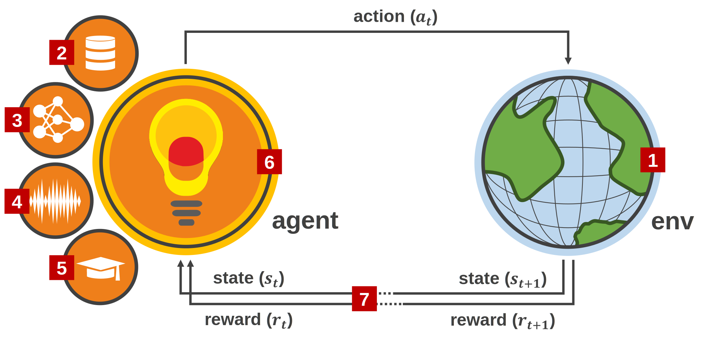

Getting Started
===============

**Reinforcement Learning (RL)** is a Machine Learning sub-field for decision making that allows an agent to learn from its interaction with the environment as shown in the following schema:

.. raw:: html

    

At each step (also called timestep) of interaction with the environment, the agent sees an observation :math:`o_t` of the complete description of the state :math:`s_t \in S` of the environment. Then, it decides which action :math:`a_t \in A` to take from the action space using a policy. The environment, which changes in response to the agent's action (or by itself), returns a reward signal :math:`r_t = R(s_t, a_t, s_{t+1})` as a measure of how good or bad the action was that moved it to its new state :math:`s_{t+1}`. The agent aims to maximize the cumulative reward (discounted or not by a factor :math:`\gamma \in (0,1]`) by adjusting the policy's behaviour via some optimization algorithm

**Based on this schema, this section intends to guide, step by step, in the creation of an RL system**

1. Environments
---------------

The environment plays a fundamental role in the definition of the RL schema. For example, the selection of the agent depends strongly on the observation and action space nature. There are several interfaces to interact with the environments such as OpenAI Gym or DeepMind. However, each of them has a different API and work with non-compatible data types

skrl offers a function to **wrap environments** based on the OpenAI Gym, DeepMind, Isaac Gym and Omniverse Isaac Gym interfaces (the last two have slight differences with OpenAI Gym) and offer, for library components, a common interface (based on OpenAI Gym) as shown in the following figure. Refer to the :doc:`Wrapping <../modules/skrl.envs.wrapping>` section for more information

.. image:: ../_static/imgs/wrapping.svg
      :width: 100%
      :align: center
      :alt: Environment wrapping

.. raw:: html

    

2. Memories
-----------

:red:`Under construction...`

3. Models
---------

:red:`Under construction...`

4. Noises
---------

:red:`Under construction...`

5. Learning rate schedulers
---------------------------

:red:`Under construction...`

6. Agents
---------

:red:`Under construction...`

7. Trainers
-----------

:red:`Under construction...`
