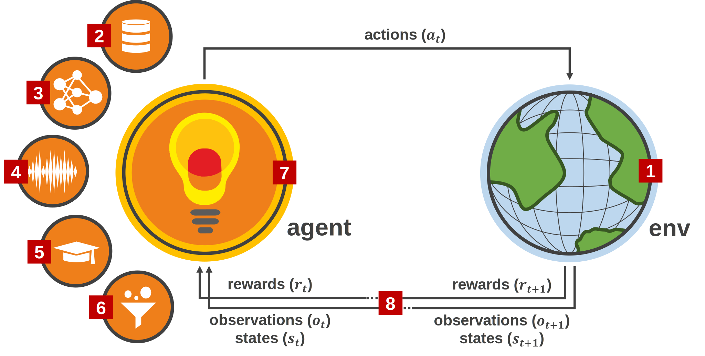
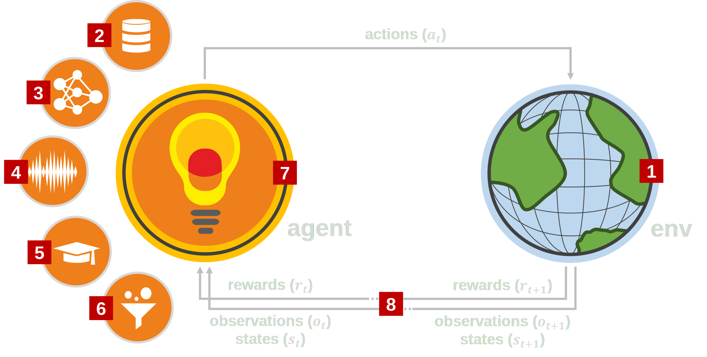

Getting Started
===============

In this section, you will learn how to use the various components of the **skrl** library to create reinforcement learning tasks. Whether you are a beginner or an experienced researcher, we hope this section will provide you with a solid foundation to build upon.

We recommend visiting the :doc:`Examples <examples>` to see how the components can be integrated and applied in practice. Let's get started!

.. raw:: html

     

**Reinforcement Learning schema**
---------------------------------

**Reinforcement Learning (RL)** is a Machine Learning sub-field for decision making that allows an agent to learn from its interaction with the environment as shown in the following schema:

.. raw:: html

     

At each step (also called timestep) of interaction with the environment, the agent sees an observation :math:`o_t` of the complete description of the state :math:`s_t \in S` of the environment. Then, it decides which action :math:`a_t \in A` to take from the action space using a policy. The environment, which changes in response to the agent's action (or by itself), returns a reward signal :math:`r_t = R(s_t, a_t, s_{t+1})` as a measure of how good or bad the action was that moved it to its new state :math:`s_{t+1}`. The agent aims to maximize the cumulative reward (discounted or not by a factor :math:`\gamma \in (0,1]`) by adjusting the policy's behaviour via some optimization algorithm.

**From this schema, this section is intended to guide in the creation of a RL system using skrl**

.. raw:: html

     

1. Environments
^^^^^^^^^^^^^^^

The environment plays a fundamental role in the definition of the RL schema. For example, the selection of the agent depends strongly on the observation and action space nature. There are several interfaces to interact with the environments such as OpenAI Gym / Farama Gymnasium or DeepMind. However, each of them has a different API and work with non-compatible data types.

* For **single-agent** environments, skrl offers a function to **wrap environments** based on the Gym/Gymnasium, DeepMind, NVIDIA Isaac Gym, Isaac Orbit and Omniverse Isaac Gym interfaces, among others. The wrapped environments provide, to the library components, a common interface (based on Gym/Gymnasium) as shown in the following figure. Refer to the :doc:`Wrapping (single-agent) <../api/envs/wrapping>` section for more information.

* For **multi-agent** environments, skrl offers a function to **wrap environments** based on the PettingZoo and Bi-DexHands interfaces. The wrapped environments provide, to the library components, a common interface (based on PettingZoo) as shown in the following figure. Refer to the :doc:`Wrapping (multi-agents) <../api/envs/multi_agents_wrapping>` section for more information.

.. tabs::

    .. group-tab:: Single-agent environments

        .. image:: ../_static/imgs/wrapping-light.svg
            :width: 100%
            :align: center
            :class: only-light
            :alt: Environment wrapping

        .. image:: ../_static/imgs/wrapping-dark.svg
            :width: 100%
            :align: center
            :class: only-dark
            :alt: Environment wrapping

    .. group-tab:: Multi-agent environments

        .. image:: ../_static/imgs/multi_agent_wrapping-light.svg
            :width: 100%
            :align: center
            :class: only-light
            :alt: Environment wrapping

        .. image:: ../_static/imgs/multi_agent_wrapping-dark.svg
            :width: 100%
            :align: center
            :class: only-dark
            :alt: Environment wrapping

Among the methods and properties defined in the wrapped environment, the observation and action spaces are one of the most relevant for instantiating other library components. The following code snippets show how to load and wrap environments based on the supported interfaces:

.. tabs::

    .. group-tab:: Single-agent environments

        .. tabs::

            .. tab:: Omniverse Isaac Gym

                .. tabs::

                    .. tab:: Common environment

                        .. tabs::

                            .. group-tab:: |_4| |pytorch| |_4|

                                .. literalinclude:: ../snippets/wrapping.py
                                    :language: python
                                    :start-after: [pytorch-start-omniverse-isaacgym]
                                    :end-before: [pytorch-end-omniverse-isaacgym]

                            .. group-tab:: |_4| |jax| |_4|

                                .. literalinclude:: ../snippets/wrapping.py
                                    :language: python
                                    :start-after: [jax-start-omniverse-isaacgym]
                                    :end-before: [jax-end-omniverse-isaacgym]

                    .. tab:: Multi-threaded environment

                        .. tabs::

                            .. group-tab:: |_4| |pytorch| |_4|

                                .. literalinclude:: ../snippets/wrapping.py
                                    :language: python
                                    :start-after: [pytorch-start-omniverse-isaacgym-mt]
                                    :end-before: [pytorch-end-omniverse-isaacgym-mt]

                            .. group-tab:: |_4| |jax| |_4|

                                .. literalinclude:: ../snippets/wrapping.py
                                    :language: python
                                    :start-after: [jax-start-omniverse-isaacgym-mt]
                                    :end-before: [jax-end-omniverse-isaacgym-mt]

            .. tab:: Isaac Orbit

                .. tabs::

                    .. group-tab:: |_4| |pytorch| |_4|

                        .. literalinclude:: ../snippets/wrapping.py
                            :language: python
                            :start-after: [pytorch-start-isaac-orbit]
                            :end-before: [pytorch-end-isaac-orbit]

                    .. group-tab:: |_4| |jax| |_4|

                        .. literalinclude:: ../snippets/wrapping.py
                            :language: python
                            :start-after: [jax-start-isaac-orbit]
                            :end-before: [jax-end-isaac-orbit]

            .. tab:: Isaac Gym

                .. tabs::

                    .. tab:: Preview 4 (isaacgymenvs.make)

                        .. tabs::

                            .. group-tab:: |_4| |pytorch| |_4|

                                .. literalinclude:: ../snippets/wrapping.py
                                    :language: python
                                    :start-after: [pytorch-start-isaacgym-preview4-make]
                                    :end-before: [pytorch-end-isaacgym-preview4-make]

                            .. group-tab:: |_4| |jax| |_4|

                                .. literalinclude:: ../snippets/wrapping.py
                                    :language: python
                                    :start-after: [jax-start-isaacgym-preview4-make]
                                    :end-before: [jax-end-isaacgym-preview4-make]

                    .. tab:: Preview 4

                        .. tabs::

                            .. group-tab:: |_4| |pytorch| |_4|

                                .. literalinclude:: ../snippets/wrapping.py
                                    :language: python
                                    :start-after: [pytorch-start-isaacgym-preview4]
                                    :end-before: [pytorch-end-isaacgym-preview4]

                            .. group-tab:: |_4| |jax| |_4|

                                .. literalinclude:: ../snippets/wrapping.py
                                    :language: python
                                    :start-after: [jax-start-isaacgym-preview4]
                                    :end-before: [jax-end-isaacgym-preview4]

                    .. tab:: Preview 3

                        .. tabs::

                            .. group-tab:: |_4| |pytorch| |_4|

                                .. literalinclude:: ../snippets/wrapping.py
                                    :language: python
                                    :start-after: [pytorch-start-isaacgym-preview3]
                                    :end-before: [pytorch-end-isaacgym-preview3]

                            .. group-tab:: |_4| |jax| |_4|

                                .. literalinclude:: ../snippets/wrapping.py
                                    :language: python
                                    :start-after: [jax-start-isaacgym-preview3]
                                    :end-before: [jax-end-isaacgym-preview3]

                    .. tab:: Preview 2

                        .. tabs::

                            .. group-tab:: |_4| |pytorch| |_4|

                                .. literalinclude:: ../snippets/wrapping.py
                                    :language: python
                                    :start-after: [pytorch-start-isaacgym-preview2]
                                    :end-before: [pytorch-end-isaacgym-preview2]

                            .. group-tab:: |_4| |jax| |_4|

                                .. literalinclude:: ../snippets/wrapping.py
                                    :language: python
                                    :start-after: [jax-start-isaacgym-preview2]
                                    :end-before: [jax-end-isaacgym-preview2]

            .. tab:: Gym / Gymnasium

                .. tabs::

                    .. tab:: Gym

                        .. tabs::

                            .. tab:: Single environment

                                .. tabs::

                                    .. group-tab:: |_4| |pytorch| |_4|

                                        .. literalinclude:: ../snippets/wrapping.py
                                            :language: python
                                            :start-after: [pytorch-start-gym]
                                            :end-before: [pytorch-end-gym]

                                    .. group-tab:: |_4| |jax| |_4|

                                        .. literalinclude:: ../snippets/wrapping.py
                                            :language: python
                                            :start-after: [jax-start-gym]
                                            :end-before: [jax-end-gym]

                            .. tab:: Vectorized environment

                                Visit the Gym documentation (`Vector <https://www.gymlibrary.dev/api/vector>`__) for more information about the creation and usage of vectorized environments

                                .. tabs::

                                    .. group-tab:: |_4| |pytorch| |_4|

                                        .. literalinclude:: ../snippets/wrapping.py
                                            :language: python
                                            :start-after: [pytorch-start-gym-vectorized]
                                            :end-before: [pytorch-end-gym-vectorized]

                                    .. group-tab:: |_4| |jax| |_4|

                                        .. literalinclude:: ../snippets/wrapping.py
                                            :language: python
                                            :start-after: [jax-start-gym-vectorized]
                                            :end-before: [jax-end-gym-vectorized]

                    .. tab:: Gymnasium

                        .. tabs::

                            .. tab:: Single environment

                                .. tabs::

                                    .. group-tab:: |_4| |pytorch| |_4|

                                        .. literalinclude:: ../snippets/wrapping.py
                                            :language: python
                                            :start-after: [pytorch-start-gymnasium]
                                            :end-before: [pytorch-end-gymnasium]

                                    .. group-tab:: |_4| |jax| |_4|

                                        .. literalinclude:: ../snippets/wrapping.py
                                            :language: python
                                            :start-after: [jax-start-gymnasium]
                                            :end-before: [jax-end-gymnasium]

                            .. tab:: Vectorized environment

                                Visit the Gymnasium documentation (`Vector <https://gymnasium.farama.org/api/vector>`__) for more information about the creation and usage of vectorized environments

                                .. tabs::

                                    .. group-tab:: |_4| |pytorch| |_4|

                                        .. literalinclude:: ../snippets/wrapping.py
                                            :language: python
                                            :start-after: [pytorch-start-gymnasium-vectorized]
                                            :end-before: [pytorch-end-gymnasium-vectorized]

                                    .. group-tab:: |_4| |jax| |_4|

                                        .. literalinclude:: ../snippets/wrapping.py
                                            :language: python
                                            :start-after: [jax-start-gymnasium-vectorized]
                                            :end-before: [jax-end-gymnasium-vectorized]

            .. tab:: DeepMind

                .. tabs::

                    .. group-tab:: |_4| |pytorch| |_4|

                        .. literalinclude:: ../snippets/wrapping.py
                            :language: python
                            :start-after: [pytorch-start-deepmind]
                            :end-before: [pytorch-end-deepmind]

                    .. .. group-tab:: |_4| |jax| |_4|

                    ..     .. literalinclude:: ../snippets/wrapping.py
                    ..         :language: python
                    ..         :start-after: [jax-start-deepmind]
                    ..         :end-before: [jax-end-deepmind]

            .. tab:: robosuite

                .. tabs::

                    .. group-tab:: |_4| |pytorch| |_4|

                        .. literalinclude:: ../snippets/wrapping.py
                            :language: python
                            :start-after: [pytorch-start-robosuite]
                            :end-before: [pytorch-end-robosuite]

                    .. .. group-tab:: |_4| |jax| |_4|

                    ..     .. literalinclude:: ../snippets/wrapping.py
                    ..         :language: python
                    ..         :start-after: [jax-start-robosuite]
                    ..         :end-before: [jax-end-robosuite]

    .. group-tab:: Multi-agent environments

        .. tabs::

            .. tab:: PettingZoo

                .. tabs::

                    .. group-tab:: |_4| |pytorch| |_4|

                        .. literalinclude:: ../snippets/wrapping.py
                            :language: python
                            :start-after: [start-pettingzoo-torch]
                            :end-before: [end-pettingzoo-torch]

                    .. group-tab:: |_4| |jax| |_4|

                        .. literalinclude:: ../snippets/wrapping.py
                            :language: python
                            :start-after: [start-pettingzoo-jax]
                            :end-before: [end-pettingzoo-jax]

            .. tab:: Bi-DexHands

                .. tabs::

                    .. group-tab:: |_4| |pytorch| |_4|

                        .. literalinclude:: ../snippets/wrapping.py
                            :language: python
                            :start-after: [start-bidexhands-torch]
                            :end-before: [end-bidexhands-torch]

                    .. group-tab:: |_4| |jax| |_4|

                        .. literalinclude:: ../snippets/wrapping.py
                            :language: python
                            :start-after: [start-bidexhands-jax]
                            :end-before: [end-bidexhands-jax]

Once the environment is known (and instantiated), it is time to configure and instantiate the agent. Agents are composed, apart from the optimization algorithm, by several components, such as memories, models or noises, for example, according to their nature. The following subsections focus on those components.

.. raw:: html

     

2. Memories
^^^^^^^^^^^

Memories are storage components that allow agents to collect and use/reuse recent or past experiences or other types of information. These can be large in size (such as replay buffers used by off-policy algorithms like DDPG, TD3 or SAC) or small in size (such as rollout buffers used by on-policy algorithms like PPO or TRPO to store batches that are discarded after use).

skrl provides **generic memory definitions** that are not tied to the agent implementation and can be used for any role, such as rollout or replay buffers. They are empty shells when they are instantiated and the agents are in charge of defining the tensors according to their needs. The total space occupied is the product of the memory size (:literal:`memory_size`), the number of environments (:literal:`num_envs`) obtained from the wrapped environment and the data size for each defined tensor.

The following code snippets show how to instantiate a memory:

.. tabs::

    .. tab:: Random memory

        .. tabs::

            .. group-tab:: |_4| |pytorch| |_4|

                .. literalinclude:: ../snippets/memories.py
                    :language: python
                    :start-after: [start-random-torch]
                    :end-before: [end-random-torch]

            .. group-tab:: |_4| |jax| |_4|

                .. literalinclude:: ../snippets/memories.py
                    :language: python
                    :start-after: [start-random-jax]
                    :end-before: [end-random-jax]

Memories are passed directly to the agent constructor, if required (not all agents require memory, such as Q-learning or SARSA, for example), during its instantiation under the argument :literal:`memory` (or :literal:`memories`).

.. raw:: html

     

3. Models
^^^^^^^^^

Models are the agents' brains. Agents can have one or several models and their parameters are adjusted via the optimization algorithms.

In contrast to other libraries, skrl does not provide predefined models or fixed templates (this practice tends to hide and reduce the flexibility of the system, forcing developers to deeply inspect the code to make even small changes). Nevertheless, **helper mixins are provided** to create discrete and continuous (stochastic or deterministic) models with the library. In this way, the user/researcher should only be concerned with the definition of the approximation functions (tables or artificial neural networks), having all the control in his hands. The following diagrams show the concept of the provided mixins.

.. tabs::

    .. tab:: Categorical

        .. image:: ../_static/imgs/model_categorical-light.svg
            :width: 100%
            :align: center
            :class: only-light
            :alt: Categorical model

        .. image:: ../_static/imgs/model_categorical-dark.svg
            :width: 100%
            :align: center
            :class: only-dark
            :alt: Categorical model

        .. raw:: html

             

        For snippets refer to :ref:`Categorical <models_categorical>` model section.

    .. tab:: Gaussian

        .. image:: ../_static/imgs/model_gaussian-light.svg
            :width: 100%
            :align: center
            :class: only-light
            :alt: Gaussian model

        .. image:: ../_static/imgs/model_gaussian-dark.svg
            :width: 100%
            :align: center
            :class: only-dark
            :alt: Gaussian model

        .. raw:: html

             

        For snippets refer to :ref:`Gaussian <models_gaussian>` model section.

    .. tab:: Multivariate Gaussian

        .. image:: ../_static/imgs/model_multivariate_gaussian-light.svg
            :width: 100%
            :align: center
            :class: only-light
            :alt: Multivariate Gaussian model

        .. image:: ../_static/imgs/model_multivariate_gaussian-dark.svg
            :width: 100%
            :align: center
            :class: only-dark
            :alt: Multivariate Gaussian model

        .. raw:: html

             

        For snippets refer to :ref:`Multivariate Gaussian <models_multivariate_gaussian>` model section.

    .. tab:: Deterministic

        .. image:: ../_static/imgs/model_deterministic-light.svg
            :width: 60%
            :align: center
            :class: only-light
            :alt: Deterministic model

        .. image:: ../_static/imgs/model_deterministic-dark.svg
            :width: 60%
            :align: center
            :class: only-dark
            :alt: Deterministic model

        .. raw:: html

             

        For snippets refer to :ref:`Deterministic <models_deterministic>` model section.

    .. tab:: Tabular

        For snippets refer to :ref:`Tabular <models_tabular>` model section.

Models must be collected in a dictionary and passed to the agent constructor during its instantiation under the argument :literal:`models`. The dictionary keys are specific to each agent. Visit their respective documentation for more details (under *Spaces and models* section). For example, the PPO agent requires the policy and value models as shown below:

.. code-block:: python

    models = {}
    models["policy"] = Policy(env.observation_space, env.action_space, env.device)
    models["value"] = Value(env.observation_space, env.action_space, env.device)

Models can be saved and loaded to and from the file system. However, the recommended practice for loading checkpoints to perform evaluations or continue an interrupted training is through the agents (they include, in addition to the models, other components and internal instances such as preprocessors or optimizers). Refer to :doc:`Saving, loading and logging <data>` (under *Checkpoints* section) for more information.

.. raw:: html

     

4. Noises
^^^^^^^^^

Noise plays a fundamental role in the exploration stage, especially in agents of a deterministic nature, such as DDPG or TD3, for example.

skrl provides, as part of its resources, **classes for instantiating noises** as shown in the following code snippets. Refer to :doc:`Noises <../api/resources/noises>` documentation for more information. Noise instances are passed to the agents in their respective configuration dictionaries.

.. tabs::

    .. tab:: Gaussian noise

        .. tabs::

            .. group-tab:: |_4| |pytorch| |_4|

                .. literalinclude:: ../snippets/noises.py
                    :language: python
                    :start-after: [torch-start-gaussian]
                    :end-before: [torch-end-gaussian]

            .. group-tab:: |_4| |jax| |_4|

                .. literalinclude:: ../snippets/noises.py
                    :language: python
                    :start-after: [jax-start-gaussian]
                    :end-before: [jax-end-gaussian]

    .. tab:: Ornstein-Uhlenbeck noise

        .. tabs::

            .. group-tab:: |_4| |pytorch| |_4|

                .. literalinclude:: ../snippets/noises.py
                    :language: python
                    :start-after: [torch-start-ornstein-uhlenbeck]
                    :end-before: [torch-end-ornstein-uhlenbeck]

            .. group-tab:: |_4| |jax| |_4|

                .. literalinclude:: ../snippets/noises.py
                    :language: python
                    :start-after: [jax-start-ornstein-uhlenbeck]
                    :end-before: [jax-end-ornstein-uhlenbeck]

.. raw:: html

     

5. Learning rate schedulers
^^^^^^^^^^^^^^^^^^^^^^^^^^^

Learning rate schedulers help RL system converge faster and improve accuracy.

skrl **supports all PyTorch and JAX (Optax) learning rate schedulers** and provides, as part of its resources, **additional schedulers**. Refer to :doc:`Learning rate schedulers <../api/resources/schedulers>` documentation for more information.

Learning rate schedulers classes and their respective arguments (except the :literal:`optimizer` argument) are passed to the agents in their respective configuration dictionaries. For example, for the PPO agent, one of the schedulers can be configured as shown below:

.. tabs::

    .. group-tab:: |_4| |pytorch| |_4|

        .. code-block:: python

            from skrl.agents.torch.ppo import PPO, PPO_DEFAULT_CONFIG
            from skrl.resources.schedulers.torch import KLAdaptiveRL

            agent_cfg = PPO_DEFAULT_CONFIG.copy()
            agent_cfg["learning_rate_scheduler"] = KLAdaptiveRL
            agent_cfg["learning_rate_scheduler_kwargs"] = {"kl_threshold": 0.008}

    .. group-tab:: |_4| |jax| |_4|

        .. code-block:: python

            from skrl.agents.jax.ppo import PPO, PPO_DEFAULT_CONFIG
            from skrl.resources.schedulers.jax import KLAdaptiveRL

            agent_cfg = PPO_DEFAULT_CONFIG.copy()
            agent_cfg["learning_rate_scheduler"] = KLAdaptiveRL
            agent_cfg["learning_rate_scheduler_kwargs"] = {"kl_threshold": 0.008}

.. raw:: html

     

6. Preprocessors
^^^^^^^^^^^^^^^^

Data preprocessing can help increase the accuracy and efficiency of training by cleaning or making data suitable for machine learning models.

skrl provides, as part of its resources, **preprocessors** classes. Refer to :doc:`Preprocessors <../api/resources/preprocessors>` documentation for more information.

Preprocessors classes and their respective arguments are passed to the agents in their respective configuration dictionaries. For example, for the PPO agent, one of the preprocessors can be configured as shown below:

.. tabs::

    .. group-tab:: |_4| |pytorch| |_4|

        .. code-block:: python

            from skrl.agents.torch.ppo import PPO, PPO_DEFAULT_CONFIG
            from skrl.resources.preprocessors.torch import RunningStandardScaler

            agent_cfg["state_preprocessor"] = RunningStandardScaler
            agent_cfg["state_preprocessor_kwargs"] = {"size": env.observation_space, "device": env.device}
            agent_cfg["value_preprocessor"] = RunningStandardScaler
            agent_cfg["value_preprocessor_kwargs"] = {"size": 1, "device": env.device}

    .. group-tab:: |_4| |jax| |_4|

        .. code-block:: python

            from skrl.agents.jax.ppo import PPO, PPO_DEFAULT_CONFIG
            from skrl.resources.preprocessors.jax import RunningStandardScaler

            agent_cfg["state_preprocessor"] = RunningStandardScaler
            agent_cfg["state_preprocessor_kwargs"] = {"size": env.observation_space, "device": env.device}
            agent_cfg["value_preprocessor"] = RunningStandardScaler
            agent_cfg["value_preprocessor_kwargs"] = {"size": 1, "device": env.device}

.. raw:: html

     

7. Agents
^^^^^^^^^

Agents are the components in charge of decision making. They are much more than models (neural networks, for example) and include the optimization algorithms that compute the optimal policy

skrl provides **state-of-the-art agents**. Their implementations are focused on readability, simplicity and code transparency. Each agent is implemented independently even when two or more agents may contain code in common. Refer to each agent documentation for more information about the models and spaces they support, their respective configurations, algorithm details and more.

.. tabs::

    .. group-tab:: (Single) agents

        * :doc:`Advantage Actor Critic <../api/agents/a2c>` (**A2C**)
        * :doc:`Adversarial Motion Priors <../api/agents/amp>` (**AMP**)
        * :doc:`Cross-Entropy Method <../api/agents/cem>` (**CEM**)
        * :doc:`Deep Deterministic Policy Gradient <../api/agents/ddpg>` (**DDPG**)
        * :doc:`Double Deep Q-Network <../api/agents/ddqn>` (**DDQN**)
        * :doc:`Deep Q-Network <../api/agents/dqn>` (**DQN**)
        * :doc:`Proximal Policy Optimization <../api/agents/ppo>` (**PPO**)
        * :doc:`Q-learning <../api/agents/q_learning>` (**Q-learning**)
        * :doc:`Robust Policy Optimization <../api/agents/rpo>` (**RPO**)
        * :doc:`Soft Actor-Critic <../api/agents/sac>` (**SAC**)
        * :doc:`State Action Reward State Action <../api/agents/sarsa>` (**SARSA**)
        * :doc:`Twin-Delayed DDPG <../api/agents/td3>` (**TD3**)
        * :doc:`Trust Region Policy Optimization <../api/agents/trpo>` (**TRPO**)

    .. group-tab:: Multi-agents

        * :doc:`Independent Proximal Policy Optimization <../api/multi_agents/ippo>` (**IPPO**)
        * :doc:`Multi-Agent Proximal Policy Optimization <../api/multi_agents/mappo>` (**MAPPO**)

Agents generally expect, as arguments, the following components: models and memories, as well as the following variables: observation and action spaces, the device where their logic is executed and a configuration dictionary with hyperparameters and other values. The remaining components, mentioned above, are collected through the configuration dictionary. For example, the PPO agent can be instantiated as follows:

.. tabs::

    .. group-tab:: |_4| |pytorch| |_4|

        .. code-block:: python

            from skrl.agents.torch.ppo import PPO

            agent = PPO(models=models,  # models dict
                        memory=memory,  # memory instance, or None if not required
                        cfg=agent_cfg,  # configuration dict (preprocessors, learning rate schedulers, etc.)
                        observation_space=env.observation_space,
                        action_space=env.action_space,
                        device=env.device)

    .. group-tab:: |_4| |jax| |_4|

        .. code-block:: python

            from skrl.agents.jax.ppo import PPO

            agent = PPO(models=models,  # models dict
                        memory=memory,  # memory instance, or None if not required
                        cfg=agent_cfg,  # configuration dict (preprocessors, learning rate schedulers, etc.)
                        observation_space=env.observation_space,
                        action_space=env.action_space,
                        device=env.device)

Agents can be saved and loaded to and from the file system. This is the **recommended practice** for loading checkpoints to perform evaluations or to continue interrupted training (since they include, in addition to models, other internal components and instances such as preprocessors or optimizers). Refer to :doc:`Saving, loading and logging <data>` (under *Checkpoints* section) for more information.

.. raw:: html

     

8. Trainers
^^^^^^^^^^^

Now that both actors, the environment and the agent, are instantiated, it is time to put the RL system in motion.

skrl offers classes (called :doc:`Trainers <../api/trainers>`) that manage the interaction cycle between the environment and the agent(s) for both: training and evaluation. These classes also enable the simultaneous training and evaluation of several agents by scope (subsets of environments among all available environments), which may or may not share resources, in the same run.

The following code snippets show how to train/evaluate RL systems using the available trainers:

.. tabs::

    .. tab:: Sequential trainer

        .. tabs::

            .. group-tab:: |_4| |pytorch| |_4|

                .. literalinclude:: ../snippets/trainer.py
                    :language: python
                    :start-after: [pytorch-start-sequential]
                    :end-before: [pytorch-end-sequential]

            .. group-tab:: |_4| |jax| |_4|

                .. literalinclude:: ../snippets/trainer.py
                    :language: python
                    :start-after: [jax-start-sequential]
                    :end-before: [jax-end-sequential]

    .. tab:: Parallel trainer

        .. tabs::

            .. group-tab:: |_4| |pytorch| |_4|

                .. literalinclude:: ../snippets/trainer.py
                    :language: python
                    :start-after: [pytorch-start-parallel]
                    :end-before: [pytorch-end-parallel]

    .. tab:: Manual trainer

        .. tabs::

            .. group-tab:: |_4| |pytorch| |_4|

                .. literalinclude:: ../snippets/trainer.py
                    :language: python
                    :start-after: [pytorch-start-manual]
                    :end-before: [pytorch-end-manual]

            .. group-tab:: |_4| |jax| |_4|

                .. literalinclude:: ../snippets/trainer.py
                    :language: python
                    :start-after: [jax-start-manual]
                    :end-before: [jax-end-manual]

.. raw:: html

     

**What's next?**

Visit the :doc:`Examples <examples>` section for training and evaluation demonstrations with different environment interfaces and highlighted practices, among others.
