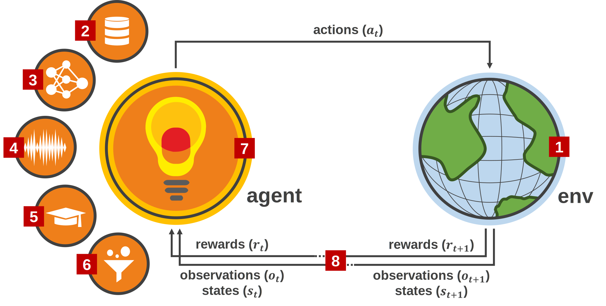
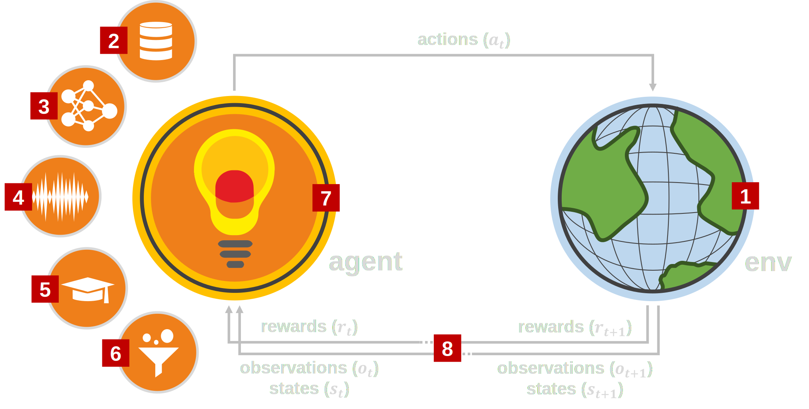

Getting Started
===============

In this section, you will learn about the different components of the **skrl** library to create reinforcement learning tasks.
Whether you are a beginner or an experienced researcher, this section will provide you with a solid foundation to build upon.

We recommend visiting the :doc:`Examples <examples>` to see how the components can be integrated and applied in practice.
Let's get started!

|br| |hr|

**Reinforcement Learning schema**
---------------------------------

**Reinforcement Learning (RL)** is a Machine Learning sub-field for decision making that allows an agent to learn from
its interaction with the environment as shown in the following schema:

|

At each step (also called timestep) of interaction with the environment, the agent sees an observation :math:`o_t`
and optionally, a complete description of the state :math:`s_t \in S` of the environment (also called privileged
observation). Then, it decides which action :math:`a_t \in A` to take from the action space using a policy.
The environment, that changes in response to the agent's action (or by itself), returns a reward signal
:math:`r_t = R(s_t, a_t, s_{t+1})` as a measure of how good or bad the action was that moved it to its new state
:math:`s_{t+1}`. The agent aims to maximize the cumulative reward (discounted or not by a factor :math:`\gamma \in (0,1]`)
by adjusting the policy's behaviour via some optimization algorithm.

**Given that, this section outlines the different components of an RL system with skrl**.

|

1. Environments
^^^^^^^^^^^^^^^

The environment plays a fundamental role in the definition of the RL schema.
For example, the selection of the agent depends strongly on the observation and action space nature.
There are several interfaces to interact with the environments such as Gym/Gymnasium or DeepMind.
However, each of them has a different API and work with non-compatible data types.

* For **single-agent** environments, the library offers a function to **wrap environments** based on
  Gym/Gymnasium, ManiSkill, MuJoCo Playground, and NVIDIA Isaac Lab interfaces, among others.
  The wrapped environments provide, to the library components, a common interface
  (adapted from the Gym/Gymnasium API) as shown in the following figure.
  Refer to the :doc:`Wrapping (single-agent) <../api/envs/wrapping>` section for more details.

* For **multi-agent** environments, the library offers a function to **wrap environments** based on
  PettingZoo and Isaac Lab interfaces, among others. The wrapped environments provide, to the library components,
  a common interface (adapted from the PettingZoo) as shown in the following figure.
  Refer to the :doc:`Wrapping (multi-agents) <../api/envs/multi_agents_wrapping>` section for more details.

.. tabs::

    .. group-tab:: Single-agent environments

        .. image:: ../_static/imgs/wrapping-light.svg
            :width: 100%
            :align: center
            :class: only-light
            :alt: Environment wrapping

        .. image:: ../_static/imgs/wrapping-dark.svg
            :width: 100%
            :align: center
            :class: only-dark
            :alt: Environment wrapping

    .. group-tab:: Multi-agent environments

        .. image:: ../_static/imgs/multi_agent_wrapping-light.svg
            :width: 100%
            :align: center
            :class: only-light
            :alt: Environment wrapping

        .. image:: ../_static/imgs/multi_agent_wrapping-dark.svg
            :width: 100%
            :align: center
            :class: only-dark
            :alt: Environment wrapping

Among the methods and properties defined in the wrapped environment, the state, observation and action spaces
are one of the most relevant for instantiating other library components.

Once the environment is known (and instantiated), it is time to configure and instantiate the agent.
Agents are composed, apart from the optimization algorithm, by several components, such as memories, models or noises,
for example, according to their nature. The following subsections focus on those components.

|

2. Memories
^^^^^^^^^^^

Memories are storage components that allow agents to collect and use/reuse recent or past experiences or other data.
These can be large in size (such as replay buffers used by off-policy algorithms like DDPG, TD3 or SAC) or small in size
(such as rollout buffers used by on-policy algorithms like PPO or TRPO to store batches that are discarded after use).

*skrl* provides **generic memory definitions** that are not tied to the agent implementation and can be used for any role,
such as rollout or replay buffers. They are empty shells when they are instantiated and the agents are in charge
of defining the tensors according to their needs. The total space occupied is the product of the memory size
(:literal:`memory_size`), the number of environments (:literal:`num_envs`) obtained from the wrapped environment
and the data size for each defined tensor.

Memories are passed directly to the agent constructor, if required (not all agents require memory, such as Q-learning),
during its instantiation under the argument :literal:`memory` (or :literal:`memories`).

|

3. Models
^^^^^^^^^

Models are the agents' brains. Agents can have one or several models and their parameters are adjusted via
some optimization algorithms.

In contrast to other libraries, *skrl* does not provide predefined models or fixed templates (this practice tends to hide
and reduce the flexibility of the system, forcing developers to deeply inspect the code to make even small changes).
Nevertheless, **helper mixins are provided** to create discrete and continuous (stochastic or deterministic) models
with the library. In this way, the user/researcher should only be concerned with the definition of the
approximation functions (tables or artificial neural networks), having all the control in his hands.

The following diagrams show the concept of the provided mixins.

.. tabs::

    .. tab:: Categorical

        Refer to :ref:`Categorical <models_categorical>` model section for more details.

        .. image:: ../_static/imgs/model_categorical-light.svg
            :width: 100%
            :align: center
            :class: only-light
            :alt: Categorical model

        .. image:: ../_static/imgs/model_categorical-dark.svg
            :width: 100%
            :align: center
            :class: only-dark
            :alt: Categorical model

    .. tab:: Multi-Categorical

        Refer to :ref:`Multi-Categorical <models_multicategorical>` model section for more details.

        .. image:: ../_static/imgs/model_multicategorical-light.svg
            :width: 100%
            :align: center
            :class: only-light
            :alt: Multi-Categorical model

        .. image:: ../_static/imgs/model_multicategorical-dark.svg
            :width: 100%
            :align: center
            :class: only-dark
            :alt: Multi-Categorical model

    .. tab:: Gaussian

        Refer to :ref:`Gaussian <models_gaussian>` model section for more details.

        .. image:: ../_static/imgs/model_gaussian-light.svg
            :width: 100%
            :align: center
            :class: only-light
            :alt: Gaussian model

        .. image:: ../_static/imgs/model_gaussian-dark.svg
            :width: 100%
            :align: center
            :class: only-dark
            :alt: Gaussian model

    .. tab:: Multivariate Gaussian

        Refer to :ref:`Multivariate Gaussian <models_multivariate_gaussian>` model section for more details.

        .. image:: ../_static/imgs/model_multivariate_gaussian-light.svg
            :width: 100%
            :align: center
            :class: only-light
            :alt: Multivariate Gaussian model

        .. image:: ../_static/imgs/model_multivariate_gaussian-dark.svg
            :width: 100%
            :align: center
            :class: only-dark
            :alt: Multivariate Gaussian model

    .. tab:: Deterministic

        Refer to :ref:`Deterministic <models_deterministic>` model section for more details.

        .. image:: ../_static/imgs/model_deterministic-light.svg
            :width: 60%
            :align: center
            :class: only-light
            :alt: Deterministic model

        .. image:: ../_static/imgs/model_deterministic-dark.svg
            :width: 60%
            :align: center
            :class: only-dark
            :alt: Deterministic model

For Tabular models refer to :ref:`Tabular <models_tabular>` section.

Models must be collected in a dictionary and passed to the agent constructor during its instantiation
under the argument :literal:`models`. The dictionary keys are specific to each agent.
Visit their respective documentation for more details (under *Spaces and models* section).
For example, the PPO agent requires the policy and value models, as shown below:

.. code-block:: python

    models = {}
    models["policy"] = Policy(env.observation_space, env.state_space, env.action_space, device)
    models["value"] = Value(env.observation_space, env.state_space, env.action_space, device)

Models can be saved and loaded to and from the file system. However, the recommended practice for loading checkpoints
to perform evaluations or continue an interrupted training is through the agents (they include, in addition to the models,
other components and internal instances such as preprocessors or optimizers).
Refer to :doc:`Saving, loading and logging <data>` (under *Checkpoints* section) for more information.

|

4. Noises
^^^^^^^^^

Noise plays a fundamental role in the exploration stage, especially for deterministic agents such as DDPG or TD3.

*skrl* provides, as part of its resources, **classes for instantiating noises** as shown in the following code snippets.
Refer to :doc:`Noises <../api/resources/noises>` documentation for more information.
Noise instances are passed to the agents in their respective configuration.

|

5. Learning rate schedulers
^^^^^^^^^^^^^^^^^^^^^^^^^^^

Learning rate schedulers help RL system converge faster and improve accuracy.

*skrl* **supports all PyTorch and JAX (Optax) learning rate schedulers** and provides, as part of its resources,
**additional schedulers**. Refer to :doc:`Learning rate schedulers <../api/resources/schedulers>` for more information.

Learning rate schedulers classes and their respective arguments (except the :literal:`optimizer` argument for PyTorch)
are passed to the agents in their respective configuration.

|

6. Preprocessors
^^^^^^^^^^^^^^^^

Data preprocessing can help increase the accuracy and efficiency of training by cleaning or making data suitable
for machine learning models.

*skrl* provides, as part of its resources, **preprocessors** classes.
Refer to :doc:`Preprocessors <../api/resources/preprocessors>` documentation for more information.

Preprocessors classes and their respective arguments are passed to the agents in their respective configuration.

|

7. Agents
^^^^^^^^^

Agents are the components in charge of decision making. They are much more than models (neural networks, for example)
and include the optimization algorithms that compute the optimal policy.

*skrl* provides **state-of-the-art agents**. The implementation is focused on readability, simplicity and code transparency.
Each agent is implemented independently, even when two or more agents may contain code in common.
Refer to each agent documentation for more information about the models and spaces they support.

.. tabs::

    .. group-tab:: (Single) agents

        * :doc:`Advantage Actor Critic <../api/agents/a2c>` (**A2C**)
        * :doc:`Adversarial Motion Priors <../api/agents/amp>` (**AMP**)
        * :doc:`Cross-Entropy Method <../api/agents/cem>` (**CEM**)
        * :doc:`Deep Deterministic Policy Gradient <../api/agents/ddpg>` (**DDPG**)
        * :doc:`Double Deep Q-Network <../api/agents/ddqn>` (**DDQN**)
        * :doc:`Deep Q-Network <../api/agents/dqn>` (**DQN**)
        * :doc:`Proximal Policy Optimization <../api/agents/ppo>` (**PPO**)
        * :doc:`Q-learning <../api/agents/q_learning>` (**Q-learning**)
        * :doc:`Robust Policy Optimization <../api/agents/rpo>` (**RPO**)
        * :doc:`Soft Actor-Critic <../api/agents/sac>` (**SAC**)
        * :doc:`State Action Reward State Action <../api/agents/sarsa>` (**SARSA**)
        * :doc:`Twin-Delayed DDPG <../api/agents/td3>` (**TD3**)
        * :doc:`Trust Region Policy Optimization <../api/agents/trpo>` (**TRPO**)

    .. group-tab:: Multi-agents

        * :doc:`Independent Proximal Policy Optimization <../api/multi_agents/ippo>` (**IPPO**)
        * :doc:`Multi-Agent Proximal Policy Optimization <../api/multi_agents/mappo>` (**MAPPO**)

Agents generally expect, as arguments, the following components: ``models`` and ``memory``, as well as the following
variables: observation, state and action spaces, the device where their logic is executed, and a configuration with
hyperparameters and other values (including preprocessors, learning rate schedulers, noises, etc.).

Agents can be saved and loaded to and from the file system. This is the **recommended practice** for loading checkpoints
to perform evaluations or to continue interrupted training (since they include, in addition to models,
other internal components and instances such as preprocessors or optimizers).
Refer to :doc:`Saving, loading and logging <data>` (under *Checkpoints* section) for more information.

|

8. Trainers
^^^^^^^^^^^

*skrl* offers classes (called :doc:`Trainers <../api/trainers>`) that manage the interaction cycle between the environment
and the agent(s) for both: training and evaluation. These classes also enable the simultaneous training and evaluation
of several agents by scope (subsets of environments among all available environments),
which may or may not share resources, in the same run.

|br| |hr|

**What's next?**

Visit the :doc:`Examples <examples>` section for training and evaluation demonstrations with different environment
interfaces and highlighted practices, among others.
