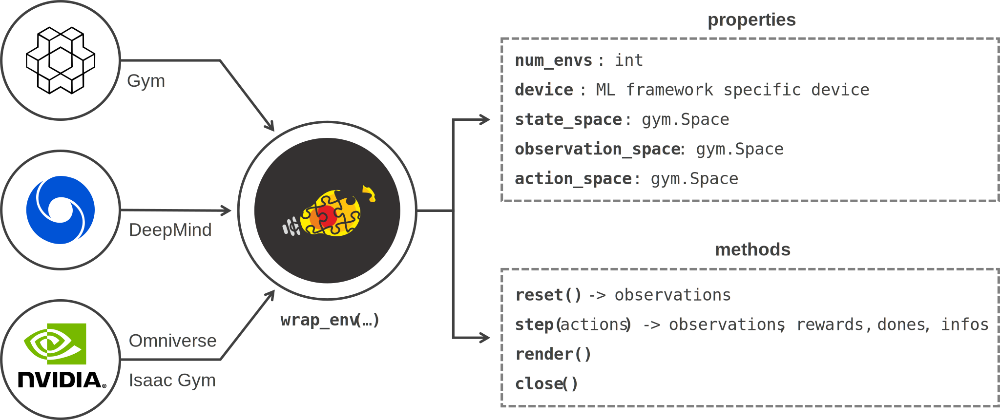

Wrapping
========

This library works with a common API to interact with the following RL environments:

* OpenAI `Gym <https://www.gymlibrary.dev>`_ / Farama `Gymnasium <https://gymnasium.farama.org/>`_ (single and vectorized environments)
* `DeepMind <https://github.com/deepmind/dm_env>`_
* `robosuite <https://robosuite.ai/>`_
* `NVIDIA Isaac Gym <https://developer.nvidia.com/isaac-gym>`_ (preview 2, 3 and 4)
* `NVIDIA Isaac Orbit <https://isaac-orbit.github.io/orbit/index.html>`_
* `NVIDIA Omniverse Isaac Gym <https://docs.omniverse.nvidia.com/app_isaacsim/app_isaacsim/tutorial_gym_isaac_gym.html>`_

To operate with them and to support interoperability between these non-compatible interfaces, a **wrapping mechanism is provided** as shown in the diagram below

.. raw:: html

      

Basic usage
^^^^^^^^^^^

.. tabs::

    .. tab:: Omniverse Isaac Gym

        .. tabs::

            .. tab:: Common environment

                .. code-block:: python
                    :linenos:

                    # import the environment wrapper and loader
                    from skrl.envs.torch import wrap_env
                    from skrl.envs.torch import load_omniverse_isaacgym_env

                    # load the environment
                    env = load_omniverse_isaacgym_env(task_name="Cartpole")

                    # wrap the environment
                    env = wrap_env(env)  # or 'env = wrap_env(env, wrapper="omniverse-isaacgym")'

            .. tab:: Multi-threaded environment

                .. code-block:: python
                    :linenos:

                    # import the environment wrapper and loader
                    from skrl.envs.torch import wrap_env
                    from skrl.envs.torch import load_omniverse_isaacgym_env

                    # load the multi-threaded environment
                    env = load_omniverse_isaacgym_env(task_name="Cartpole", multi_threaded=True, timeout=30)

                    # wrap the environment
                    env = wrap_env(env)  # or 'env = wrap_env(env, wrapper="omniverse-isaacgym")'

    .. tab:: Isaac Orbit

        .. code-block:: python
            :linenos:

            # import the environment wrapper and loader
            from skrl.envs.torch import wrap_env
            from skrl.envs.torch import load_isaac_orbit_env

            # load the environment
            env = load_isaac_orbit_env(task_name="Isaac-Cartpole-v0")

            # wrap the environment
            env = wrap_env(env)  # or 'env = wrap_env(env, wrapper="isaac-orbit")'

    .. tab:: Isaac Gym

        .. tabs::

            .. tab:: Preview 4 (isaacgymenvs.make)

                .. code-block:: python
                    :linenos:

                    import isaacgymenvs

                    # import the environment wrapper
                    from skrl.envs.torch import wrap_env

                    # create/load the environment using the easy-to-use API from NVIDIA
                    env = isaacgymenvs.make(seed=0,
                                            task="Cartpole",
                                            num_envs=512,
                                            sim_device="cuda:0",
                                            rl_device="cuda:0",
                                            graphics_device_id=0,
                                            headless=False)

                    # wrap the environment
                    env = wrap_env(env)  # or 'env = wrap_env(env, wrapper="isaacgym-preview4")'

            .. tab:: Preview 4

                .. code-block:: python
                    :linenos:

                    # import the environment wrapper and loader
                    from skrl.envs.torch import wrap_env
                    from skrl.envs.torch import load_isaacgym_env_preview4

                    # load the environment
                    env = load_isaacgym_env_preview4(task_name="Cartpole")

                    # wrap the environment
                    env = wrap_env(env)  # or 'env = wrap_env(env, wrapper="isaacgym-preview4")'

            .. tab:: Preview 3

                .. code-block:: python
                    :linenos:

                    # import the environment wrapper and loader
                    from skrl.envs.torch import wrap_env
                    from skrl.envs.torch import load_isaacgym_env_preview3

                    # load the environment
                    env = load_isaacgym_env_preview3(task_name="Cartpole")

                    # wrap the environment
                    env = wrap_env(env)  # or 'env = wrap_env(env, wrapper="isaacgym-preview3")'

            .. tab:: Preview 2

                .. code-block:: python
                    :linenos:

                    # import the environment wrapper and loader
                    from skrl.envs.torch import wrap_env
                    from skrl.envs.torch import load_isaacgym_env_preview2

                    # load the environment
                    env = load_isaacgym_env_preview2(task_name="Cartpole")

                    # wrap the environment
                    env = wrap_env(env)  # or 'env = wrap_env(env, wrapper="isaacgym-preview2")'

    .. tab:: Gym / Gymnasium

        .. tabs::

            .. tab:: Gym

                .. tabs::

                    .. tab:: Single environment

                        .. code-block:: python
                            :linenos:

                            # import the environment wrapper and gym
                            from skrl.envs.torch import wrap_env
                            import gym

                            # load environment
                            env = gym.make('Pendulum-v1')

                            # wrap the environment
                            env = wrap_env(env)  # or 'env = wrap_env(env, wrapper="gym")'

                    .. tab:: Vectorized environment

                        Visit the Gym documentation (`Vector <https://www.gymlibrary.dev/api/vector>`__) for more information about the creation and usage of vectorized environments

                        .. code-block:: python
                            :linenos:

                            # import the environment wrapper and gym
                            from skrl.envs.torch import wrap_env
                            import gym

                            # load a vectorized environment
                            env = gym.vector.make("Pendulum-v1", num_envs=10, asynchronous=False)

                            # wrap the environment
                            env = wrap_env(env)  # or 'env = wrap_env(env, wrapper="gym")'

            .. tab:: Gymnasium

                .. tabs::

                    .. tab:: Single environment

                        .. code-block:: python
                            :linenos:

                            # import the environment wrapper and gymnasium
                            from skrl.envs.torch import wrap_env
                            import gymnasium as gym

                            # load environment
                            env = gym.make('Pendulum-v1')

                            # wrap the environment
                            env = wrap_env(env)  # or 'env = wrap_env(env, wrapper="gymnasium")'

                    .. tab:: Vectorized environment

                        Visit the Gymnasium documentation (`Vector <https://gymnasium.farama.org/api/vector>`__) for more information about the creation and usage of vectorized environments

                        .. code-block:: python
                            :linenos:

                            # import the environment wrapper and gymnasium
                            from skrl.envs.torch import wrap_env
                            import gymnasium as gym

                            # load a vectorized environment
                            env = gym.vector.make("Pendulum-v1", num_envs=10, asynchronous=False)

                            # wrap the environment
                            env = wrap_env(env)  # or 'env = wrap_env(env, wrapper="gymnasium")'

    .. tab:: DeepMind

        .. code-block:: python
            :linenos:

            # import the environment wrapper and the deepmind suite
            from skrl.envs.torch import wrap_env
            from dm_control import suite

            # load environment
            env = suite.load(domain_name="cartpole", task_name="swingup")

            # wrap the environment
            env = wrap_env(env)  # or 'env = wrap_env(env, wrapper="dm")'

    .. tab:: robosuite

        .. code-block:: python
            :linenos:

            # import the environment wrapper and robosuite
            from skrl.envs.torch import wrap_env
            import robosuite
            from robosuite.controllers import load_controller_config

            # load environment
            controller_config = load_controller_config(default_controller="OSC_POSE")
            env = robosuite.make("TwoArmLift",
                                 robots=["Sawyer", "Panda"],             # load a Sawyer robot and a Panda robot
                                 gripper_types="default",                # use default grippers per robot arm
                                 controller_configs=controller_config,   # each arm is controlled using OSC
                                 env_configuration="single-arm-opposed", # (two-arm envs only) arms face each other
                                 has_renderer=True,                      # on-screen rendering
                                 render_camera="frontview",              # visualize the "frontview" camera
                                 has_offscreen_renderer=False,           # no off-screen rendering
                                 control_freq=20,                        # 20 hz control for applied actions
                                 horizon=200,                            # each episode terminates after 200 steps
                                 use_object_obs=True,                    # provide object observations to agent
                                 use_camera_obs=False,                   # don't provide image observations to agent
                                 reward_shaping=True)                    # use a dense reward signal for learning

            # wrap the environment
            env = wrap_env(env)  # or 'env = wrap_env(env, wrapper="robosuite")'

.. raw:: html

    

API
^^^

.. autofunction:: skrl.envs.torch.wrappers.wrap_env

.. raw:: html

    

Internal API
^^^^^^^^^^^^

.. autoclass:: skrl.envs.torch.wrappers.Wrapper
    :undoc-members:
    :show-inheritance:
    :members:

    .. automethod:: __init__

    .. py:property:: device

        The device used by the environment

        If the wrapped environment does not have the ``device`` property, the value of this property will be ``"cuda:0"`` or ``"cpu"`` depending on the device availability

.. autoclass:: skrl.envs.torch.wrappers.OmniverseIsaacGymWrapper
    :undoc-members:
    :show-inheritance:
    :members:

    .. automethod:: __init__

.. autoclass:: skrl.envs.torch.wrappers.IsaacOrbitWrapper
    :undoc-members:
    :show-inheritance:
    :members:

    .. automethod:: __init__

.. autoclass:: skrl.envs.torch.wrappers.IsaacGymPreview3Wrapper
    :undoc-members:
    :show-inheritance:
    :members:

    .. automethod:: __init__

.. autoclass:: skrl.envs.torch.wrappers.IsaacGymPreview2Wrapper
    :undoc-members:
    :show-inheritance:
    :members:

    .. automethod:: __init__

.. autoclass:: skrl.envs.torch.wrappers.GymWrapper
    :undoc-members:
    :show-inheritance:
    :members:

    .. automethod:: __init__

.. autoclass:: skrl.envs.torch.wrappers.GymnasiumWrapper
    :undoc-members:
    :show-inheritance:
    :members:

    .. automethod:: __init__

.. autoclass:: skrl.envs.torch.wrappers.DeepMindWrapper
    :undoc-members:
    :show-inheritance:
    :private-members: _spec_to_space, _observation_to_tensor, _tensor_to_action
    :members:

    .. automethod:: __init__

.. autoclass:: skrl.envs.torch.wrappers.RobosuiteWrapper
    :undoc-members:
    :show-inheritance:
    :private-members: _spec_to_space, _observation_to_tensor, _tensor_to_action
    :members:

    .. automethod:: __init__
