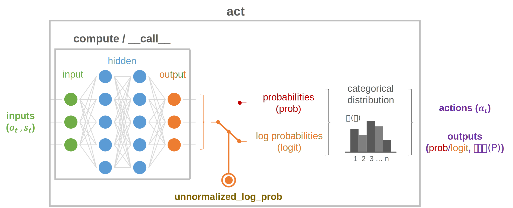
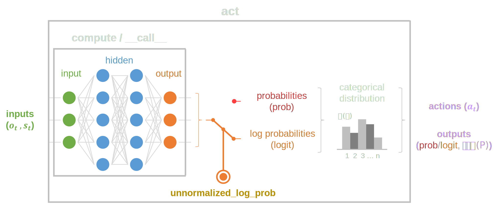

.. _models_categorical:

Categorical model
=================

Categorical models run **discrete-domain stochastic** policies.

skrl provides a Python mixin (:literal:`CategoricalMixin`) to assist in the creation of these types of models, allowing users to have full control over the function approximator definitions and architectures. Note that the use of this mixin must comply with the following rules:

* The definition of multiple inheritance must always include the :ref:`Model <models_base_class>` base class at the end.

  .. code-block:: python
      :emphasize-lines: 1

      class CategoricalModel(CategoricalMixin, Model):
          def __init__(self, observation_space, action_space, device, unnormalized_log_prob=True):
              Model.__init__(self, observation_space, action_space, device)
              CategoricalMixin.__init__(self, unnormalized_log_prob)

* The :ref:`Model <models_base_class>` base class constructor must be invoked before the mixins constructor.

  .. code-block:: python
      :emphasize-lines: 3-4

      class CategoricalModel(CategoricalMixin, Model):
          def __init__(self, observation_space, action_space, device, unnormalized_log_prob=True):
              Model.__init__(self, observation_space, action_space, device)
              CategoricalMixin.__init__(self, unnormalized_log_prob)

Concept
-------

Basic usage
-----------

* Multi-Layer Perceptron (**MLP**)
* Convolutional Neural Network (**CNN**)
* Recurrent Neural Network (**RNN**)
* Gated Recurrent Unit RNN (**GRU**)
* Long Short-Term Memory RNN (**LSTM**)

.. tabs::

    .. tab:: MLP

        .. image:: ../_static/imgs/model_categorical_mlp-light.svg
            :width: 40%
            :align: center
            :class: only-light

        .. image:: ../_static/imgs/model_categorical_mlp-dark.svg
            :width: 40%
            :align: center
            :class: only-dark

        .. raw:: html

             

        .. tabs::

            .. group-tab:: nn.Sequential

                .. literalinclude:: ../snippets/categorical_model.py
                    :language: python
                    :linenos:
                    :start-after: [start-mlp-sequential]
                    :end-before: [end-mlp-sequential]

            .. group-tab:: nn.functional

                .. literalinclude:: ../snippets/categorical_model.py
                    :language: python
                    :linenos:
                    :start-after: [start-mlp-functional]
                    :end-before: [end-mlp-functional]

    .. tab:: CNN

        .. image:: ../_static/imgs/model_categorical_cnn-light.svg
            :width: 100%
            :align: center
            :class: only-light

        .. image:: ../_static/imgs/model_categorical_cnn-dark.svg
            :width: 100%
            :align: center
            :class: only-dark

        .. raw:: html

             

        .. tabs::

            .. group-tab:: nn.Sequential

                .. literalinclude:: ../snippets/categorical_model.py
                    :language: python
                    :linenos:
                    :start-after: [start-cnn-sequential]
                    :end-before: [end-cnn-sequential]

            .. group-tab:: nn.functional

                .. literalinclude:: ../snippets/categorical_model.py
                    :language: python
                    :linenos:
                    :start-after: [start-cnn-functional]
                    :end-before: [end-cnn-functional]

    .. tab:: RNN

        .. image:: ../_static/imgs/model_categorical_rnn-light.svg
            :width: 90%
            :align: center
            :class: only-light

        .. image:: ../_static/imgs/model_categorical_rnn-dark.svg
            :width: 90%
            :align: center
            :class: only-dark

        where:

        .. math::
            \begin{aligned}
                N ={} & \text{batch size} \\
                L ={} & \text{sequence length} \\
                D ={} & 2 \text{ if bidirectional=True otherwise } 1 \\
                H_{in} ={} & \text{input_size} \\
                H_{out} ={} & \text{hidden_size}
            \end{aligned}

        .. raw:: html

            

        The following points are relevant in the definition of recurrent models:

        * The ``.get_specification()`` method must be overwritten to return, under a dictionary key ``"rnn"``, a sub-dictionary that includes the sequence length (under key ``"sequence_length"``) as a number and a list of the dimensions (under key ``"sizes"``) of each initial hidden state

        * The ``.compute()`` method's ``inputs`` parameter will have, at least, the following items in the dictionary:

            * ``"states"``: state of the environment used to make the decision
            * ``"taken_actions"``: actions taken by the policy for the given states, if applicable
            * ``"terminated"``: episode termination status for sampled environment transitions. This key is only defined during the training process
            * ``"rnn"``: list of initial hidden states ordered according to the model specification

        * The ``.compute()`` method must inlcude, under the ``"rnn"`` key of the returned dictionary, a list of each final hidden state

        .. raw:: html

             

        .. tabs::

            .. group-tab:: nn.Sequential

                .. literalinclude:: ../snippets/categorical_model.py
                    :language: python
                    :linenos:
                    :start-after: [start-rnn-sequential]
                    :end-before: [end-rnn-sequential]

            .. group-tab:: nn.functional

                .. literalinclude:: ../snippets/categorical_model.py
                    :language: python
                    :linenos:
                    :start-after: [start-rnn-functional]
                    :end-before: [end-rnn-functional]

    .. tab:: GRU

        .. image:: ../_static/imgs/model_categorical_rnn-light.svg
            :width: 90%
            :align: center
            :class: only-light

        .. image:: ../_static/imgs/model_categorical_rnn-dark.svg
            :width: 90%
            :align: center
            :class: only-dark

        where:

        .. math::
            \begin{aligned}
                N ={} & \text{batch size} \\
                L ={} & \text{sequence length} \\
                D ={} & 2 \text{ if bidirectional=True otherwise } 1 \\
                H_{in} ={} & \text{input_size} \\
                H_{out} ={} & \text{hidden_size}
            \end{aligned}

        .. raw:: html

            

        The following points are relevant in the definition of recurrent models:

        * The ``.get_specification()`` method must be overwritten to return, under a dictionary key ``"rnn"``, a sub-dictionary that includes the sequence length (under key ``"sequence_length"``) as a number and a list of the dimensions (under key ``"sizes"``) of each initial hidden state

        * The ``.compute()`` method's ``inputs`` parameter will have, at least, the following items in the dictionary:

            * ``"states"``: state of the environment used to make the decision
            * ``"taken_actions"``: actions taken by the policy for the given states, if applicable
            * ``"terminated"``: episode termination status for sampled environment transitions. This key is only defined during the training process
            * ``"rnn"``: list of initial hidden states ordered according to the model specification

        * The ``.compute()`` method must inlcude, under the ``"rnn"`` key of the returned dictionary, a list of each final hidden state

        .. raw:: html

             

        .. tabs::

            .. group-tab:: nn.Sequential

                .. literalinclude:: ../snippets/categorical_model.py
                    :language: python
                    :linenos:
                    :start-after: [start-gru-sequential]
                    :end-before: [end-gru-sequential]

            .. group-tab:: nn.functional

                .. literalinclude:: ../snippets/categorical_model.py
                    :language: python
                    :linenos:
                    :start-after: [start-gru-functional]
                    :end-before: [end-gru-functional]

    .. tab:: LSTM

        .. image:: ../_static/imgs/model_categorical_rnn-light.svg
            :width: 90%
            :align: center
            :class: only-light

        .. image:: ../_static/imgs/model_categorical_rnn-dark.svg
            :width: 90%
            :align: center
            :class: only-dark

        where:

        .. math::
            \begin{aligned}
                N ={} & \text{batch size} \\
                L ={} & \text{sequence length} \\
                D ={} & 2 \text{ if bidirectional=True otherwise } 1 \\
                H_{in} ={} & \text{input_size} \\
                H_{cell} ={} & \text{hidden_size} \\
                H_{out} ={} & \text{proj_size if } \text{proj_size}>0 \text{ otherwise hidden_size} \\
            \end{aligned}

        .. raw:: html

            

        The following points are relevant in the definition of recurrent models:

        * The ``.get_specification()`` method must be overwritten to return, under a dictionary key ``"rnn"``, a sub-dictionary that includes the sequence length (under key ``"sequence_length"``) as a number and a list of the dimensions (under key ``"sizes"``) of each initial hidden/cell states

        * The ``.compute()`` method's ``inputs`` parameter will have, at least, the following items in the dictionary:

            * ``"states"``: state of the environment used to make the decision
            * ``"taken_actions"``: actions taken by the policy for the given states, if applicable
            * ``"terminated"``: episode termination status for sampled environment transitions. This key is only defined during the training process
            * ``"rnn"``: list of initial hidden/cell states ordered according to the model specification

        * The ``.compute()`` method must inlcude, under the ``"rnn"`` key of the returned dictionary, a list of each final hidden/cell states

        .. raw:: html

             

        .. tabs::

            .. group-tab:: nn.Sequential

                .. literalinclude:: ../snippets/categorical_model.py
                    :language: python
                    :linenos:
                    :start-after: [start-lstm-sequential]
                    :end-before: [end-lstm-sequential]

            .. group-tab:: nn.functional

                .. literalinclude:: ../snippets/categorical_model.py
                    :language: python
                    :linenos:
                    :start-after: [start-lstm-functional]
                    :end-before: [end-lstm-functional]

API
---

.. autoclass:: skrl.models.torch.categorical.CategoricalMixin
    :show-inheritance:
    :members:

    .. automethod:: __init__
