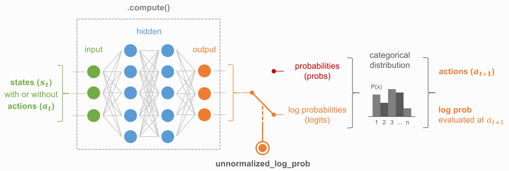

.. _models_categorical:

Categorical model
=================

Concept
^^^^^^^

Basic usage
^^^^^^^^^^^

View the raw code `here <https://raw.githubusercontent.com/Toni-SM/skrl/main/docs/source/snippets/categorical_model.py>`_

.. literalinclude:: ../snippets/categorical_model.py
    :language: python
    :linenos:

API
^^^

.. autoclass:: skrl.models.torch.categorical.CategoricalModel
   :undoc-members:
   :show-inheritance:
   :members:
   
   .. automethod:: __init__
   .. automethod:: compute
