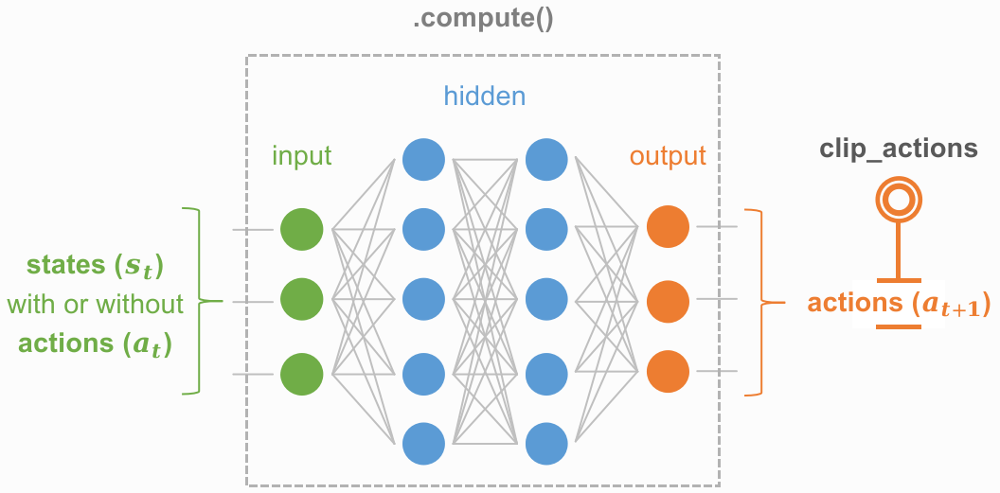

Deterministic model
===================

Concept
^^^^^^^

Basic usage
^^^^^^^^^^^

   .. code-block:: python
      :linenos:
 
      import torch
      import torch.nn as nn
      import torch.nn.functional as F

      from skrl.models.torch import DeterministicModel

    
      class Critic(DeterministicModel):
          def __init__(self, observation_space, action_space, device="cuda:0", clip_actions=False):
              super().__init__(observation_space, action_space, device, clip_actions)

              self.layer_linear1 = nn.Linear(self.num_observations + self.num_actions, 32)
              self.layer_linear2 = nn.Linear(32, 32)
              self.layer_action_linear = nn.Linear(32, 1)

          def compute(self, states, taken_actions):
              x = torch.cat((states, taken_actions), dim=1)
              x = F.elu(self.layer_linear1(x))
              x = F.elu(self.layer_linear2(x))
              return self.layer_action_linear(x)
              
API
^^^

.. autoclass:: skrl.models.torch.deterministic.DeterministicModel
   :undoc-members:
   :show-inheritance:
   :members:
   
   .. automethod:: __init__
   .. automethod:: compute
