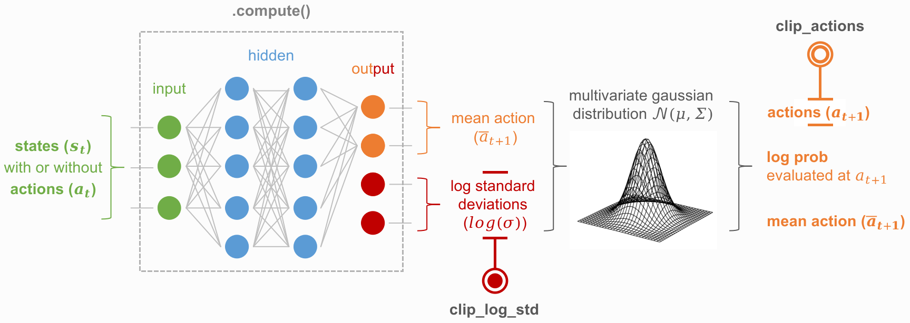

.. _models_gaussian:

Gaussian model
==============

Concept
^^^^^^^

Basic usage
^^^^^^^^^^^

   .. code-block:: python
      :linenos:
 
      import numpy as np
      import torch.nn as nn
      import torch.nn.functional as F

      from skrl.models.torch import GaussianModel

      class Policy(GaussianModel):
          def __init__(self, observation_space, action_space, device="cuda:0", clip_actions=False, 
                       clip_log_std=True, min_log_std=-20, max_log_std=2):
              super().__init__(observation_space, action_space, device, clip_actions,   
                               clip_log_std, min_log_std, max_log_std)
      
              self.linear_1 = nn.Linear(self.num_observations, 32)
              self.linear_2 = nn.Linear(32, 32)
      
              self.linear_mean = nn.Linear(32, self.num_actions)
              self.log_std = nn.Parameter(np.log(1.0) * torch.ones(self.num_actions))
      
          def compute(self, states, taken_actions):
              x = F.relu(self.linear_1(states))
              x = F.relu(self.linear_2(x))
              return torch.tanh(self.linear_mean(x)), self.log_std

API
^^^

.. autoclass:: skrl.models.torch.gaussian.GaussianModel
   :undoc-members:
   :show-inheritance:
   :members:
   
   .. automethod:: __init__
   .. automethod:: compute
