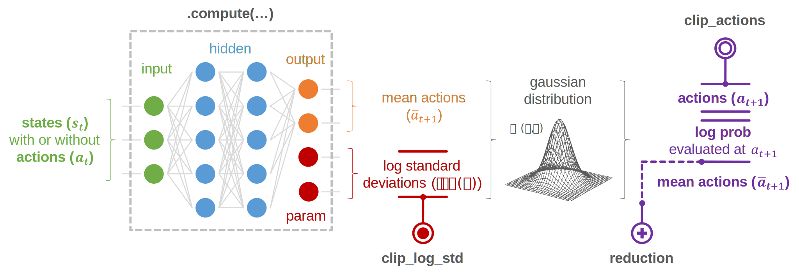

.. _models_gaussian:

Gaussian model
==============

Gaussian models run **continuous-domain stochastic** policies.

skrl provides a Python mixin (:literal:`GaussianMixin`) to assist in the creation of these types of models, allowing users to have full control over the function approximator definitions and architectures. Note that the use of this mixin must comply with the following rules:

* The definition of multiple inheritance must always include the :ref:`Model <models_base_class>` base class at the end.

  .. code-block:: python
      :emphasize-lines: 1

      class GaussianModel(GaussianMixin, Model):
          def __init__(self, observation_space, action_space, device="cuda:0",
                       clip_actions=False, clip_log_std=True, min_log_std=-20, max_log_std=2, reduction="sum"):
              Model.__init__(self, observation_space, action_space, device)
              GaussianMixin.__init__(self, clip_actions, clip_log_std, min_log_std, max_log_std, reduction)

* The :ref:`Model <models_base_class>` base class constructor must be invoked before the mixins constructor.

  .. code-block:: python
      :emphasize-lines: 4-5

      class GaussianModel(GaussianMixin, Model):
          def __init__(self, observation_space, action_space, device="cuda:0",
                       clip_actions=False, clip_log_std=True, min_log_std=-20, max_log_std=2, reduction="sum"):
              Model.__init__(self, observation_space, action_space, device)
              GaussianMixin.__init__(self, clip_actions, clip_log_std, min_log_std, max_log_std, reduction)

Concept
-------

Basic usage
-----------

* Multi-Layer Perceptron (**MLP**)
* Convolutional Neural Network (**CNN**)

.. tabs::

    .. tab:: MLP

        .. image:: ../_static/imgs/model_gaussian_mlp.svg
            :width: 42%
            :align: center

        .. raw:: html

             

        .. tabs::

            .. group-tab:: nn.Sequential

                .. literalinclude:: ../snippets/gaussian_model.py
                    :language: python
                    :linenos:
                    :start-after: [start-mlp-sequential]
                    :end-before: [end-mlp-sequential]

            .. group-tab:: nn.functional

                .. literalinclude:: ../snippets/gaussian_model.py
                    :language: python
                    :linenos:
                    :start-after: [start-mlp-functional]
                    :end-before: [end-mlp-functional]

    .. tab:: CNN

        .. image:: ../_static/imgs/model_gaussian_cnn.svg
            :width: 100%
            :align: center

        .. raw:: html

             

        .. tabs::

            .. group-tab:: nn.Sequential

                .. literalinclude:: ../snippets/gaussian_model.py
                    :language: python
                    :linenos:
                    :start-after: [start-cnn-sequential]
                    :end-before: [end-cnn-sequential]

            .. group-tab:: nn.functional

                .. literalinclude:: ../snippets/gaussian_model.py
                    :language: python
                    :linenos:
                    :start-after: [start-cnn-functional]
                    :end-before: [end-cnn-functional]

API
---

.. autoclass:: skrl.models.torch.gaussian.GaussianMixin
    :show-inheritance:
    :members:

    .. automethod:: __init__
