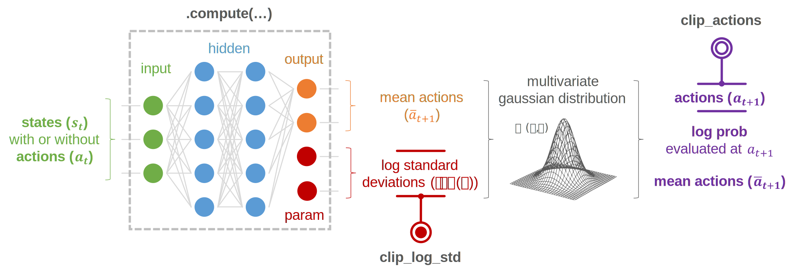

.. _models_multivariate_gaussian:

Multivariate Gaussian model
===========================

Concept
^^^^^^^

Basic usage
^^^^^^^^^^^

.. tabs::
    
    .. tab:: Multi-Layer Perceptron (MLP)

        .. literalinclude:: ../snippets/multivariate_gaussian_model.py
            :language: python
            :linenos:
            :start-after: [start-mlp]
            :end-before: [end-mlp]

    .. tab:: Convolutional Neural Network (CNN)

        .. literalinclude:: ../snippets/multivariate_gaussian_model.py
            :language: python
            :linenos:
            :start-after: [start-cnn]
            :end-before: [end-cnn]

API
^^^

.. autoclass:: skrl.models.torch.multivariate_gaussian.MultivariateGaussianModel
   :show-inheritance:
   :members:
   
   .. automethod:: __init__
   .. automethod:: compute
