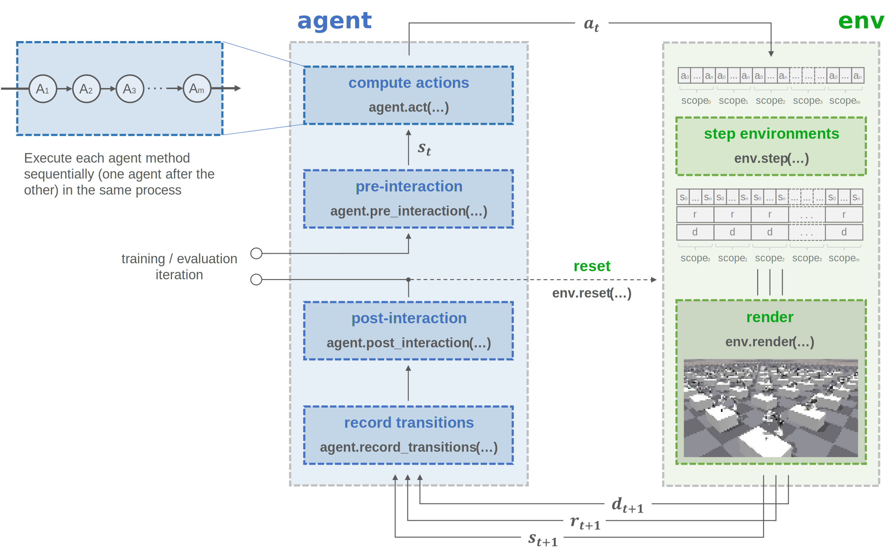

Manual trainer
==============

Concept
^^^^^^^

Basic usage
^^^^^^^^^^^

.. tabs::

    .. tab:: Snippet

        .. literalinclude:: ../snippets/trainer.py
            :language: python
            :linenos:
            :start-after: [start-manual]
            :end-before: [end-manual]

Configuration
^^^^^^^^^^^^^

.. py:data:: skrl.trainers.torch.manual.MANUAL_TRAINER_DEFAULT_CONFIG

.. literalinclude:: ../../../skrl/trainers/torch/manual.py
    :language: python
    :lines: 14-17
    :linenos:

API
^^^

.. autoclass:: skrl.trainers.torch.manual.ManualTrainer
    :undoc-members:
    :show-inheritance:
    :inherited-members:
    :members:

    .. automethod:: __init__
