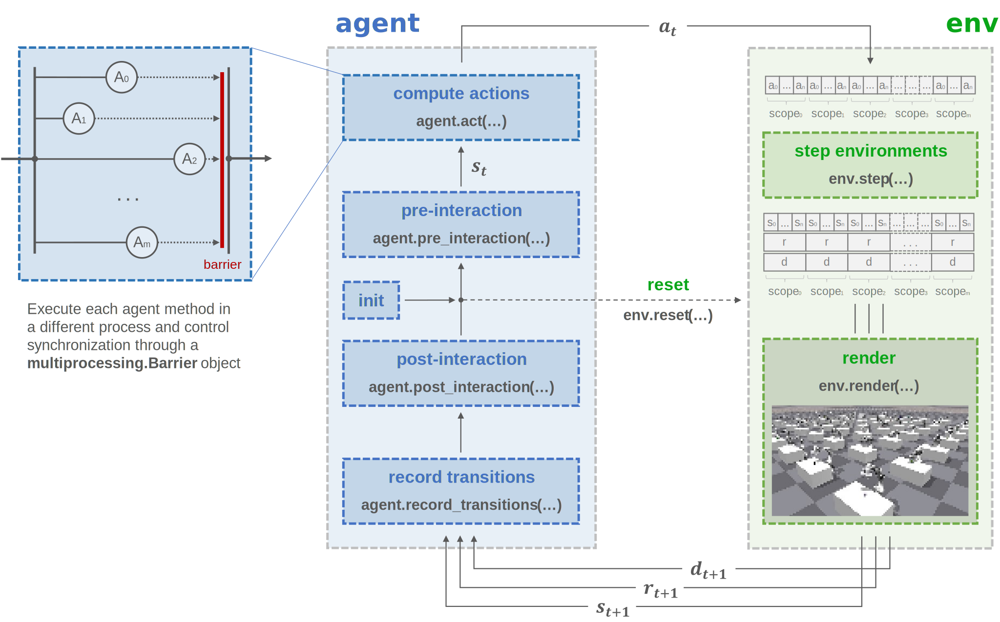

Parallel trainer
================

Concept
^^^^^^^

Basic usage
^^^^^^^^^^^

.. note::

    Each process adds a GPU memory overhead (~1GB, although it can be much higher) due to PyTorch's CUDA kernels. See PyTorch `Issue #12873 <https://github.com/pytorch/pytorch/issues/12873>`_ for more details

.. note::

    At the moment, only simultaneous training and evaluation of agents with local memory (no memory sharing) is implemented

.. tabs::
            
    .. tab:: Snippet

        .. literalinclude:: ../snippets/trainer.py
            :language: python
            :linenos:
            :start-after: [start-parallel]
            :end-before: [end-parallel]

API
^^^

.. autoclass:: skrl.trainers.torch.parallel.ParallelTrainer
    :undoc-members:
    :show-inheritance:
    :inherited-members:
    :members:

    .. automethod:: __init__
